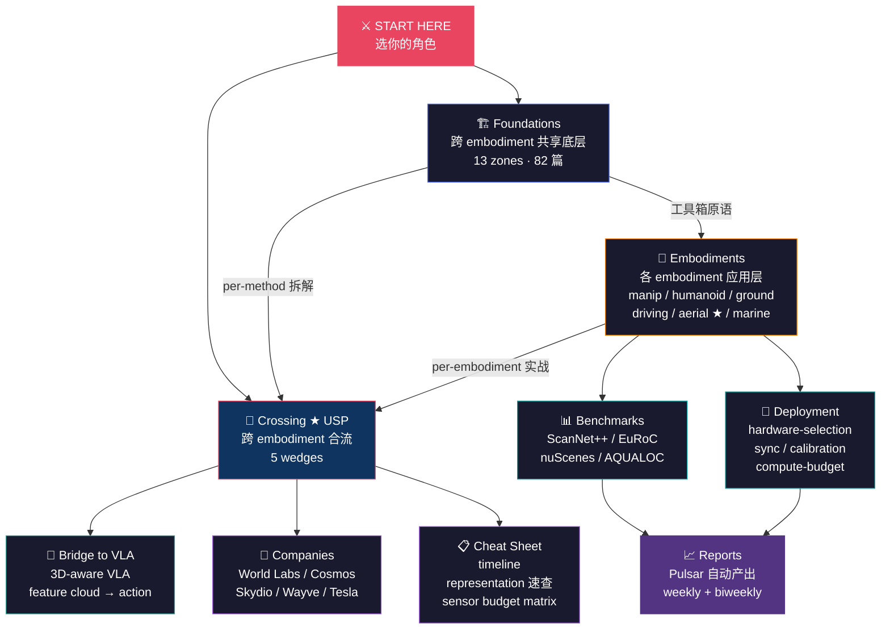

# Spatial Intelligence Handbook

> **The first cross-embodiment spatial AI handbook** — comparing SLAM, VIO, 3D representations, sensor stacks, and deployment gotchas across manipulation, drones, autonomous vehicles, humanoids, and underwater robots. With a unified 3DGS / VGGT / depth-foundation textbook layer underneath.
>
> **从厘米到公里，从地下到空中** — 桌面机械臂、自动驾驶、无人机、水下机器人都把物理空间变成可推理的表示，但 manipulation 圈的 SLAM 综述里没 outdoor，AD 圈的 BEV 综述里没 manipulation，drone 圈和水下圈基本不读对方的论文。**本 handbook 做一件事：把这些圈各自闭门发明的同一类问题摊在桌上横向对比。**

[](https://kensou.mintlify.app)
[](https://github.com/sou350121/Spatial-Intelligence-Handbook/actions)
[](./LICENSE)
[](./cheat-sheet/functional_map.md)
[](./cheat-sheet/cross_zone_failure_atlas.md)
[](./cheat-sheet/ontology.md)
[](./scripts/handbook_audit.py)

| | |
|---|---|
| 📖 **讀線上版** | [kensou.mintlify.app](https://kensou.mintlify.app) — full-text search + sidebar nav + 11 tabs |
| 🚪 **5 分鐘 onboarding** | [`ONBOARDING.md`](./ONBOARDING.md) — 6 場景分流（production / 範式 / paper idea / 學生 / 轉崗 / ML 研究員）|
| 🧭 **學術 taxonomy** | [`cheat-sheet/ontology.md`](./cheat-sheet/ontology.md) — 5 軸分類 + 120+ glossary + 51 canonical refs（4-expert reviewed v2）|
| 🤖 **AI access via MCP** | `https://kensou.mintlify.app/mcp` — Claude / agent 直接查 handbook（[setup](./docs/mcp-integration.md)）|
| 🌉 **姊妹仓** | [VLA-Handbook](https://github.com/sou350121/VLA-Handbook) · VLA 管 action policy，Spatial 管 world representation；交集 → [`bridge-to-vla/`](./bridge-to-vla/) |

&nbsp;

## 三句话说清楚这个 Handbook 的价值

1. **不只是综述**：每篇给出表示选型理由、关键超参、shape sanity-check、部署陷阱——"看懂论文"和"跑通代码"之间的坑，都标出来。
2. **跨 embodiment 横向比较**：市场上所有 spatial intelligence 综述都是单 embodiment 闭门写。这本是第一本把 manipulation / driving / aerial / marine 的同一类问题摊在桌上对比的。
3. **活的知识库**：自动 pipeline 每天抓最新论文（⚡/🔧/📖 评级），精选后生成深度解析写入仓库，不是六个月没人维护的静态文档。

&nbsp;

---

&nbsp;

## 🎭 你是谁？

> *选你的角色 → 跳到对应入口。整本 handbook 9 个顶层目录都有自己的旗舰。*

| | 角色 | 你的背景 | 👉 推荐起点 |
|:---:|------|---------|-----------|
| 🛰️ | **跨 embodiment 算法工程师** | manipulation → drone、AD → robot、机器人 → 水下 | → [`crossing/` 旗舰：VGGT vs Drone VIO](./crossing/slam-vio-migration/vggt_vs_drone_vio.md) — 同一问题在不同 embodiment 解空间为什么差这么大 |
| 🏢 | **多 embodiment 公司架构师** | NVIDIA / Apple / Tesla / 华为这种同时做车 + 机器人 + AR | → [`cheat-sheet/sensor-budget-matrix.md`](./cheat-sheet/) + [`companies/`](./companies/) — 横向决策"哪个 representation 跨 embodiment 复用" |
| 🔬 | **找下一个 paper idea 的研究者** | 想看哪些 niche 没人解 | → [`crossing/failure-modes-atlas/`](./crossing/) — 跨 embodiment failure mode 对比图就是论文 idea 来源 |
| 📡 | **传感器 / 硬件团队** | 写过 driver / 算过 BoM / 选过 LiDAR | → [`foundations/sensor-physics/`](./foundations/) — 学界综述写不出的 SWaP-C 工程账（独家轴） |
| 🧮 | **想补空间 SLAM / 3D 数学基础** | 听过 SE(3) 但不会用、想吃透 BA | → [`foundations/spatial-math/`](./foundations/) — SE(3)/BA/IMU preintegration 的数学骨架 |
| 🤖 | **想看 VLA 的 spatial 侧** | 来自 VLA-Handbook、想知道 3D representation 怎么接进 action policy | → [`bridge-to-vla/`](./bridge-to-vla/) — feature cloud → action head、3D-aware VLA 的两端契约 |
| 🎯 | **manipulation 工程师** | 调过 grasp planner、用过 6D pose | → [`foundations/pose-tracking/`](./foundations/) + [`embodiments/manipulation/`](./embodiments/) |
| 🚁 | **无人机 / aerial autonomy** | UZH RPG / Skydio 风格 | → [`embodiments/aerial/`](./embodiments/) — 维护者深度锚点（其他 embodiment 的 1.5–2×） |

> 不接受"HR / 招聘"入口 — 这是技术 handbook，不是产业地图（产业地图见 [`companies/`](./companies/)）。

&nbsp;

---

&nbsp;

## 🌍 世界地图



> **读图方式**：`foundations/` 是工具箱（每个 embodiment / crossing wedge 都在引用它）；`crossing/` 是 USP（把单 embodiment 视角打开）；`embodiments/` 是应用层；其余 6 个目录是支撑层。

&nbsp;

---

&nbsp;

## 🏛️ 九大顶层目录

&nbsp;

<details open>
<summary><h3>🏗️ 1. <code>foundations/</code> — 跨 embodiment 共享底层 &nbsp;<code>13 zones · 82 篇</code></h3></summary>

**一句话**：3DGS / VGGT / Depth Foundation / 经典 SLAM 这些"工具箱"原语 — 无论你做 manipulation、aerial 还是 marine，最终都会回到这里。

**为什么这目录存在**：学术界的空间智能资源是按"方法"切（NeRF 综述、SLAM 综述、occupancy 综述），不是按"embodiment"切。本目录把所有 embodiment 共用的底层方法收齐一份，让 `embodiments/` 和 `crossing/` 不必重复造轮子。

| 推荐入口 | 说明 |
|---------|------|
| [`feed-forward-3d/` VGGT 解构](./foundations/feed-forward-3d/) | 2025 CVPR best paper — 范式转移信号 |
| [`3dgs-family/` 3DGS Original](./foundations/3dgs-family/) | 取代 NeRF 的 hegemon，6 个月内 100× |
| [`depth-foundation/` Depth Anything v2](./foundations/depth-foundation/) | 相对 vs 度量深度的现场 trap |
| [`sensor-physics/` 850nm NIR](./foundations/sensor-physics/) | ★ 独家轴 — 学界写不出的 SWaP-C 物理 |
| [`spatial-math/` SE(3) primer](./foundations/spatial-math/) | 所有 SLAM/VIO 的数学骨架 |

📂 **完整 13 zones 导览**：[`foundations/overview.md`](./foundations/overview.md) — explorer-map 风格，含 mermaid + persona + speed runs

</details>

&nbsp;

<details>
<summary><h3>🤖 2. <code>embodiments/</code> — 各 embodiment 应用层 &nbsp;<code>6 embodiments · aerial 深度锚点</code></h3></summary>

**一句话**：同一类 spatial 问题在不同 embodiment 上 scale、sensor、dynamics、failure mode 截然不同 — 这目录写各 embodiment 的 SOTA stack + 特殊问题。

**为什么这目录存在**：操作 / 移动 / 驾驶 / 空中 / 水下都要 perceive → represent → reason → act 空间，但 1cm vs 1000km 的尺度、IMU 噪声、scene constraint 完全不同。把每个 embodiment 的 lane 单独写，再交给 `crossing/` 做横向对比。

| 子目录 | 备注 |
|--------|------|
| `manipulation/` | 桌面、抓取、装配、双臂、humanoid 上肢 |
| `humanoid-legged/` | 全身、行走、平衡 |
| `ground-mobile/` | AGV / 室内移动 / VLN |
| `driving/` | 自动驾驶 / BEV / 占用网络 |
| `aerial/` ★ | **维护者深度锚点** — VIO / 障碍避让 / 主动追踪 / on-board mapping / long-range SLAM / event camera / swarm / sensor stack |
| `marine/` | AUV / USV / 声呐 / 视觉退化（contrasting case） |

> AR/VR (Apple Vision Pro / Quest) 不独立成 embodiment — 作为 `crossing/` 对比案例提及；太空机器人不收。

</details>

&nbsp;

<details>
<summary><h3>🔭 3. <code>crossing/</code> ★ — 跨 embodiment 合流 &nbsp;<code>5 wedges · 本书 USP</code></h3></summary>

**一句话**：把各 embodiment 圈闭门发明的同类问题摊在桌上横向对比 — 这是市场上所有空间智能资源都没有的内容。

**为什么这目录存在**：spatial intelligence 是一个统一领域，但它的具体表达取决于 embodiment。所有 embodiment 都要 perceive → represent → reason → act 空间，但 scale、sensor、dynamics、failure modes 截然不同。**中间的 crossing 层是这本书唯一不可替代的内容**——把统一底层和各应用 lane 之间的对比关系系统写出来。

| 子目录 | 一句话 |
|--------|------|
| [`scale-comparison/`](./crossing/) | 1cm → 1000km，同一问题在不同尺度怎么变形 |
| [`sensor-stack-matrix/`](./crossing/) | 各 embodiment 用什么 sensor / 为什么 / SWaP-C 对比 |
| [`slam-vio-migration/`](./crossing/) ★ | 桌面 → 室内 → 户外 → 空中 → 水下 同源问题不同解（旗舰：[VGGT vs Drone VIO](./crossing/slam-vio-migration/vggt_vs_drone_vio.md)） |
| [`representation-migration/`](./crossing/) | 3DGS / VGGT 在各 embodiment 的部署对比 |
| [`failure-modes-atlas/`](./crossing/) | 不同 embodiment 的 spatial 失败方式总图 |

**写入门槛极高**：必须跨 ≥3 embodiment、每 embodiment 都附论文来源、至少 1 个工程数字（哪怕 `UNVERIFIED`）、文末必须有 Boundary 段。见 [`AGENTS.md`](./AGENTS.md#crossing-写入门槛高严格度)。

</details>

&nbsp;

<details>
<summary><h3>🌉 4. <code>bridge-to-vla/</code> — 与 VLA-Handbook 接口 &nbsp;<code>3 篇</code></h3></summary>

**一句话**：Spatial 这边算出来的 3D 表示怎么接到 VLA-Handbook 那边的 action policy。

**为什么这目录存在**：VLA-Handbook 管 *action policy*（diffusion / flow matching / RL），本仓管 *world representation*（3DGS / VGGT / depth foundation）。两者交集 = 3D-aware VLA — 但两端契约需要显式写出来（数据 schema、坐标系、scale flag）。

| 推荐入口 | 说明 |
|---------|------|
| [`3d-aware-vla.md`](./bridge-to-vla/) | 3D-VLA / PointVLA / SpatialVLM |
| [`feature-cloud-to-action.md`](./bridge-to-vla/) | 3D feature cloud → action head 工程范式 |
| [`neural-map-as-memory.md`](./bridge-to-vla/) | neural map 作为 long-horizon memory |

</details>

&nbsp;

<details>
<summary><h3>📊 5. <code>benchmarks/</code> — 评测 benchmark 拆解 &nbsp;<code>6 子目录</code></h3></summary>

**一句话**：每个 embodiment 有自己的 benchmark 生态，刷榜数字不等于真机能跑。

**为什么这目录存在**：ScanNet++ / EuRoC / nuScenes / AQUALOC 已被反复刷榜，"100% recovery" 不等于户外能用。本目录拆 benchmark 的 *条件 + 失败模式 + 真机 gap*，不只是 leaderboard。

| 子目录 | 内容 |
|--------|------|
| `geometry/` | ScanNet++ / TUM-RGBD / ETH3D / DTU |
| `manipulation/` | GraspNet / YCB / RLBench |
| `driving/` | nuScenes / Waymo Open / Argoverse 2 |
| `aerial/` ★ | EuRoC / TUM-VI / UZH-FPV / Hilti SLAM Challenge |
| `marine/` | AQUALOC / Mining-Sub / SubPipe |
| `reasoning/` | 3DSRBench / BLINK / CV-Bench / What's Up |

</details>

&nbsp;

<details>
<summary><h3>🏢 6. <code>companies/</code> — 产业地图 &nbsp;<code>10+ 厂商</code></h3></summary>

**一句话**：spatial intelligence 在工业界谁在做什么、谁的 stack 值得抄。

| 厂商 | 角度 |
|------|------|
| [World Labs / Marble](./companies/) | 生成式 3D，部分 decision-useful |
| [Niantic Spatial](./companies/) | 大规模 outdoor SLAM 数据 |
| [NVIDIA Cosmos](./companies/) | sim2real data factory |
| [Skydio](./companies/) | aerial autonomy 教科书 |
| [DJI / Autel](./companies/) | aerial sensor stack |
| [Physical Intelligence](./companies/) | π0 / π0.6 — 与 VLA-Handbook 互引 |
| [Apple Vision](./companies/) | inside-out tracking / spatial anchor |
| [Wayve / Tesla Occupancy](./companies/) | AD 占用网络生态 |

</details>

&nbsp;

<details>
<summary><h3>🔧 7. <code>deployment/</code> — 工程实战 &nbsp;<code>5 lanes</code></h3></summary>

**一句话**：从 paper 到真机的工程坑全在这。

| 子目录 | 内容 |
|--------|------|
| `hardware-selection/` | IMX900 / 850nm BPF / ToF vs SL / event camera |
| `multi-modal-sync/` | RGB + Depth + IMU + IR 硬同步 |
| `calibration/` | 多相机外参 / stereo rect / IMU-cam / 飞行中在线标定 |
| `compute-budget/` | Jetson Orin / RK3588 / 3DGS 端侧 / VGGT 蒸馏 |
| `failure-modes/` | camera-shift / 振动 / 逆光 / 反射 / 透明 / 雨雪 / 粉尘 / 水下 |

</details>

&nbsp;

<details>
<summary><h3>📋 8. <code>cheat-sheet/</code> — 速查表</h3></summary>

**一句话**：3 张大表 — 时间线、representation 速查、sensor budget matrix。

| 文件 | 内容 |
|------|------|
| `timeline.md` | 2020-2026 关键论文时间线 |
| `representation-comparison.md` | NeRF / 3DGS / SDF / voxel / point 速查 |
| `sensor-budget-matrix.md` | embodiment × sensor 一张大表（**禁止自动写入**，人工 SWaP-C 核算） |

</details>

&nbsp;

<details>
<summary><h3>📈 9. <code>reports/</code> — Pulsar 自动产出 &nbsp;<code>weekly + biweekly</code></h3></summary>

**一句话**：每周前瞻侦察 + 每两周回顾分析（带预测打分回溯）— 由 [Pulsar pipeline](https://github.com/sou350121/Pulsar-KenVersion) 自动生成。

- `weekly/` — 前瞻侦察（意外 / 可证伪命题 / 观察清单）
- `biweekly/` — 回顾分析（趋势 / 洞察 / 预测）+ 上期预测得分卡

</details>

&nbsp;

---

&nbsp;

## 📍 先看这几篇（30 分钟建立框架）

按依赖顺序排列——每一篇回答上一篇读完后自然产生的问题。

**第一层：foundations 是什么、为什么 2024-2026 是分水岭（~15 min）**

1. **[3DGS family overview](./foundations/3dgs-family/)** `5 min` — 先建立全局图：3DGS 为什么取代 NeRF 成为 spatial representation 的 hegemon、4DGS / GS-SLAM / GS-as-simulator 三条衍生线。
2. **[VGGT family — feed-forward 3D 的范式转移](./foundations/feed-forward-3d/)** `10 min` — 1 告诉你 3DGS 怎么用，这篇回答 *VGGT 这条 feed-forward 路线为什么可能让 3DGS 也变成中间产物*。CVPR 2025 best paper 不是孤立事件。

**第二层：crossing 怎么把单 embodiment 看法打开（~15 min）**

3. **[VGGT 能不能替代 drone VIO？](./crossing/slam-vio-migration/vggt_vs_drone_vio.md)** `10 min` — feed-forward 推理在 Jetson Orin 上 100ms 够不够，scale ambiguity 怎么和 IMU/GNSS 融合，比 VINS-Mono 优势在哪、bug 在哪。**这一篇是这本 handbook 的代表作**——同一个问题在 manipulation/aerial/marine 上的答案完全不同。
4. **[sensor budget matrix](./crossing/sensor-stack-matrix/)** `5 min` — 一张大矩阵看完，理解为什么 manipulation 不用 LiDAR、drone 不用 RGBD、水下不用 RGB。

**第三层：对接 VLA-Handbook（按需深入）**

5. **[3D feature cloud → action head](./bridge-to-vla/)** — Spatial 这边算出来的 3D 表示怎么接到 VLA-Handbook 那边的 action policy。

&nbsp;

---

&nbsp;

## ⚡ Speed Runs

> *按目标选一条最短路线。*

&nbsp;

### 🛰️ 跨 embodiment 转岗的算法工程师（4 篇）

```
foundations/feed-forward-3d (VGGT) →
crossing/slam-vio-migration (VGGT vs Drone VIO) →
crossing/sensor-stack-matrix →
embodiments/<目标 embodiment>/
```

[开始 →](./foundations/feed-forward-3d/) — 先吃 foundation，再用 crossing 矩阵决定迁移路径

&nbsp;

### 🔬 找下一个 paper idea（3 篇）

```
crossing/failure-modes-atlas →
crossing/representation-migration →
reports/biweekly (最新预测得分卡)
```

[开始 →](./crossing/) — failure mode 跨 embodiment 对比图就是 paper idea 来源

&nbsp;

### 🚁 为无人机选 perception stack（4 篇）

```
foundations/depth-foundation (Depth Anything v2) →
foundations/depth-foundation (FoundationStereo) →
foundations/sensor-physics (850nm NIR) →
crossing/slam-vio-migration (VGGT vs Drone VIO)
```

[开始 →](./foundations/depth-foundation/) — 先理解 relative-vs-metric，再决定 active vs passive

&nbsp;

### 🎯 为 manipulation 选 3D 表示（3 篇）

```
foundations/feed-forward-3d (VGGT) →
foundations/semantic-3d (OpenScene) →
bridge-to-vla/feature-cloud-to-action
```

[开始 →](./foundations/feed-forward-3d/) — encoder → semantic lift → policy interface 完整链

&nbsp;

### 🚗 为 AD 选 occupancy / BEV 方案（4 篇）

```
embodiments/driving/ →
companies/wayve + tesla-occupancy →
foundations/world-model (NVIDIA Cosmos) →
benchmarks/driving
```

[开始 →](./embodiments/) — BEV / 占用网络 / Cosmos 是 spatial intelligence 资源最密集的一翼

&nbsp;

### 📡 想搞清楚 sensor 物理（2 篇 + 1 crossing）

```
foundations/sensor-physics (850nm) →
foundations/sensor-physics (LiDAR 905 vs 1550) →
crossing/sensor-stack-matrix
```

[开始 →](./foundations/sensor-physics/) — 先吃透物理，再看跨 embodiment SWaP-C 矩阵

&nbsp;

### 🛬 第一次飛真機 — production 不踩坑（4 篇）

```
embodiments/aerial/dynamics_and_control_primer.md →
embodiments/aerial/planning/min_snap_dissection.md →
embodiments/aerial/vio/ekf_from_scratch_dissection.md →
embodiments/aerial/real_flight_production_gotchas.md
```

[开始 →](./embodiments/aerial/dynamics_and_control_primer.md) — HKUST ELEC5660 全套 + 一手 lab gotchas（取材 BSD 3-Clause）

&nbsp;

### 🧠 ML 研究員 — 把 SE(3) / 3D 加進你的 model（4 篇）

```
foundations/spatial-math/rotation_reps_in_deep_learning_primer.md →
foundations/spatial-math/se3_equivariance_in_networks_primer.md →
foundations/feed-forward-3d/vggt_cvpr2025_dissection.md →
bridge-to-vla/feature-cloud-to-action.md
```

[开始 →](./foundations/spatial-math/rotation_reps_in_deep_learning_primer.md) — 從 Zhou 2019 6D 開始，到 Equivariant Diffusion Policy

&nbsp;

---

&nbsp;

## 🏆 Achievements

读完一篇就算解锁。看看你能拿几个？

| | 成就 | 解锁条件 |
|:---:|------|---------|
| 🥉 | **First Blood** | 读完任意 1 篇 dissection |
| 🎓 | **Orientation** | 读完 VGGT + 3DGS Original + Depth Anything v2 |
| 🌍 | **World Tour** | 跨 4-5 个顶层目录各读至少 1 篇 |
| 🛰️ | **Cross-Embodiment** | 至少读 1 篇 foundations + 1 篇 crossing + 1 篇 embodiments |
| 🐉 | **Boss Hunter** | 读完 3 篇 "整本 handbook 最难"的文章（见下表） |
| ⚡ | **Speed Runner** | 完成任意一条 Speed Run |
| 🧮 | **Math Initiated** | 读完 SE(3) primer + Bundle Adjustment + IMU preintegration |
| 👑 | **Handbook Master** | 9 个顶层目录都至少读 1 篇 + 完成 ≥3 条 Speed Run |

<details>
<summary>🐉 Boss Monsters（整本 handbook 最难的 5 篇）</summary>

| 文章 | Why It's Hard |
|------|---------------|
| [VGGT vs Drone VIO](./crossing/slam-vio-migration/vggt_vs_drone_vio.md) | 跨 ≥3 embodiment + falsifiable prediction + 工程数字门槛全打齐 |
| [Sensor Budget Matrix](./crossing/sensor-stack-matrix/) | 各 embodiment × 7 种 sensor 的 SWaP-C 工程账，每 cell 都要 vendor 数据手册 |
| [FoundationPose (CVPR 2024 best)](./foundations/pose-tracking/) | Mesh-free novel-object pose + 1M 对象 scaling 推导 |
| [IMU Preintegration Math](./foundations/spatial-math/) | Forster 2017 — 让 VINS-Mono / OpenVINS 跑得起来的核心 trick |
| [Block-NeRF (Waymo)](./foundations/nerf-family/) | City-scale 拼接 + 生产 AV 仿真细节，3DGS 至今未取代它 |

</details>

&nbsp;

---

&nbsp;

## 与 VLA-Handbook 的边界

| 内容类型 | 主入口 | 另一侧 |
|---|---|---|
| Manipulation / humanoid 的空间表示创新（3D-VLA, PointVLA） | VLA-Handbook | Spatial 留 cross-ref |
| Drone / aerial 的空间表示与感知（Champion-level racing, Skydio autonomy） | Spatial-Handbook | VLA cross-ref |
| 通用 3D representation backbone（3DGS, VGGT, Depth Anything） | Spatial-Handbook（主理论位置）| VLA 引用结论 |
| Action policy 训练（diffusion / flow matching） | VLA-Handbook | 不收 |
| Sensor 物理 / 硬件选型 | Spatial-Handbook | 不收 |
| Sim2Real（动力学侧） | VLA-Handbook | Spatial 引 representation 侧 |
| World model（作为 data generator） | 两边都收，视角不同 | 互引 |

&nbsp;

---

&nbsp;

## 许可证与贡献

CC BY 4.0 · 欢迎 Issue 和 PR：补论文解读 · 真机经验 · sensor 选型实测 · 跨 embodiment 对比案例

- 看 [`AGENTS.md`](./AGENTS.md) — 14 项 dissection 模板 + 5 type 文檔分層 + 自動 audit 規則
- 看 [`CONTRIBUTING.md`](./CONTRIBUTING.md) — PR 流程
- 維護者 / 路線圖 / 風險對冲 / Pulsar 整合：[`MAINTAINER.md`](./MAINTAINER.md)
- AI 整合：[`docs/mcp-integration.md`](./docs/mcp-integration.md) · Mintlify 部署：[`docs/mintlify-deployment.md`](./docs/mintlify-deployment.md)

&nbsp;

---

&nbsp;

[→ Foundations (工具箱)](./foundations/overview.md) · [→ Crossing ★ USP](./crossing/) · [→ Embodiments](./embodiments/) · [→ Bridge to VLA-Handbook](./bridge-to-vla/) · [姊妹仓：VLA-Handbook](https://github.com/sou350121/VLA-Handbook)
