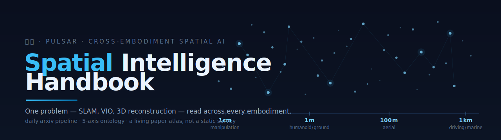

<div align="center">



<br/>

[](https://kensou.mintlify.app)
[](./reports/atlas/overview.md)
[](./reports/spatial-daily/)
[](https://github.com/sou350121/Spatial-Intelligence-Handbook/actions)
[](./crossing/failure-modes-atlas/)
[](./cheat-sheet/ontology.md)
[](./LICENSE)

**The first cross-embodiment spatial-AI handbook.**
SLAM, VIO, 3D reconstruction, sensor stacks and deployment traps — read side by side across
manipulation · aerial · driving · marine, on one shared 3DGS / VGGT / depth-foundation layer.

</div>

---

从厘米到公里、从地下到空中,桌面机械臂、无人机、自动驾驶、水下机器人都把物理空间变成可推理的表示。但
manipulation 圈的 SLAM 综述里没有 outdoor,AD 圈的 BEV 综述里没有 manipulation,drone 圈和水下圈几乎不读
对方的论文。**这本 handbook 做一件别人不做的事:把各圈闭门发明的同一类问题,摊在一张桌上横向对比。**

## Why this exists

- **横向,不是纵向.** 市面上每一份空间智能综述都是单 embodiment 闭门写的。这是第一本把 manipulation /
  driving / aerial / marine 的**同一类问题**摊开对比的 —— 这层 `crossing/` 内容别处没有。
- **落地深度,不是文献罗列.** 每篇 dissection 给出表示选型理由、关键超参、shape sanity-check、部署陷阱
  —— "看懂论文" 和 "跑通代码" 之间的坑都标出来。
- **活的,不是六个月没人维护的静态文档.** 每个工作日一条 arxiv 管线抓最新论文、按 ⚡/🔧/📖 评级,精选后
  写成深度解析入库,并把每篇的 5 轴坐标累积进下面的 **Atlas**。

## The Atlas — a map, not a list

[**`reports/atlas/overview.md`**](./reports/atlas/overview.md) · 机器可读源 [`atlas.jsonl`](./reports/atlas/atlas.jsonl)

管线评级过的每一篇论文都落一组 ontology **五轴坐标**(problem / representation / sensor / paradigm / time)。
Atlas 不是清单,是**漂移**:看领域的质量沿 paradigm 轴 `geometric → … → world-model-as-policy` 随时间迁移。
座标流每个工作日增长 —— 这既是内容,也是 "这本书是活的" 的证明。

```
Paradigm axis — where the field sits          (seed corpus, grows daily)
geometric              ██████·················· 23
learned                ███████████████████····· 76
hybrid                 ██████████████·········· 55
VLA                    ████████████████████████ 94
world-model-as-policy  ████████················ 31   ← most ⚡ breakthroughs land here
```

## Where to start

**30 分钟建立框架** — 按依赖顺序,每篇回答上一篇读完后自然产生的问题:

1. [**3DGS family**](./foundations/3dgs-family/) `5 min` — 3DGS 为何取代 NeRF 成为空间表示的 hegemon。
2. [**VGGT — feed-forward 3D 的范式转移**](./foundations/feed-forward-3d/) `10 min` — CVPR 2025 best paper 不是孤立事件;为何这条前馈路线可能让 3DGS 也变成中间产物。
3. [**VGGT 能替代 drone VIO 吗?**](./crossing/slam-vio-migration/vggt_vs_drone_vio.md) `10 min` — **本书代表作**。同一个问题在 manipulation / aerial / marine 上的答案完全不同:Jetson Orin 上 100ms 够不够、scale ambiguity 怎么和 IMU/GNSS 融合、比 VINS-Mono 强在哪、坑在哪。
4. [**sensor budget matrix**](./crossing/sensor-stack-matrix/) `5 min` — 一张矩阵看懂为何 manipulation 不用 LiDAR、drone 不用 RGBD、水下不用 RGB。

**或者按角色选入口:**

| 你是 | 起点 |
|---|---|
| 跨 embodiment 转岗的算法工程师 | [`crossing/slam-vio-migration/`](./crossing/slam-vio-migration/vggt_vs_drone_vio.md) — 同源问题在不同 embodiment 的解空间为何差这么大 |
| 找下一个 paper idea 的研究者 | [`crossing/failure-modes-atlas/`](./crossing/failure-modes-atlas/) — 跨 embodiment failure mode 对比图就是 idea 来源 |
| 传感器 / 硬件团队 | [`foundations/sensor-physics/`](./foundations/sensor-physics/) `★ 独家轴` — 学界综述写不出的 SWaP-C 工程账 |
| 无人机 / aerial autonomy | [`embodiments/aerial/`](./embodiments/aerial/) — 维护者深度锚点,其他 embodiment 的 1.5–2× 深度 |
| 补 SE(3) / BA / 3D 数学基础 | [`foundations/spatial-math/`](./foundations/spatial-math/) — 所有 SLAM/VIO 的数学骨架 |
| 从 VLA 侧来,想接 3D 表示 | [`bridge-to-vla/`](./bridge-to-vla/) — feature cloud → action head 的两端契约 |

> 完整 6 场景分流见 [`ONBOARDING.md`](./ONBOARDING.md)。线上版含全文搜索 + 侧栏导航:[kensou.mintlify.app](https://kensou.mintlify.app)。

## Repository map

九个内容目录 —— `foundations/` 是所有 embodiment 共用的工具箱,`crossing/` 是本书不可替代的 USP,`embodiments/`
是应用层,其余是支撑层。

<details open>
<summary><b><code>foundations/</code></b> — 跨 embodiment 共享底层 · <code>13 zones · 93 篇</code></summary>

3DGS / VGGT / Depth Foundation / 经典 SLAM 这些原语 —— 无论做 manipulation、aerial 还是 marine 最终都回到这里。学界按 "方法" 切,本书把所有 embodiment 共用的底层收齐一份,让上层不必重复造轮子。

| 入口 | 说明 |
|---|---|
| [`feed-forward-3d/`](./foundations/feed-forward-3d/) | VGGT 解构 — CVPR 2025 best,范式转移信号 |
| [`3dgs-family/`](./foundations/3dgs-family/) | 取代 NeRF 的 hegemon,6 个月 100× |
| [`depth-foundation/`](./foundations/depth-foundation/) | Depth Anything v2 — 相对 vs 度量深度的现场 trap |
| [`sensor-physics/`](./foundations/sensor-physics/) | `★` 独家轴 — 学界写不出的 SWaP-C 物理 |
| [`spatial-math/`](./foundations/spatial-math/) | SE(3) / BA / IMU preintegration 数学骨架 |

</details>

<details>
<summary><b><code>crossing/</code></b> `★ USP` — 跨 embodiment 合流 · <code>5 wedges</code></summary>

把各 embodiment 圈闭门发明的同类问题摊开横向对比 —— 市场上所有空间智能资源都没有的内容。写入门槛极高:必须跨 ≥3 embodiment、每 embodiment 附论文来源、至少 1 个工程数字、文末必须有 Boundary 段。

| wedge | 一句话 |
|---|---|
| [`slam-vio-migration/`](./crossing/slam-vio-migration/vggt_vs_drone_vio.md) `★` | 桌面 → 户外 → 空中 → 水下 同源问题不同解 |
| [`sensor-stack-matrix/`](./crossing/sensor-stack-matrix/) | 各 embodiment 用什么 sensor、为什么、SWaP-C 对比 |
| [`scale-comparison/`](./crossing/scale-comparison/) | 1cm → 1000km,同一问题在不同尺度怎么变形 |
| [`representation-migration/`](./crossing/representation-migration/) | 3DGS / VGGT 在各 embodiment 的部署对比 |
| [`failure-modes-atlas/`](./crossing/failure-modes-atlas/) | 不同 embodiment 的空间失败方式总图 |

</details>

<details>
<summary><b><code>embodiments/</code></b> — 各 embodiment 应用层 · <code>6 lanes · aerial 深度锚点</code></summary>

同一类空间问题在不同 embodiment 上 scale / sensor / dynamics / failure mode 截然不同。`manipulation` · `humanoid-legged` · `ground-mobile` · `driving` · **`aerial` ★**(维护者深度锚点)· `marine`(视觉退化 contrasting case)。AR/VR 作为 `crossing/` 对比案例提及,不独立成 embodiment。

</details>

<details>
<summary><b>支撑目录</b> — bridge-to-vla · benchmarks · companies · deployment · cheat-sheet · reports</summary>

| 目录 | 内容 |
|---|---|
| [`bridge-to-vla/`](./bridge-to-vla/) | 3D 表示怎么接到 [VLA-Handbook](https://github.com/sou350121/VLA-Handbook) 的 action policy(两端契约) |
| [`benchmarks/`](./benchmarks/) | ScanNet++ / EuRoC / nuScenes / AQUALOC — 拆 *条件 + 失败模式 + 真机 gap*,不只是 leaderboard |
| [`companies/`](./companies/) | World Labs / Cosmos / Skydio / Wayve / Tesla — 谁的 stack 值得抄 |
| [`deployment/`](./deployment/) | hardware-selection · 多模态同步 · calibration · compute-budget · failure-modes |
| [`cheat-sheet/`](./cheat-sheet/) | timeline · representation 速查 · sensor budget matrix · [ontology v3.2](./cheat-sheet/ontology.md) |
| [`reports/`](./reports/) | 每日 Atlas + 每周前瞻侦察 + 每两周回顾(带预测得分卡)· Pulsar 自动产出 |

</details>

## 照见 trilogy — 三册一体

「照见」是三本独立但互引的 handbook,同一条 paper 在不同册读出的结论不一样。本仓是 **perception 端**。

| 册 | 角色 | 管什么 | 仓库 |
|---|---|---|---|
| VLA-Handbook | **action** | action policy(diffusion / flow / RL) | [github](https://github.com/sou350121/VLA-Handbook) |
| **Spatial-Handbook** *(本仓)* | **perception** | world representation(3DGS / VGGT / depth / sensor 物理) | [github](https://github.com/sou350121/Spatial-Intelligence-Handbook) · [live](https://kensou.mintlify.app) |
| Physics-Gen-Handbook | **generation** | 物理可控生成(video WM / diff-sim / neural surrogate) | [github](https://github.com/sou350121/Physics-Controllable-Generation-Handbook) |

穿越时走对应 `bridge-to-*` 目录 —— 与 VLA 的接口见 [`bridge-to-vla/`](./bridge-to-vla/);边界划分详见 [`bridge-to-vla/overview.md`](./bridge-to-vla/).

## Contributing

CC BY 4.0 · 欢迎 Issue / PR:补论文解读 · 真机经验 · sensor 选型实测 · 跨 embodiment 对比案例。

- [`ONBOARDING.md`](./ONBOARDING.md) — 6 场景分流入口
- [`AGENTS.md`](./AGENTS.md) — dissection 模板 + 文档分层 + 自动 audit 规则
- [`CONTRIBUTING.md`](./CONTRIBUTING.md) · [`MAINTAINER.md`](./MAINTAINER.md) — PR 流程 / 路线图 / Pulsar 整合
- AI / agent 访问:[`docs/mcp-integration.md`](./docs/mcp-integration.md)(MCP endpoint `kensou.mintlify.app/mcp`)

<div align="center">
<br/>
<a href="./foundations/overview.md">Foundations</a> ·
<a href="./crossing/slam-vio-migration/vggt_vs_drone_vio.md">Crossing ★</a> ·
<a href="./reports/atlas/overview.md">Atlas</a> ·
<a href="./bridge-to-vla/">Bridge to VLA</a> ·
<a href="https://kensou.mintlify.app">Read online</a>
</div>
