# 功能类地图 (Functional Map)

> **一张图看清整本 handbook 的功能分类** — 按 "做什么" 而不是 "在哪里" 组织。
>
> 用法：定位自己的需求 → 看属于哪类 → 跳到对应顶层目录的具体 dissection。

&nbsp;

## 🗂️ 按功能分类（10 个功能簇）

```mermaid
graph TB
    subgraph TOOLBOX["🧰 工具箱 (foundations/)"]
        MATH["🧮 数学骨架<br/>SE(3) · 四元数 · BA<br/>PGO · EKF/MSCKF · IMU<br/><i>spatial-math/</i>"]
        CLASSIC["🗺️ 经典 SLAM<br/>ORB-SLAM3 · DSO/LSD<br/>Kalibr · maplab<br/><i>classical-slam/</i>"]
    end

    subgraph PERCEPTION["👁️ 感知原语 (foundations/)"]
        FF["🔮 前向 3D<br/>VGGT · DUSt3R · MASt3R<br/><i>feed-forward-3d/</i>"]
        GS["💎 3DGS family<br/>3DGS · 4DGS · GS-SLAM<br/>Mip-Splatting<br/><i>3dgs-family/</i>"]
        NF["🔬 NeRF family<br/>NeRF · Instant-NGP<br/>Mip-NeRF 360 · Block-NeRF<br/><i>nerf-family/</i>"]
        DF["📏 深度基础<br/>Depth Anything v2 · Metric3D<br/>MoGe · FoundationStereo<br/><i>depth-foundation/</i>"]
        PT["🎯 位姿 / 追踪<br/>FoundationPose · MegaPose<br/>RAFT · CoTracker<br/><i>pose-tracking/</i>"]
    end

    subgraph SEMANTICS["🧠 语义与推理 (foundations/)"]
        SEM["🌐 语义 3D<br/>LERF · OpenScene<br/>DINOv2 / SigLIP 上抬到 3D<br/><i>semantic-3d/</i>"]
        VLM["🧠 VLM 空间推理<br/>SpatialVLM · SpatialBot<br/>3DSRBench · BLINK<br/><i>vlm-spatial-reasoning/</i>"]
        WM["🌍 世界模型 (决策)<br/>Cosmos · Genie · Marble<br/><i>world-model/</i>"]
    end

    subgraph SIM["🎬 仿真 / Sim2Real (foundations/)"]
        GEN["🎬 生成式 3D<br/>Splat-Sim · Aerial Gym<br/>Mitsuba · nvdiffrast<br/><i>generative-3d-sim/</i>"]
        PHY["⚛️ 物理感知<br/>PhysGaussian<br/>MPM + 渲染<br/><i>physics/</i>"]
    end

    subgraph SENSOR["📡 硬件物理 (foundations/) ★"]
        SP["📡 Sensor Physics<br/>NIR 850 · ToF · LiDAR<br/>IMU · Event Camera<br/><i>sensor-physics/</i>"]
    end

    subgraph EMBODY["🤖 应用层 (embodiments/)"]
        MANIP["✋ Manipulation<br/>桌面 / 抓取 / 双臂<br/>灵巧手 / humanoid 上肢"]
        HUMAN["🦿 Humanoid / 足式<br/>全身 / 行走 / 平衡<br/>Unitree · Figure · 1X"]
        GROUND["🛒 Ground Mobile<br/>AGV / 室内 / VLN"]
        DRIVE["🚗 Driving<br/>BEV · 占用网络<br/>Waymo vs Tesla"]
        AERIAL["🚁 Aerial ★<br/>VIO · 避障 · 追踪<br/>on-board 3DGS · event"]
        MARINE["🌊 Marine<br/>AUV · USV · 声呐"]
    end

    subgraph CROSSING["🔭 跨 embodiment ★ USP (crossing/)"]
        CR1["📏 尺度对比"]
        CR2["📋 sensor 矩阵"]
        CR3["🔁 SLAM/VIO 迁移"]
        CR4["🔀 表示迁移"]
        CR5["💥 失败模式图谱"]
    end

    subgraph SUPPORT["🌉 支撑层"]
        BRIDGE["🌉 Bridge to VLA<br/>3D-aware VLA<br/>feature cloud → action<br/>neural map as memory"]
        BENCH["📊 Benchmarks<br/>ScanNet++ · EuRoC<br/>nuScenes · AQUALOC<br/>3DSRBench"]
        DEPLOY["🔧 Deployment<br/>BoM · 同步 · 标定<br/>compute · failure"]
        COMP["🏢 Companies<br/>NVIDIA · Skydio · Wayve<br/>Apple · Tesla · World Labs<br/>Physical Intelligence"]
        CHEAT["📋 Cheat Sheet<br/>timeline · 表示对比<br/>sensor budget · 功能图"]
    end

    subgraph AUTO["📈 Pulsar 自动产出"]
        WEEKLY["每周报告"]
        BIWEEK["双周报告"]
    end

    TOOLBOX --> PERCEPTION
    PERCEPTION --> SEMANTICS
    SEMANTICS --> EMBODY
    PERCEPTION --> EMBODY
    SIM --> EMBODY
    SENSOR -.->|硬件来源| PERCEPTION
    SENSOR -.->|物理底层| SIM

    EMBODY --> CROSSING
    SEMANTICS --> CROSSING
    SIM --> CROSSING

    CROSSING --> BRIDGE
    EMBODY --> BENCH
    EMBODY --> DEPLOY
    EMBODY --> COMP

    BENCH --> AUTO
    DEPLOY --> AUTO
    CROSSING --> CHEAT

    style TOOLBOX fill:#0f0f1e,stroke:#9d4edd,color:#fff
    style PERCEPTION fill:#0f1e2e,stroke:#4361ee,color:#fff
    style SEMANTICS fill:#1e0f1e,stroke:#e94560,color:#fff
    style SIM fill:#1e1e0f,stroke:#f77f00,color:#fff
    style SENSOR fill:#0f1e1e,stroke:#2a9d8f,color:#fff
    style EMBODY fill:#1e0f0f,stroke:#f77f00,color:#fff
    style CROSSING fill:#1e0f2e,stroke:#e94560,color:#fff
    style SUPPORT fill:#0f1e0f,stroke:#06a0a0,color:#fff
    style AUTO fill:#2e0f2e,stroke:#533483,color:#fff
```



&nbsp;

## 🎯 按需求反查

| 你想要做什么 | 跳到哪个功能簇 | 具体目录 |
|---|---|---|
| 选一个 SOTA 3D representation | 感知原语 | `foundations/3dgs-family/` 或 `foundations/feed-forward-3d/` |
| 写一个新的 SLAM 系统 | 数学骨架 + 经典 SLAM | `foundations/spatial-math/` + `foundations/classical-slam/` |
| 给机器人加视觉 depth | 感知原语 | `foundations/depth-foundation/` |
| 训练一个 3D-aware policy | 语义推理 + bridge | `foundations/semantic-3d/` + `bridge-to-vla/` |
| 设计无人机感知 stack | 应用层 + 硬件 + 跨 embodiment | `embodiments/aerial/` + `foundations/sensor-physics/` + `crossing/sensor-stack-matrix/` |
| 选 sensor BoM | 硬件物理 + 工程 | `foundations/sensor-physics/` + `deployment/hardware-selection/` |
| 找下一个 paper idea | 跨 embodiment USP | `crossing/failure-modes-atlas/` |
| 跟产业最新动态 | Companies + Pulsar 自动 | `companies/` + `reports/` |
| 学 spatial AI 基础数学 | 数学骨架 | `foundations/spatial-math/` |
| 选 sim2real 仿真方案 | 仿真 / Sim2Real | `foundations/generative-3d-sim/` |
| 6D 物体位姿估计 | 感知原语 | `foundations/pose-tracking/` |
| AD BEV / 占用网络 | 应用层 + Companies | `embodiments/driving/` + `companies/tesla_occupancy.md` |

&nbsp;

## 📐 三层架构（功能视角）

```
┌─────────────────────────────────────────────────────────────────┐
│                         应用层 (embodiments/)                     │
│   ✋ Manip · 🦿 Humanoid · 🛒 Ground · 🚗 Drive · 🚁 Aerial · 🌊 Marine │
├─────────────────────────────────────────────────────────────────┤
│                  跨 embodiment 合流 (crossing/)  ★ USP            │
│  📏 Scale · 📋 Sensor matrix · 🔁 SLAM · 🔀 Repr · 💥 Failure     │
├─────────────────────────────────────────────────────────────────┤
│                     工具箱 (foundations/)  13 zones               │
│  🧮 数学骨架  🗺️ 经典 SLAM  🔮 前向 3D  💎 3DGS  🔬 NeRF          │
│  📏 深度  🎯 位姿/追踪  🌐 语义 3D  🧠 VLM 推理  🌍 世界模型        │
│  🎬 生成式 3D 仿真  ⚛️ 物理感知  📡 Sensor Physics ★             │
├─────────────────────────────────────────────────────────────────┤
│  🌉 Bridge VLA · 📊 Benchmarks · 🔧 Deployment · 🏢 Companies     │
│  📋 Cheat Sheet · 📈 Pulsar Auto Reports                          │
└─────────────────────────────────────────────────────────────────┘
```

每一层都对应一组 dissection 文件，按 [`AGENTS.md`](../AGENTS.md) 的 14 项门槛写。

&nbsp;

---

## 📊 当前内容总览（截至 2026-05-22 · 多轮深化后）

| 功能簇 | 子目录 | 篇数 | 重大更新 |
|---|---|---|---|
| 🧮 数学骨架 | `spatial-math/` | **9** | + 前置教学 + 相机投影多视几何 + 跨领域灵感 + IMU §6 production 优化 |
| 🗺️ 经典 SLAM | `classical-slam/` | 3 | |
| 🔮 前向 3D | `feed-forward-3d/` | **3** ★ | + VGGT-Ω + MapAnything (metric solved) |
| 💎 3DGS family | `3dgs-family/` | 4 | |
| 🔬 NeRF family | `nerf-family/` | 4 | |
| 📏 深度基础 | `depth-foundation/` | **5** | + depth_models_comparison ★ (横向对比) |
| 🎯 位姿 / 追踪 | `pose-tracking/` | 4 | |
| 🌐 语义 3D | `semantic-3d/` | **4** | + SAM3D + LangSplat (retrieval × promptable 双轴) |
| 🧠 VLM 空间推理 | `vlm-spatial-reasoning/` | **3** | + SpatialBot + 3DSRBench (implicit / explicit / judge 三脚架) |
| 🌍 世界模型 | `world-model/` | 3 | |
| 🎬 生成式 3D | `generative-3d-sim/` | 3 | |
| ⚛️ 物理感知 | `physics/` | 1 | |
| 📡 **Sensor Physics ★** | `sensor-physics/` | **23 · 7 桶** | + RGB / GNSS / barometer / magnetometer / opt-flow / range finder / UWB / WiFi-5G / 水下声呐 / 热红外 / 24GHz Doppler / mic array — drone + 室内 + 水下 + counter-drone 全闭合 |
| **foundations 小计** | | **69** | |
| ✋ Manipulation | `embodiments/manipulation/` | 2 | |
| 🦿 Humanoid | `embodiments/humanoid-legged/` | 2 | |
| 🛒 Ground Mobile | `embodiments/ground-mobile/` | 2 | |
| 🚗 Driving | `embodiments/driving/` | 2 | |
| 🚁 Aerial ★ | `embodiments/aerial/` | 9 | |
| 🌊 Marine | `embodiments/marine/` | 2 | |
| **embodiments 小计** | | **14** | aerial 是维护者深度锚 |
| 🔭 Crossing ★ USP | `crossing/` | 5 | flagship: VGGT(-Ω) vs Drone VIO |
| 🌉 Bridge to VLA | `bridge-to-vla/` | 3 | |
| 📊 Benchmarks | `benchmarks/` | 6 | |
| 🔧 Deployment | `deployment/` | **6** | + calibration drift + edge compute + silent failure (物理→监测→缓解 三段链)|
| 🏢 Companies | `companies/` | 7 | |
| 📋 Cheat Sheet | `cheat-sheet/` | 3 | |

**总计：~113 dissections · 27 功能簇 · 9 顶层目录 · 154 md 文件 (含 READMEs)**

**Tier 1 logic 升级完成 (2026-05-22)** — AGENTS.md 5 类型文档分层 + vlm-spatial 1→3 + semantic-3d 2→4 + deployment 3→6 + 之前 multi-round (FF-3D 三件套, sensor-physics 7 桶, spatial-math 9 篇, depth comparison, IMU §6, cross-domain inspirations).

---

[← Back to Handbook root](../README.md) · [← Back to Cheat Sheet](./README.md)
