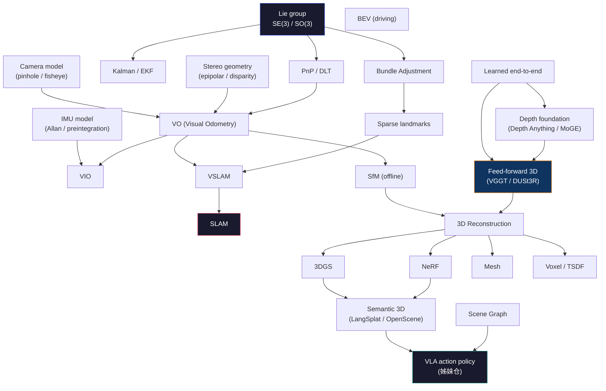

# Ontology — Spatial AI 領域學術 taxonomy

> **本文是 Spatial AI 領域的「概念骨架」** — 不是手冊章節指南（→ [`functional_map.md`](./functional_map.md)）；不是論文目錄（→ 各 zone overview）；不是失敗圖鑑（→ [`cross_zone_failure_atlas.md`](./cross_zone_failure_atlas.md)）。本文回答：**這個領域的概念是怎麼被分類的？它們之間什麼關係？**
>
> 適合：想搞清楚 SLAM / VIO / VO / SfM / NeRF / 3DGS / VGGT 這些詞**到底是什麼分類軸下的什麼**、它們互相是子集還是並列、為什麼一篇 paper 同時被叫好幾個名字。

---

## 60 秒總綱

Spatial AI 不是一個方法，是 **5 個正交軸的張量積**：

```
                Problem (做什麼)
                       ×
              Representation (用什麼存)
                       ×
                  Sensor (從哪來)
                       ×
                  Paradigm (怎麼算)
                       ×
                    Time (即時 / 離線 / 增量)
                       ↓
                一條具體的 "spatial AI" stack
```

當你看到一個方法名（ORB-SLAM3 / VGGT / FoundationPose / 3DGS），它在這 5 個軸上**都有一個座標**。學會用座標讀法，每篇 paper 都會分類自如。

---

## §1 · 5 個分類軸

| 軸 | 問什麼 | 取值範例 |
|---|---|---|
| **Problem** | 你想算出什麼？ | pose / map / depth / object 6D / 場景圖 / affordance |
| **Representation** | 結果用什麼數據結構存？ | sparse points / mesh / NeRF MLP / 3DGS / voxel / BEV / scene graph |
| **Sensor** | 從什麼物理訊號來？ | mono / stereo / RGB-D / IMU / LiDAR / event / sonar / radar / GNSS |
| **Paradigm** | 用什麼計算範式？ | geometric / filter / optimization / end-to-end learned / hybrid / generative |
| **Time** | 線上還是離線？增量還是 batch？ | online incremental / online streaming / offline batch / feed-forward one-shot |

5 個軸是**正交**的（沒有一個包含另一個），所以同一個方法可以在每個軸上單獨指認。

---

## §2 · Problem 軸

**最常見的混淆來自這軸** — VO / VIO / SLAM / VSLAM / SfM 都長得很像，但其實是父子集 + 並列的混合。

```
spatial AI problems
├── Localization (我在哪)
│   ├── VO    (Visual Odometry) — 單純從連續 image 推 pose，無 map
│   ├── VIO   (Visual-Inertial Odometry) — VO + IMU 融合，metric scale 回來了
│   ├── LIO   (LiDAR-Inertial Odometry) — LiDAR 替代相機
│   ├── Relocalization — 給定 map，重新定位
│   └── Place recognition — 「這場景我見過嗎？」（比 reloc 弱，沒 6-DoF）
│
├── Mapping (世界長怎樣)
│   ├── Sparse map — 3D landmarks (keypoints)
│   ├── Dense map — voxel / mesh / TSDF
│   ├── Semantic map — sparse/dense + per-element 標籤
│   └── Topological map — graph (節點=地點，邊=可達)
│
├── SLAM (= Localization + Mapping 同時)
│   ├── Visual SLAM (VSLAM) — 視覺主，可加 IMU (= VINS)
│   ├── LiDAR SLAM — LiDAR 主
│   ├── Multi-session SLAM — 多次跑同地，map 接力
│   └── Multi-agent SLAM — 多機共享 map（→ SG-Reg 之類）
│
├── Reconstruction (世界長得多漂亮)
│   ├── SfM (Structure from Motion) — 離線、batch、無 IMU
│   ├── MVS (Multi-View Stereo) — SfM 之後的 densify 步驟
│   ├── Feed-forward 3D — one-shot 從多 view 出 pose+depth+points (VGGT / DUSt3R)
│   ├── Novel-view synthesis — NeRF / 3DGS 為主任務
│   └── 4D reconstruction — 加時間軸 (4DGS / NeRF-T)
│
├── Tracking (東西去哪)
│   ├── Object 6-DoF pose tracking — 已知物體模型 (FoundationPose / MegaPose)
│   ├── Object 2D tracking — bounding box (SORT / ByteTrack)
│   ├── Pixel-level / point tracking — RAFT / CoTracker / TAP
│   ├── Optical flow — dense 2D motion field
│   └── Visual tracking (classical) — KCF / CSRT, no learning
│
├── Spatial reasoning (這場景什麼意思)
│   ├── VLM 空間 QA — 「杯子在桌子左邊嗎」(3DSRBench / BLINK)
│   ├── Scene graph — 物體 + 空間關係
│   ├── Affordance — 「這物體可以怎麼操作」
│   └── Open-vocabulary 3D — LangSplat / OpenScene
│
├── Pose estimation (孤立任務)
│   ├── Camera pose (PnP / DLT) — 給 2D-3D 對應算 6-DoF
│   ├── Human pose — body / hand / face landmarks
│   └── Object pose — instance / category-level
│
└── Action interface (→ VLA)
    ├── 3D feature cloud → policy
    ├── Goal/waypoint → planner
    └── Affordance → grasp planner
```

**關鍵子集關係**：
- VIO ⊂ VO（加 IMU）
- VSLAM ⊂ Localization + Mapping（VO 後加 mapping + loop closure）
- VINS = VIO + map = VSLAM with IMU
- SfM ⊂ Reconstruction（offline VSLAM 的離線批處理變體）
- VGGT 同時是 Reconstruction + 隱含的 Localization（它輸出 pose + depth + points）

---

## §3 · Representation 軸

```
              dense ←──────────────────────────────→ sparse
                │                                       │
   continuous   │ 3DGS  TSDF  voxel  mesh  occupancy   │ landmarks
   implicit     │ NeRF                                 │ keypoints
                │                                       │
   structured   │ BEV   scene graph                    │ feature cloud
```

| 表徵 | 是什麼 | 經典代表 | 何時選 |
|---|---|---|---|
| **Sparse landmarks** | 幾百到幾萬個 3D 點 + descriptor | ORB-SLAM3 / VINS | localization 主，map 小，CPU OK |
| **Feature cloud** | per-point semantic feature vector | DINOv2 lifted / OpenScene / LangSplat | 開放詞匯查詢 / VLA 接口 |
| **Voxel grid** | 規則 3D 網格 + occupancy 或 SDF | KinectFusion / Vox-Fusion | dense reconstruction，內存可控 |
| **TSDF** | Truncated SDF — voxel 存有符號距離 | KinectFusion / Voxblox | 高品質 mesh extract 用 |
| **Mesh** | 三角形面片 | open3d / Trimesh | 渲染 / 物理仿真 / VR |
| **Occupancy grid** | binary or probability per voxel | Octomap / 駕駛 occupancy net | 規劃 / collision check |
| **NeRF (implicit)** | MLP(x,y,z,d) → (RGB,σ) | NeRF / Instant-NGP / Mip-NeRF | 高品質 novel view，per-scene |
| **3DGS (explicit)** | N×(pos, scale, rot, color, opacity) Gaussians | 3DGS / Mip-Splatting | NeRF 級畫質 + 100× 渲染速度 |
| **BEV (driving)** | 鳥瞰圖 + heightmap channels | BEVFormer / Tesla occupancy | AD 路徑規劃，遠距 |
| **Scene graph** | 物體節點 + 空間關係邊 | ConceptGraphs / SG-Reg | LLM/VLM 友好 query |
| **Depth map** | per-pixel depth (相機坐標) | Depth Anything / MoGE / VGGT | feed-forward 中間結果 |

**正交於 problem 軸**：同一個 problem 可以用不同 representation（e.g., SLAM map 可以是 sparse landmarks **或** voxel **或** 3DGS）。

---

## §4 · Sensor 軸

**主光 / 主聲 / 主場 / 慣性**四個 modality 分類：

```
Sensor modality
├── Optical (主光)
│   ├── Passive
│   │   ├── Monocular RGB camera
│   │   ├── Stereo (passive baseline)
│   │   ├── Multi-camera array (Insta360 / GoPro 多視角)
│   │   └── Polarization camera
│   ├── Active
│   │   ├── Structured light (Kinect v1 / Realsense D435)
│   │   ├── ToF (Kinect v2 / iPhone LiDAR / Azure Kinect)
│   │   └── Active NIR (850 nm 主動投影紋理)
│   └── Specialty
│       ├── Event camera (DVS / DAVIS / Prophesee)
│       ├── Thermal IR (8-14 μm LWIR)
│       └── Hyperspectral
│
├── Inertial (慣性)
│   └── IMU = 3-axis accelerometer + 3-axis gyroscope (+ magnetometer = MARG)
│
├── Range / depth (距離直接)
│   ├── LiDAR (mechanical / solid-state / spinning)
│   ├── ToF (single-point / scanning)
│   ├── Ultrasonic (cm 級，cheap)
│   ├── mmWave radar (77/79 GHz, automotive)
│   └── FMCW radar (24 GHz / 60 GHz / 77 GHz)
│
├── Acoustic (聲學)
│   ├── Microphone array (beamforming)
│   ├── Multibeam sonar (marine 主圖)
│   ├── Side-scan sonar (海底紋理)
│   └── DVL (Doppler Velocity Log, marine 對地速度)
│
├── RF / EM (電磁 / 無線)
│   ├── GNSS / RTK (GPS / Galileo / BeiDou / GLONASS)
│   ├── UWB (室內 cm 級定位 anchor)
│   ├── WiFi-RTT (FTM-2nd-gen)
│   ├── Bluetooth AoA
│   └── Magnetometer (地磁場 yaw 校正)
│
└── Contact / proprioceptive (接觸 / 本體)
    ├── Force-torque sensor (wrist mounted)
    ├── Tactile (DIGIT / GelSight)
    ├── Joint encoder (機械臂 / 腿)
    └── Pressure (深度計 marine / 高度 aerial)
```

**Sensor 屬於物理層，跟 problem 軸獨立**：同一個 problem（如 VO）可以靠 mono 或 stereo 或 RGB-D；同一個 sensor（如 IMU）可以給 VIO 也可以給 LIO 也可以給 humanoid 全身平衡。

---

## §5 · Paradigm 軸

**算法範式** — 是用幾何 + 優化還是學習？

```
┌──────────────────────────────────────────────────────────┐
│  Geometric / classical (基於幾何 + 標定 + 優化)            │
│  ├── Filter-based                                         │
│  │   ├── KF (Kalman Filter)                              │
│  │   ├── EKF (Extended) — 非線性，第一階 Taylor          │
│  │   ├── UKF (Unscented) — sigma point，避 Jacobian     │
│  │   ├── MSCKF (Multi-State Constraint) — OpenVINS      │
│  │   └── Particle filter — non-Gaussian                  │
│  ├── Optimization-based                                   │
│  │   ├── Bundle Adjustment (BA) — 全局 reprojection      │
│  │   ├── Factor graph (GTSAM / iSAM2)                    │
│  │   ├── Pose graph optimization                          │
│  │   └── Sparse non-linear solvers (Ceres / g2o)         │
│  └── Closed-form                                          │
│      ├── PnP (P3P / EPnP) — 2D-3D → pose                 │
│      ├── DLT (Direct Linear Transform)                    │
│      ├── 8-point algorithm (essential matrix)             │
│      └── ICP (Iterative Closest Point)                    │
│                                                            │
│  Learned / data-driven (端到端神經網絡)                    │
│  ├── End-to-end                                           │
│  │   ├── DROID-SLAM — 學 BA layer                        │
│  │   ├── VGGT / DUSt3R — feed-forward 多 view → pose+depth│
│  │   └── NeuralRecon — voxel + neural surface             │
│  ├── Feature learning                                     │
│  │   ├── SuperPoint / DISK — learned keypoint+descriptor │
│  │   ├── LoFTR / LightGlue — detector-free matching      │
│  │   └── R2D2 / SiLK                                      │
│  ├── Depth foundation                                     │
│  │   ├── Depth Anything (v1/v2) — relative depth         │
│  │   ├── Metric3D — metric scale                          │
│  │   ├── MoGE — 多任務 geometry foundation               │
│  │   └── FoundationStereo                                │
│  └── Pose foundation                                      │
│      ├── FoundationPose / MegaPose — 6-DoF object        │
│      └── PoseDiffusion                                   │
│                                                            │
│  Hybrid (學習 + 幾何混合)                                  │
│  ├── Learned front-end + classical back-end              │
│  │   ├── SuperGlue+VINS                                  │
│  │   └── LightGlue+COLMAP                                │
│  ├── Differentiable rendering                             │
│  │   ├── NeRF (MLP + volume rendering + GD)              │
│  │   └── 3DGS (Gaussian + rasterization + GD)            │
│  └── Differentiable simulation                            │
│      ├── MuJoCo MJX (XLA-JIT)                            │
│      └── NVIDIA Warp                                      │
│                                                            │
│  Generative (生成式)                                       │
│  ├── Video diffusion as 3D prior — Sora / Genie          │
│  ├── World models — Wayve GAIA / Cosmos                  │
│  └── 3D diffusion — Zero123 / Wonder3D                   │
└──────────────────────────────────────────────────────────┘
```

**Paradigm 跟 Problem / Representation 全正交**：同一個 problem（如 VSLAM）可以用 geometric（ORB-SLAM3）、learned（DROID-SLAM）、hybrid（GS-SLAM）三種範式做。

---

## §6 · Time 軸

| 模式 | 特徵 | 代表 |
|---|---|---|
| **Incremental online** | 每幀來就更新 state；增加 / 刪除 keyframe | ORB-SLAM3 / VINS-Fusion / OpenVINS |
| **Streaming online** | 每幀來就出結果，狀態固定大小 | EKF-VIO / MSCKF / LIO |
| **Sliding-window** | 維護最近 N 幀的 state，舊的 marginalize | VINS-Fusion / OpenVINS（也算 streaming）|
| **Offline batch** | 所有 image 一起進去，跑到最優 | COLMAP / OpenMVG / SfM 經典 |
| **Feed-forward one-shot** | 多 view 一次性 → output（無增量 / 無優化）| VGGT / DUSt3R / MoGE |
| **Per-scene optimization** | 一個場景訓一次 model | NeRF / 3DGS / LERF / LangSplat |

---

## §7 · 跨軸座標表 — 代表方法在 5 軸上的座標

| 方法 | Problem | Representation | Sensor | Paradigm | Time |
|---|---|---|---|---|---|
| **ORB-SLAM3** | VSLAM + reloc + multi-session | sparse landmarks + keyframe graph | mono / stereo / RGB-D + IMU optional | geometric + ORB feature + BA | incremental online |
| **VINS-Fusion** | VIO + GPS fusion | sparse + IMU bias state | mono + IMU + GNSS optional | geometric + factor graph | sliding-window online |
| **OpenVINS** | VIO | sparse + 21-state aug | mono / stereo + IMU | MSCKF (filter) | streaming online |
| **DROID-SLAM** | VO / VSLAM | dense flow + pose graph | mono + IMU optional | learned end-to-end + diff BA | online (GPU 需) |
| **VGGT** | Feed-forward 3D | pose + depth + point cloud (all dense) | multi-view RGB | learned end-to-end | feed-forward one-shot |
| **DUSt3R / MASt3R** | Two-view → 3D | dense point cloud | 2 RGB images | learned end-to-end | feed-forward one-shot |
| **Depth Anything v2** | Depth estimation | per-pixel depth map | single RGB | learned end-to-end (relative) | feed-forward |
| **MoGE** | Multi-task geometry | depth + normal + segmentation | RGB | learned (foundation) | feed-forward |
| **COLMAP** | SfM | sparse → MVS dense | image collection | geometric BA + MVS | offline batch |
| **NeRF** | Novel-view synthesis | implicit MLP field | RGB + poses (from COLMAP) | hybrid (MLP + diff render) | per-scene optimization |
| **3DGS** | Novel-view synthesis | explicit Gaussian set | RGB + poses (from COLMAP) | hybrid (Gaussian + diff rasterize) | per-scene optimization |
| **LangSplat** | Open-vocab 3D | 3DGS + CLIP feature field | RGB + CLIP teacher | hybrid + distillation | per-scene |
| **OpenScene** | Open-vocab 3D | voxel + CLIP feature | RGB-D | zero-shot CLIP fusion | streaming or batch |
| **FoundationPose** | Object 6-DoF pose | mesh template + RGB-D | RGB-D + object mesh | learned + diff render refine | online |
| **MegaPose** | Object 6-DoF pose (unseen) | rendered template hypothesis | RGB + mesh | learned coarse + refine | online |
| **RAFT** | Optical flow | dense per-pixel 2D flow | 2 RGB frames | learned iterative refine | feed-forward |
| **CoTracker** | Point tracking | per-point trajectory | video | learned transformer | online |
| **ByteTrack** | Multi-object 2D tracking | bbox + ID | detection input | data association + Kalman | streaming online |
| **EKF (from scratch)** | VIO 基線 | 15-state vector + covariance | IMU + camera measurements | filter (EKF) | streaming online |
| **Min-snap** | Trajectory generation | polynomial pieces + waypoints | (no sensor, planner) | optimization (QP) | offline |

---

## §8 · 概念依賴圖



---

## §9 · 60+ term glossary

> 一行定義 + 在 handbook 何處深拆。

### 9.1 · Math / Geometry

| Term | 一句話 | 深拆 |
|---|---|---|
| **SE(3)** | 6-DoF rigid transformation group (rotation + translation) | [`foundations/spatial-math/se3_so3_lie_groups_primer.md`](../foundations/spatial-math/se3_so3_lie_groups_primer.md) |
| **SO(3)** | 3D rotation group (沒平移) | 同上 |
| **so(3)** | SO(3) 的 Lie algebra（skew-symmetric matrices）| 同上 |
| **Lie group** | smooth manifold + group operation；機器人 pose 的代數結構 | 同上 |
| **Exponential map** | algebra → group (e^ξ̂ → SE(3))；preintegration 核心 | [`imu_preintegration_math.md`](../foundations/spatial-math/imu_preintegration_math.md) |
| **Quaternion** | 4D unit-norm rotation representation；無 gimbal lock | [`rotation_intuition_primer.md`](../foundations/spatial-math/rotation_intuition_primer.md) |
| **6D rotation rep** | Zhou 2019：DL regression 用 6D 比 quat / euler 收斂好 | [`rotation_reps_in_deep_learning_primer.md`](../foundations/spatial-math/rotation_reps_in_deep_learning_primer.md) |
| **Manifold** | 局部歐氏，全局彎曲；SO(3) / SE(3) 都是 | 同 SE(3) |
| **Tangent space** | manifold 上某點的線性化（用來算梯度）| 同上 |
| **Jacobian (on manifold)** | manifold 上的 right/left Jacobian for retraction | 同上 |
| **Rodrigues formula** | axis-angle → rotation matrix 公式 | 同 quaternion |
| **Bundle Adjustment** | joint optimize poses + landmarks，min reprojection | [`bundle_adjustment.md`](../foundations/spatial-math/bundle_adjustment.md) |
| **Factor graph** | bipartite graph of variables + factors；GTSAM 主數據結構 | [`pose_graph_optimization.md`](../foundations/spatial-math/pose_graph_optimization.md) |
| **Schur complement** | 解 BA Hessian 時邊化掉 landmark 用的線性代數 | [`bundle_adjustment.md`](../foundations/spatial-math/bundle_adjustment.md) |
| **Marginalization** | 從 state 裡去掉舊變量保留信息（sliding window 必需）| [`bayesian_filtering_ekf_msckf.md`](../foundations/spatial-math/bayesian_filtering_ekf_msckf.md) |
| **iSAM / iSAM2** | incremental factor graph solver | 同 factor graph |
| **Gauss-Newton / Levenberg-Marquardt** | non-linear LSQ 的兩個經典 solver | 同 BA |

### 9.2 · Sensor physics

| Term | 一句話 | 深拆 |
|---|---|---|
| **IMU** | accel + gyro (+ mag = MARG)；6-axis 或 9-axis | [`imu_physics_and_noise_model.md`](../foundations/sensor-physics/imu_physics_and_noise_model.md) |
| **Allan variance** | IMU noise 的標準化測量（bias instability / random walk）| [`sensor_noise_modeling_allan_variance.md`](../foundations/sensor-physics/sensor_noise_modeling_allan_variance.md) |
| **IMU preintegration** | 把 IMU 數據壓成 keyframe 間的 delta，避免每 step 重算 | [`imu_preintegration_math.md`](../foundations/spatial-math/imu_preintegration_math.md) |
| **Bias (IMU)** | 慣性測量的 DC offset；隨溫度 / 時間漂移 | 同上 |
| **Rolling shutter** | CMOS 逐行曝光 → 動態時幾何畸變 | [`rolling_vs_global_shutter.md`](../foundations/sensor-physics/rolling_vs_global_shutter.md) |
| **Global shutter** | 全幀同時曝光；無 RS 偽影；機器人首選 | 同上 |
| **Pinhole camera** | 最簡相機模型（focal + principal point）| [`stereo_camera_geometry_physics.md`](../foundations/sensor-physics/stereo_camera_geometry_physics.md) |
| **Fisheye / equidistant** | 廣角畸變模型；FOV &gt; 120° 用 | 同上 |
| **Distortion model** | Brown-Conrady (徑向 + 切向) / Mei / KB | 同上 |
| **Disparity** | 立體匹配的水平偏移；換 depth 用 baseline / disparity | [`classical_stereo_primer.md`](../foundations/depth-foundation/classical_stereo_primer.md) |
| **Baseline** | stereo 兩相機距離；越長 depth 越準但 occlusion 越多 | 同上 |
| **ToF (Time-of-Flight)** | 主動發光 + 量飛行時間 → depth | [`tof_physics_for_embodied_ai.md`](../foundations/sensor-physics/tof_physics_for_embodied_ai.md) |
| **Event camera (DVS)** | 像素級異步亮度變化事件流；高速 / HDR 利器 | [`event_camera_dvs_physics.md`](../foundations/sensor-physics/event_camera_dvs_physics.md) |
| **LiDAR** | 激光距離 + 反射強度；mechanical / solid-state | （見 sensor-physics zone）|
| **mmWave radar** | 60-77 GHz；穿霧 / 雨 / 灰塵；分辨率比 LiDAR 低 | [`mmwave_radar_physics_for_ad.md`](../foundations/sensor-physics/mmwave_radar_physics_for_ad.md) |
| **GNSS / RTK** | 衛星定位；RTK 載波相位 cm 級 | [`gnss_multi_constellation_rtk.md`](../foundations/sensor-physics/gnss_multi_constellation_rtk.md) |
| **UWB** | 室內 anchor 系統 cm 級 ToF | [`uwb_ultra_wideband_positioning.md`](../foundations/sensor-physics/uwb_ultra_wideband_positioning.md) |
| **DVL (Doppler Velocity Log)** | 水下 marine 用聲波測對地速度 | [`underwater_sonar_physics.md`](../foundations/sensor-physics/underwater_sonar_physics.md) |
| **Calibration (intrinsic)** | 相機自己的參數（focal / dist）| [`sensor_calibration_drift_in_production.md`](../deployment/calibration/sensor_calibration_drift_in_production.md) |
| **Calibration (extrinsic)** | sensor 間的相對 pose（cam ↔ IMU ↔ LiDAR）| 同上 |
| **Time sync (PTP / trigger / sw)** | 多 sensor 對時；hardware trigger 是金本位 | [`hardware_trigger_vs_ptp_vs_software.md`](../deployment/multi-modal-sync/hardware_trigger_vs_ptp_vs_software.md) |

### 9.3 · SLAM / Estimation

| Term | 一句話 | 深拆 |
|---|---|---|
| **VO (Visual Odometry)** | 連續 image → 相對 pose；無 map，無 loop closure | （見 classical-slam zone）|
| **VIO (Visual-Inertial Odometry)** | VO + IMU；找回 metric scale + 提升 robustness | [`embodiments/aerial/vio/overview.md`](../embodiments/aerial/vio/overview.md) |
| **VINS** | Visual-Inertial Navigation System = VIO 完整工程實作 | [`vins_mono_fusion_dissection.md`](../embodiments/aerial/vio/vins_mono_fusion_dissection.md) |
| **SLAM** | Simultaneous Localization And Mapping | （見 classical-slam / pose-tracking）|
| **VSLAM** | Visual SLAM；camera 主，可加 IMU | [`orb_slam3_dissection.md`](../foundations/classical-slam/orb_slam3_dissection.md) |
| **Loop closure** | 「我回到老地方了」→ 全局優化矯正 drift | 同上 |
| **Relocalization** | 給 map + 一幀 → 在 map 裡定位 | 同上 |
| **Place recognition** | 「這場景我見過嗎」（bag-of-words / NetVLAD）| 同上 |
| **Keyframe** | 選代表幀做 mapping anchor；省計算 | 同上 |
| **MSCKF** | Multi-State Constraint KF — OpenVINS 用，CPU 友好 | [`openvins_dissection.md`](../embodiments/aerial/vio/openvins_dissection.md) |
| **EKF-SLAM** | extended KF state 含 robot + landmarks；scale 差 | [`bayesian_filtering_ekf_msckf.md`](../foundations/spatial-math/bayesian_filtering_ekf_msckf.md) |
| **Graph SLAM** | pose 之間用 factor graph 表達，全局優化 | [`pose_graph_optimization.md`](../foundations/spatial-math/pose_graph_optimization.md) |
| **Atlas (multi-map)** | ORB-SLAM3 的多 session map 合併機制 | [`orb_slam3_dissection.md`](../foundations/classical-slam/orb_slam3_dissection.md) |
| **Sliding window** | 只保留最近 N 幀；舊的 marginalize | [`vins_mono_fusion_dissection.md`](../embodiments/aerial/vio/vins_mono_fusion_dissection.md) |
| **Tight vs loose coupling** | sensor 融合在 state space 內（tight）還是後處理（loose）| 同上 |

### 9.4 · 3D Representation

| Term | 一句話 | 深拆 |
|---|---|---|
| **NeRF** | MLP(x,y,z,d) → (RGB, σ)；volume rendering | [`nerf_original_dissection.md`](../foundations/nerf-family/nerf_original_dissection.md) |
| **3DGS** | N×Gaussian primitives 顯式表徵 | [`3dgs_original_dissection.md`](../foundations/3dgs-family/3dgs_original_dissection.md) |
| **Instant-NGP** | NeRF + multi-resolution hash grid → 秒級訓練 | [`instant_ngp_dissection.md`](../foundations/nerf-family/instant_ngp_dissection.md) |
| **Mip-NeRF / Mip-Splatting** | 多尺度抗鋸齒版本 | [`mip_nerf_360_dissection.md`](../foundations/nerf-family/mip_nerf_360_dissection.md) |
| **TSDF** | Truncated Signed Distance Field；voxel 存有符號距離 | （見 sensor-physics + classical-slam）|
| **Voxel grid** | 規則 3D 格子；KinectFusion / Octomap | 同上 |
| **Occupancy grid** | binary or probability per voxel | [`embodiments/driving/bev_and_occupancy.md`](../embodiments/driving/bev_and_occupancy.md) |
| **Mesh** | 三角形面片；可從 TSDF marching cube 得 | （見 generative-3d-sim）|
| **BEV** | bird's-eye-view；driving stack 標配 | [`embodiments/driving/bev_and_occupancy.md`](../embodiments/driving/bev_and_occupancy.md) |
| **Scene graph** | 物體節點 + 空間關係邊；planner 友好 | [`semantic-3d/overview.md`](../foundations/semantic-3d/overview.md) |
| **Feature cloud** | per-point CLIP/DINOv2 feature；語義可查詢 | 同上 |

### 9.5 · Modern foundation (2023-2026)

| Term | 一句話 | 深拆 |
|---|---|---|
| **VGGT** | CVPR 2025 best paper；feed-forward 多 view → pose + depth + tracks | [`vggt_cvpr2025_dissection.md`](../foundations/feed-forward-3d/vggt_cvpr2025_dissection.md) |
| **DUSt3R / MASt3R** | Naver Labs；two-view → dense point cloud | [`feed-forward-3d/overview.md`](../foundations/feed-forward-3d/overview.md) |
| **MapAnything** | Meta；feed-forward 3D 通用 | [`mapanything_dissection.md`](../foundations/feed-forward-3d/mapanything_dissection.md) |
| **Depth Anything** | ByteDance；relative depth foundation | [`depth_anything_v2_dissection.md`](../foundations/depth-foundation/depth_anything_v2_dissection.md) |
| **Metric3D** | metric scale depth foundation | [`metric3d_dissection.md`](../foundations/depth-foundation/metric3d_dissection.md) |
| **MoGE** | Microsoft；multi-task geometry foundation (depth + normal + seg) | [`moge_dissection.md`](../foundations/depth-foundation/moge_dissection.md) |
| **FoundationStereo** | NVIDIA；stereo 的 foundation model | [`foundationstereo_dissection.md`](../foundations/depth-foundation/foundationstereo_dissection.md) |
| **FoundationPose** | NVIDIA；6-DoF object pose foundation | [`foundation_pose_dissection.md`](../foundations/pose-tracking/foundation_pose_dissection.md) |
| **LangSplat** | CVPR 2024；3DGS + language feature distillation | [`langsplat_dissection.md`](../foundations/semantic-3d/langsplat_dissection.md) |
| **OpenScene** | CVPR 2023；voxel + CLIP，無 per-scene 訓練 | [`openscene_dissection.md`](../foundations/semantic-3d/openscene_dissection.md) |

### 9.6 · Tracking

| Term | 一句話 | 深拆 |
|---|---|---|
| **RAFT** | learned optical flow，iterative refinement | [`raft_optical_flow.md`](../foundations/pose-tracking/raft_optical_flow.md) |
| **CoTracker / TAP** | 任意點長時跟蹤 | [`cotracker_and_tap_dissection.md`](../foundations/pose-tracking/cotracker_and_tap_dissection.md) |
| **KCF / CSRT** | 經典 visual tracker；OpenCV-shipped | [`classical_visual_tracking_kcf_csrt.md`](../foundations/pose-tracking/classical_visual_tracking_kcf_csrt.md) |
| **SORT / ByteTrack** | 2D 多物體跟蹤（IoU + Kalman）| [`sort_bytetrack_mot_dissection.md`](../foundations/pose-tracking/sort_bytetrack_mot_dissection.md) |
| **MegaPose / FoundationPose** | unseen object 6-DoF pose | [`megapose_dissection.md`](../foundations/pose-tracking/megapose_dissection.md) |

### 9.7 · Embodiment / Deployment

| Term | 一句話 | 深拆 |
|---|---|---|
| **SWaP-C** | Size, Weight, Power, Cost — 機器人 sensor 選型四維 | [`sensor_selection_decision_matrix.md`](../foundations/sensor-physics/sensor_selection_decision_matrix.md) |
| **Onboard compute** | 機器人本機 SoC（Jetson / Snapdragon / Orin）| [`edge_inference_budget_engineering.md`](../deployment/compute-budget/edge_inference_budget_engineering.md) |
| **Calibration drift** | 標定參數半年後因溫度 / 振動失效 | [`sensor_calibration_drift_in_production.md`](../deployment/calibration/sensor_calibration_drift_in_production.md) |
| **Latency budget** | 從 sensor → action 的端到端時延上限 | [`embodiments/aerial/real_flight_production_gotchas.md`](../embodiments/aerial/real_flight_production_gotchas.md) |
| **State rate** | 估計輸出頻率；aerial 要 ≥ 100 Hz | 同上 |
| **Min-snap** | 4 階導數最小的多項式 trajectory（HKUST 經典）| [`min_snap_dissection.md`](../embodiments/aerial/planning/min_snap_dissection.md) |
| **Cascaded controller** | aerial：position → attitude → motor 多層 PID | [`dynamics_and_control_primer.md`](../embodiments/aerial/dynamics_and_control_primer.md) |

---

## §10 · 邊界 — 什麼不在 spatial AI 範圍

| 不算 spatial AI | 為什麼 | 去哪找 |
|---|---|---|
| 2D 物體檢測 (Faster R-CNN 等) | 沒 3D 輸出 | classical CV 課程 |
| 純語言 reasoning (LLM) | 沒空間理解 | LLM 文獻 |
| Image classification | 沒幾何 | classical DL |
| Speech / NLP | 不同 modality | 各自領域 |
| VLA action policy | 是 spatial AI 的 **下游消費者**，不是它 | 姊妹仓 [VLA-Handbook](https://github.com/sou350121/VLA-Handbook) |
| 純 reinforcement learning policy | 沒 spatial state | RL 文獻 |
| Pure object 6-DoF pose（離 SLAM）| 灰色帶 — 我們收 FoundationPose 等，因為它跟 manipulation 直接相連 | [`pose-tracking/`](../foundations/pose-tracking/) |

---

## §11 · 跨參考

| Want | 去 |
|---|---|
| 看每個 zone 寫什麼 | [`functional_map.md`](./functional_map.md) |
| 看 42 個工具的生死 | [`cross_zone_failure_atlas.md`](./cross_zone_failure_atlas.md) |
| 看 NeRF / 3DGS / SfM / VGGT 範式轉變時間線 | [`timeline.md`](./timeline.md) |
| 看不同 representation 對比 | [`representation_comparison.md`](./representation_comparison.md) |
| 看每個 zone 入口 | [`foundations/overview.md`](../foundations/overview.md) |
| 從場景找入口 | [`../ONBOARDING.md`](../ONBOARDING.md) |

---

*Last updated: 2026-05-24 · 5 axes / 60+ terms / 全 handbook 概念骨架·配合 functional_map 讀。*
