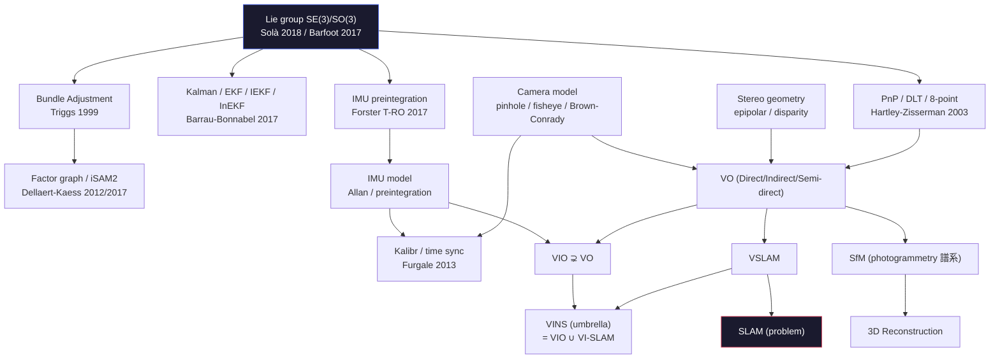

# Ontology — Spatial AI 領域學術 taxonomy (v2 · 4-expert reviewed)

> **本文是 Spatial AI 領域的「概念骨架」** — 不是手冊章節指南（→ [`functional_map.md`](./functional_map.md)）；不是論文目錄（→ 各 zone overview）；不是失敗圖鑑（→ [`cross_zone_failure_atlas.md`](./cross_zone_failure_atlas.md)）。
>
> **本文回答**：這個領域的概念是怎麼被分類的？它們之間什麼關係？什麼是子集 / 什麼是並列 / 什麼是同義？
>
> **v2 (2026-05-24)**: 經 4 個方向專家 (Classical SLAM / Modern 3D Foundation / 3D Representation / Sensor+Embodiment) 並行 review 後重寫，新增 canonical references、子分類、跨 embodiment matrix、3 條 lineage diagram、修正 VO/VIO subset 方向。

---

## 60 秒總綱

Spatial AI 不是一個方法，是 **5 個正交軸的張量積**：

```
                Problem (做什麼)
                       ×
              Representation (用什麼存)
                       ×
                  Sensor (從哪來)
                       ×
                  Paradigm (怎麼算)
                       ×
                    Time (即時 / 離線 / 增量)
                       ↓
                一條具體的 spatial AI stack
```

當你看到一個方法名（ORB-SLAM3 / VGGT / FoundationPose / 3DGS），它在這 5 個軸上**都有一個座標**。學會用座標讀法，每篇 paper 都自如分類。

**領域權威 survey**：Cadena, Carlone, Carrillo, Latif, Scaramuzza, Neira, Reid, Leonard (2016). "Past, Present, and Future of SLAM: Towards the Robust-Perception Age." IEEE T-RO. — 整個 SLAM taxonomy 的標桿。

---

## §1 · 5 個分類軸

| 軸 | 問什麼 | 取值範例 |
|---|---|---|
| **Problem** | 你想算出什麼？ | pose / map / depth / object 6D / scene graph / affordance |
| **Representation** | 結果用什麼數據結構存？ | sparse points / mesh / NeRF MLP / 3DGS / voxel / BEV / scene graph |
| **Sensor** | 從什麼物理訊號來？ | mono / stereo / RGB-D / IMU / LiDAR / event / sonar / radar / GNSS |
| **Paradigm** | 用什麼計算範式？ | geometric / filter / optimization / learned / hybrid / generative |
| **Time** | 線上還是離線？增量還是 batch？ | filter streaming / fixed-lag smoother / batch / feed-forward / per-scene |

5 個軸是**正交**的（沒有一個包含另一個），所以同一個方法可以在每個軸上單獨指認。

---

## §2 · Problem 軸

**SLAM 一詞同時指問題與方法類**：本文用 SLAM 指**問題**（joint estimation of state + map + global consistency），VSLAM / LIO-SLAM 指**方法**（具體解法）。

```
spatial AI problems
├── Localization (我在哪 — 不包含 mapping)
│   ├── VO    (Visual Odometry) — 連續 image → 相對 pose；無 global map、無 loop closure
│   │   │      drift 線性累積（per-frame error ~0.5-2%）
│   │   ├── Direct VO        — photometric error (DSO / LSD-SLAM, Engel 2018/2014)
│   │   ├── Indirect VO      — reprojection error of keypoints (ORB-SLAM / VINS)
│   │   └── Semi-direct VO   — SVO (Forster ICRA 2014)
│   ├── VIO   (Visual-Inertial Odometry) — VO ⊊ VIO：在 VO 之上加 IMU 因子；scale + roll/pitch 由 IMU 鎖死
│   ├── LIO   (LiDAR-Inertial Odometry) — LiDAR 替代相機
│   ├── Relocalization — 給定 map，重新定位（典型 pipeline: place recognition → geometric verification → PnP+RANSAC）
│   └── Place recognition — image-level similarity，**reloc pipeline 的第一階段**，不是 reloc 的「弱版本」
│       └── DBoW2 / DBoW3 (Gálvez-López & Tardós 2012) / NetVLAD (Arandjelović 2016) / HF-Net / HLOC (Sarlin 2019/2020)
│
├── Mapping (世界長怎樣)
│   ├── 三個正交內部軸：density (sparse↔dense) / content (geometric↔semantic) / structure (metric↔topological)
│   ├── 三軸正交 → 「sparse semantic topological map」是合法組合
│   ├── Sparse map — 3D landmarks (keypoints + descriptors)
│   ├── Dense map — voxel / mesh / TSDF / occupancy
│   ├── Semantic map — 任何 density + per-element class label
│   └── Topological map — graph (節點=地點，邊=可達)
│
├── SLAM (= Localization + Mapping + Global consistency 同時)
│   ├── Visual SLAM (VSLAM) — camera 主，可加 IMU
│   │   ├── VINS = Visual-Inertial Navigation System — **umbrella term**，涵蓋 VIO + VI-SLAM
│   │   │       VINS-Mono / VINS-Fusion 內含 loop closure → 屬於 VI-SLAM
│   │   ├── ORB-SLAM3 — visual + visual-inertial + multi-map (Atlas)
│   │   └── DSO / LSD-SLAM — direct VO（嚴格說 DSO 無 loop closure，不是完整 SLAM）
│   ├── LIO-SLAM (LiDAR Inertial SLAM) — LIO-SAM / FAST-LIO2 / R3LIVE
│   ├── Multi-session SLAM — 多次跑同地，map 接力
│   └── Multi-agent SLAM — 多機共享 map（→ SG-Reg / Hydra-Multi 之類）
│
├── Initialization (是 VIO / SLAM 內部一個 subfield)
│   ├── Static init — IMU 不動，從重力反推 roll/pitch + accel bias
│   ├── Dynamic / motion-based init — visual SfM + IMU alignment (Qin & Shen 2017 VINS-Mono)
│   ├── Stereo / RGB-D bootstrap — 有 metric depth，初始化簡化
│   └── Loosely-coupled vs tightly-coupled init
│
├── Reconstruction (世界長得多漂亮 — offline / multi-view)
│   ├── SfM (Structure from Motion) — **photogrammetry 譜系（1980s+）**；offline batch；no IMU；**not** offline VSLAM
│   ├── MVS (Multi-View Stereo) — SfM 之後的 densify 步驟
│   ├── Feed-forward 3D — one-shot 多 view → pose+depth+points（詳見 §5 / §9.5）
│   ├── Novel-view synthesis — NeRF / 3DGS 為主任務
│   └── 4D reconstruction — 加時間軸 (4DGS / D-NeRF / MonST3R)
│
├── Tracking (東西去哪)
│   ├── Object 6-DoF pose tracking — 已知物體模型 (FoundationPose / MegaPose)
│   ├── Object 2D tracking — bounding box (SORT / ByteTrack)
│   ├── Pixel-level / point tracking — CoTracker / TAP
│   ├── Optical flow — RAFT (Teed & Deng ECCV 2020)
│   └── Visual tracking (classical) — KCF / CSRT, no learning
│
├── Spatial reasoning (這場景什麼意思)
│   ├── VLM 空間 QA — 「杯子在桌子左邊嗎」(3DSRBench / BLINK)
│   ├── Scene graph reasoning — 物體 + 空間關係
│   ├── Affordance — 「這物體可以怎麼操作」
│   └── Open-vocabulary 3D — LangSplat / OpenScene
│
├── Pose estimation (孤立任務 / 不需序列)
│   ├── Camera pose (PnP / DLT) — 給 2D-3D 對應算 6-DoF
│   ├── Human pose — body / hand / face landmarks
│   └── Object pose — instance / category-level / unseen
│
└── Action interface (→ VLA)
    ├── 3D feature cloud → policy
    ├── Goal/waypoint → planner
    └── Affordance → grasp planner
```

**子集關係 (corrected)**：

| 關係 | 說明 |
|---|---|
| VO ⊊ VIO | VIO 嚴格擴展 VO 的 state，加入 IMU 因子。**箭頭方向是「VIO 包含 VO 作為退化情形」** |
| VSLAM = SLAM ∩ {camera as primary sensor} | 不是 ⊂，是「camera-主導 SLAM 方法的子類」 |
| VINS = {VIO} ∪ {VI-SLAM} | VINS 是 umbrella term，**不是公式**；包括 VIO（無 loop closure）與 VI-SLAM（有 loop closure） |
| SfM ≠ offline VSLAM | 不同學術譜系：SfM 來自 photogrammetry (1980s+)，VSLAM 來自 robotics (1990s+)。共享 BA 工具但**動機與系統範疇不同** |
| Place recognition ⊂ reloc 的第一階段 | 不是 reloc 的「弱版本」 |
| VGGT 同時佔 Reconstruction + Localization + Tracking | 多任務 synergy 是它的核心論點（Wang et al. CVPR 2025 best paper） |

---

## §3 · Representation 軸

**警告：這軸最容易混淆**。原因：實際上有 **7 個正交內部子軸**，常見表述把它們扁平化導致誤解（e.g., NeRF 被叫「continuous + implicit」、3DGS 被叫「explicit + dense」 — 兩者本質上都是 **volumetric radiance field**，只是 basis function 不同：MLP vs anisotropic Gaussian）。

### §3.1 · 7 個正交子軸

| 子軸 | Pole A | Pole B |
|---|---|---|
| **Density** | sparse (landmarks) | dense (voxel / radiance field) |
| **Storage** | explicit (data stored) | implicit (function evaluated) |
| **Geometry type** | surface (2-manifold in R³) | volume (3D scalar/vector field) |
| **Sampling** | discrete | continuous |
| **Topology** | regular grid | irregular set (point cloud / mesh / graph) |
| **Time** | static | dynamic |
| **Content** | geometric only | semantic (含 feature / label) |

### §3.2 · 主要表徵的 7-軸座標

| 表徵 | Density | Storage | Geometry | Sampling | Topology | Time | Content |
|---|:---:|:---:|:---:|:---:|:---:|:---:|:---:|
| **Sparse landmarks** | sparse | explicit | implicit surface | discrete | irregular | static | geom |
| **Point cloud** | varies | explicit | surface/points | discrete | irregular | static | either |
| **Mesh** | varies | explicit | **surface (2-mfld)** | discrete | irregular | static | geom |
| **Voxel grid (general)** | dense | explicit | volume | discrete | regular | static | either |
| **TSDF (Curless-Levoy 1996)** | dense | explicit | volume (surface at d=0) | discrete | regular | static | geom |
| **Occupancy grid** | dense | explicit | volume (surface at p=0.5) | discrete | regular | static | geom/sem |
| **NeRF (Mildenhall 2020)** | dense | implicit | volume (radiance + density) | continuous | (MLP, no topology) | static | radiance |
| **3DGS (Kerbl 2023)** | dense | explicit | volume (radiance + density) | continuous (alpha-blend) | irregular set of Gaussians | static | radiance |
| **NeuS / VolSDF (NeurIPS 2021)** | dense | implicit | **surface (zero-level-set)** | continuous | (MLP) | static | geom |
| **Plenoxels (Yu 2022)** | dense | explicit | volume | continuous | sparse voxel + SH | static | radiance |
| **Instant-NGP (Müller 2022)** | dense | explicit (hash) + implicit (MLP) | volume | continuous | multi-res hash | static | radiance |
| **BEV map** | dense | explicit | volume → 2D projection | discrete | regular 2D grid | varies | either |
| **Scene graph** | sparse | explicit | abstract | discrete | graph | static | semantic |
| **Feature cloud (OpenScene)** | sparse | explicit | (points + feat vectors) | discrete | irregular | static | semantic |
| **Feature field (LERF / LangSplat)** | dense | implicit (or 3DGS-explicit) | volume of features | continuous | (function) | static | semantic |
| **Depth map** | dense | explicit | 2.5D image-space | discrete | regular 2D | varies | geom |

### §3.3 · Voxel ≠ TSDF ≠ Occupancy ≠ Density — 都是「voxel grid」但存不同 scalar field

| 變體 | 每 voxel 存 | Surface 隱含於 | 用途 | 代表 |
|---|---|---|---|---|
| **Occupancy** | p ∈ [0,1] (or log-odds ℓ ∈ R) | p = 0.5 | planning / collision | Octomap / Tesla Occupancy Net |
| **TSDF** | (d, w) — signed distance + weight | d = 0 | high-quality mesh extract | KinectFusion / Voxblox |
| **Density** | σ ∈ R₊ | (sample-based render) | volume rendering | Plenoxels / Instant-NGP |
| **SH radiance** | SH coefficients per voxel | (render) | view-dependent color | Plenoxels |

### §3.4 · BEV ≠ Occupancy Network — 不同維度

| 表徵 | 維度 | 經典 |
|---|---|---|
| **LSS (Lift-Splat-Shoot)** | (x, y) → C-channel | Philion ECCV 2020 |
| **BEVFormer** | (x, y) → C-channel via attention | Li ECCV 2022 |
| **BEVFusion** | LSS + LiDAR voxel fused at BEV stage | Liu ICRA 2023 |
| **Occupancy Network (Tesla 2022 / OccFormer ICCV 2023)** | **(x, y, z) → class** — true 3D, not BEV | Tesla AI Day 2022 / Zhang ICCV 2023 |

### §3.5 · 5 種 Scene Graph

| Scene Graph 變體 | 是什麼 | 代表 |
|---|---|---|
| **3D Scene Graph (Armeni 2019 ICCV)** | hierarchical (building→room→object)，offline | Armeni et al. |
| **Image SGG** | 2D, `<subj, rel, obj>` predicates，**not 3D** | Xu CVPR 2017 等 |
| **ConceptGraphs (Gu ICRA 2024)** | open-vocab，LLM-grounded，online RGB-D | Gu et al. |
| **SG-Reg / Hydra-Multi** | scene graph **registration** 跨 agent / session | Liu T-RO 2025 / MIT SPARK |
| **OVIR-3D / OpenScene** | open-vocab 3D segmentation (voxel/point)，常被誤認為 scene graph 但**沒有顯式 edge** | Peng CVPR 2023 等 |

### §3.6 · Feature cloud vs Feature field — 重要 distinction

| | Feature cloud | Feature field |
|---|---|---|
| **是什麼** | explicit 點集，每點帶 CLIP/DINO feature | 一個函數 f: R³ → R^F |
| **儲存** | 離散有限 | 連續無限解析度 |
| **代表** | OpenScene / ConceptFusion | LERF / LangSplat / DFF / F3RM |
| **類比** | point cloud vs NeRF（但用在 semantic 軸） | 同 |

### §3.7 · Depth maps：2.5D, 不算 3D

Depth / disparity / surface-normal / optical flow 都是 **image-space** 表徵：pixel-aligned，缺背面，single-view。它們是 spatial AI pipeline 的**輸出**（Depth Anything / MoGE / MASt3R）或**中間結果**（LSS depth distribution / MVS cost volume），不是世界表徵。要升 3D 需要 unprojection + fusion。

---

## §4 · Sensor 軸

**Sensor 是物理層**：跟 problem 軸獨立。但**每個 sensor 還有子型**，子型差異常常決定能不能用。

### §4.1 · Modality 樹

```
Sensor modality
├── Optical (光)
│   ├── Passive
│   │   ├── Monocular RGB
│   │   │   ├── Shutter: Global (Sony IMX296 / Basler ace) vs Rolling (IMX477)
│   │   │   │           ※ >30°/s yaw + rolling → VIO 直接不可用
│   │   │   ├── Sensor: Mono (2× SNR, no demosaic) vs Bayer (color)
│   │   │   └── Wavelength: Visible (400-700 nm) / NIR (700-1000) / SWIR (1000-2500) / LWIR (8-14 μm) / MWIR (3-5)
│   │   ├── Stereo (passive baseline)
│   │   ├── Multi-camera array (Insta360 / GoPro 多視角)
│   │   └── Polarization camera
│   ├── Active
│   │   ├── Structured light (Kinect v1, 已 EOL)
│   │   ├── Active stereo (D435/D455/D456) — passive stereo + 隨機 IR pattern aug ※ **不是 structured light**
│   │   ├── ToF
│   │   │   ├── Single-point ToF (TF-Mini / VL53L1X) — drone altitude
│   │   │   ├── Indirect ToF iTOF (Kinect v2 / Azure Kinect / L515 已 EOL)
│   │   │   └── Direct ToF dToF / SPAD (iPhone Pro / Velabit)
│   │   └── Active NIR projection (850 nm 主動投影紋理)
│   └── Specialty
│       ├── Event camera / DVS (Prophesee EVK4 / DAVIS346) — 像素級異步亮度變化
│       ├── Thermal IR (FLIR Boson / Lepton, 8-14 μm LWIR)
│       └── Hyperspectral
│
├── Inertial (慣性)
│   └── IMU = 3-axis accel + 3-axis gyro (+ mag = MARG)
│       ├── Consumer MEMS — BMI270 / ICM-42688 / MPU-9250 — BI ~10°/hr — $1-10
│       ├── Industrial MEMS — ADIS16470/16505 / VN-100 — BI ~1°/hr — $1-3k
│       ├── Tactical — Honeywell HG4930 / KVH 1750 — BI ~0.1°/hr — $3-30k
│       └── Navigation / FOG / RLG — Honeywell HG9900 — BI &lt;0.01°/hr — $30k+
│
├── Range / depth (距離直接)
│   ├── LiDAR
│   │   ├── Mechanical spinning (Velodyne VLP-16/HDL-32, Ouster OS1) — 360° FOV，bearing 壽命有限
│   │   ├── Solid-state MEMS / OPA (Hesai AT128, Innoviz One) — 窄 FOV，automotive 用
│   │   ├── Flash (Continental HFL110) — 無 scan，低 res
│   │   ├── FMCW coherent (Aeva Aeries II / SiLC) — 直接 radial-velocity per point，1550 nm InGaAs
│   │   └── 波長：905 nm Si APD（cheaper, 怕陽光）vs 1550 nm InGaAs（eye-safe, 雨霧穿透好）
│   ├── ToF (single-point / scanning, 見 Optical Active)
│   ├── Ultrasonic — cm 級，cheap
│   ├── mmWave radar (77/79 GHz, automotive) — TI AWR / Continental ARS
│   └── FMCW radar (24/60/77 GHz)
│
├── Acoustic (聲學)
│   ├── Microphone array (beamforming)
│   ├── Multibeam sonar (marine 主圖)
│   ├── Side-scan sonar (海底紋理)
│   └── DVL (Doppler Velocity Log, marine 對地速度) — Teledyne $30k+
│
├── RF / EM (電磁)
│   ├── GNSS — sub-types:
│   │   ├── SPP — 5-10 m
│   │   ├── SBAS — 1-3 m (廣域差分)
│   │   ├── DGPS — sub-m
│   │   ├── RTK fix — cm（載波相位，需 base station 或網絡 RTK）
│   │   ├── RTK float — dm（ambiguity 未解算）
│   │   └── PPP / PPP-RTK — 10 cm，30 min 收斂（u-blox F9P / Septentrio Mosaic / NovAtel OEM7）
│   ├── UWB — sub-types:
│   │   ├── ToF / DS-TWR (Ubisense / Decawave DW1000) — 雙向 ranging
│   │   ├── TDoA (Pozyx) — 單向，需多 anchor 時間同步
│   │   └── AoA / phase-based (DW3000 / Apple U1/U2)
│   ├── WiFi-RTT (FTM-2nd gen)
│   ├── Bluetooth AoA
│   └── Magnetometer (地磁場 yaw 校正，drone ESC 干擾大)
│
└── Contact / proprioceptive (接觸 / 本體)
    ├── Joint encoder
    │   ├── Incremental optical
    │   ├── Absolute magnetic (AS5048)
    │   ├── SSI / BiSS
    │   └── Resolver (harsh-env motor feedback)
    ├── Force-torque sensor (wrist 6-DoF: ATI Mini40 / Robotiq FT300) — $5-10k
    ├── Tactile array
    │   ├── Vision-based (DIGIT $1.5k / GelSight / TacTip)
    │   ├── Capacitive
    │   └── Piezoresistive (BioTac / ReSkin)
    ├── Skin pressure / load cell (humanoid foot)
    ├── Current sensing (cobot 碰撞偵測)
    └── Pressure altimeter (depth gauge marine / barometer drone)
```

### §4.2 · 跨 modality 的高層分類

| 軸 | Pole A | Pole B | 解釋 |
|---|---|---|---|
| **Active vs Passive** | Passive (mono / stereo / RGB / event) | Active (LiDAR / radar / sonar / structured light / ToF) — 發信號再接收 |
| **Coherent vs Incoherent** | Incoherent (ToF / 一般 LiDAR) | Coherent (FMCW radar / FMCW LiDAR) — encode per-pixel velocity |
| **Direct vs Indirect range** | Direct (LiDAR ToF / radar) | Indirect (stereo triangulation / SfM) |
| **Range-bearing vs Bearing-only** | Range-bearing (LiDAR + landmark) | Bearing-only (mono camera) — Thrun *Probabilistic Robotics* ch. 6 classification |

### §4.3 · Modality 失敗交叉表（誰怕誰）

| 環境/物體 | RGB | Active stereo (D435) | LiDAR (905 nm) | LiDAR (1550 nm) | mmWave radar | Sonar |
|---|:---:|:---:|:---:|:---:|:---:|:---:|
| **透明 (玻璃)** | ❌ | ❌ | ❌ | ⚠️ | ✅ | ⚠️ |
| **鏡面 (拋光金屬)** | ⚠️ | ❌ | ❌ | ❌ | ⚠️（corner reflector glints）| ⚠️ |
| **金屬一般** | ✅ | ✅ | ✅ | ✅ | ⚠️ | ✅ |
| **暗環境** | ❌ | ✅（active）| ✅ | ✅ | ✅ | ✅ |
| **強光 / 陽光直射** | ⚠️ | ❌（IR 干擾）| ❌（905 nm 怕陽光）| ⚠️ | ✅ | n/a |
| **雨 / 霧** | ⚠️ | ❌ | ❌（Mie scatter）| ⚠️ | ✅ | n/a |
| **水下 &gt;10m** | ❌（紅光吸收）| ❌ | ❌ | ❌ | ❌（不在水下傳播）| ✅ |
| **動態 / 高速** | ⚠️（RS 偽影）| ⚠️ | ⚠️ | ⚠️ | ✅ | ⚠️ |
| **稀紋理** | ❌ | ✅（pattern aug）| ✅ | ✅ | ⚠️ | n/a |

→ 詳見 [`foundations/sensor-physics/sensor_selection_decision_matrix.md`](../foundations/sensor-physics/sensor_selection_decision_matrix.md)（23 sensor × 14 維 SWaP-C 對比 + 6 use case 決策樹）。

---

## §5 · Paradigm 軸

```
┌──────────────────────────────────────────────────────────┐
│  Geometric / classical (基於幾何 + 標定 + 優化)            │
│  ├── Filter-based                                         │
│  │   ├── KF (Kalman Filter)                              │
│  │   ├── EKF — first-order Taylor                        │
│  │   ├── IEKF (Iterated EKF) — relinearize until convg   │
│  │   ├── Invariant EKF (Barrau & Bonnabel 2017)          │
│  │   │      MIT Cheetah contact-aided InEKF / RI-MSCKF   │
│  │   ├── UKF — sigma points，避 Jacobian                  │
│  │   ├── MSCKF (Mourikis & Roumeliotis ICRA 2007)        │
│  │   │      null-space projection 消 landmark            │
│  │   ├── ROVIO (Bloesch et al. IROS 2015) — direct EKF   │
│  │   └── Particle filter — non-Gaussian                  │
│  ├── Optimization-based                                   │
│  │   ├── Bundle Adjustment (Triggs et al. 1999 synthesis)│
│  │   │      Schur complement / Cholesky / LDLT          │
│  │   ├── Factor graph (Dellaert & Kaess FnT-Robotics 2017)│
│  │   ├── Pose graph optimization                          │
│  │   ├── iSAM2 (Kaess et al. IJRR 2012) — Bayes tree     │
│  │   ├── Square-root SAM (Dellaert IJRR 2006)            │
│  │   └── Solvers: Ceres (Google, dense Jac + auto-diff)  │
│  │              g2o (Kümmerle/Grisetti, pose graph)      │
│  │              GTSAM (Dellaert, factor graph + iSAM2)   │
│  ├── Closed-form                                          │
│  │   ├── PnP / P3P / EPnP — 2D-3D → pose                 │
│  │   ├── DLT (Direct Linear Transform)                    │
│  │   ├── 8-point algorithm (essential matrix)             │
│  │   └── ICP (Iterative Closest Point) / point-to-plane  │
│  ├── Outlier rejection                                    │
│  │   ├── RANSAC (Fischler & Bolles 1981)                 │
│  │   ├── PROSAC / LO-RANSAC                              │
│  │   └── MAGSAC++ (Barath CVPR 2020) — 現代 SLAM 預設    │
│  └── Robust kernels (used inside optimization)            │
│      Huber / Cauchy / Geman-McClure / DCS / Switchable   │
│      Constraints (Sünderhauf 2012) — outlier-soft        │
│                                                            │
│  Learned / data-driven (端到端神經網絡)                    │
│  詳見 §5.2 三層分類                                        │
│                                                            │
│  Hybrid (學習 + 幾何混合)                                  │
│  ├── Learned front-end + classical back-end              │
│  │   ├── SuperPoint+VINS                                 │
│  │   ├── LightGlue + COLMAP                              │
│  │   └── DROID-SLAM — 學 dense BA layer (DBA, diff GN)   │
│  ├── Differentiable rendering                             │
│  │   ├── NeRF (MLP + volume rendering + GD)              │
│  │   └── 3DGS (Gaussian + rasterization + GD)            │
│  └── Differentiable simulation                            │
│      ├── MuJoCo MJX (XLA-JIT)                            │
│      └── NVIDIA Warp                                      │
│                                                            │
│  Generative (生成式)                                       │
│  詳見 §5.3                                                 │
└──────────────────────────────────────────────────────────┘
```

### §5.1 · Theoretical / numerical concepts (canonical)

| 概念 | 用處 | Canonical ref |
|---|---|---|
| **Right perturbation Jacobian** | manifold optimization on SE(3) | Solà et al. 2018 "A micro Lie theory for state estimation in robotics" |
| **First-Estimates Jacobian (FEJ)** | EKF-SLAM observability inconsistency 解法 | Huang & Mourikis 2010 |
| **Schur complement** | BA 邊化 landmark 得 reduced camera system | Triggs et al. 1999 BA synthesis |
| **Marginalization prior** | sliding-window 保留舊變量信息 | Sibley 2010 / OKVIS (Leutenegger IJRR 2015) |
| **Information / square-root form** | covariance form 數值不穩定的替代 | iSAM (Kaess) / Barfoot 2017 |
| **Observability (VIO 4 unobservable directions)** | 為什麼 VIO 永遠 drift in xyz + yaw | Hesch-Huang-Roumeliotis series |
| **Robust kernel switchable constraints** | 自動 outlier rejection in optimization | Sünderhauf & Protzel 2012 |

### §5.2 · Learned geometry foundations — 3 層分層

```
Learned geometry foundations
├── Monocular geometry foundation (單 image 輸入，無 pose 輸出)
│   ├── Relative depth: Depth Anything v1/v2 (Yang 2024, ByteDance)，MiDaS (Ranftl 2020 ancestor)
│   ├── Metric depth: Metric3D v2 (Hu 2024 ICCV/TPAMI)，ZoeDepth，UniDepth
│   ├── Point map (affine-invariant): MoGE (Wang et al. ICCV 2025, Microsoft) ※ single-task
│   ├── Multi-task depth+normal: Marigold (Ke CVPR 2024 oral, ETH)，GeoWizard，Lotus，GenPercept
│   └── Stereo foundation: FoundationStereo (Wen NVIDIA CVPR 2025)
│
├── Multi-view feed-forward 3D (多 view 輸入，pose + dense geometry 同時輸出)
│   ├── 兩 view: DUSt3R (Wang CVPR 2024, Naver Labs)，MASt3R (Leroy ECCV 2024)
│   ├── 多 view batch: VGGT (Wang CVPR 2025 best paper)，MapAnything (Meta)，MV-DUSt3R+ (Tang CVPR 2025)，Pi3
│   ├── Online streaming: CUT3R (Wang CVPR 2025, Meta+UCB)，Spann3R (Wang 3DV 2025)
│   ├── SfM-replacement frontend: MASt3R-SfM (Duisterhof 2024)，ACE-Zero
│   └── Dynamic / 4D: MonST3R (Zhang 2024)，Stereo4D
│
│   譜系: CroCo (Weinzaepfel NeurIPS 2022) → DUSt3R → MASt3R → VGGT
│         **這是 2023-2026 feed-forward 3D 的中心譜系**
│
├── Object / pose foundation
│   ├── Object 6-DoF: FoundationPose (Wen NVIDIA CVPR 2024)，MegaPose
│   └── Camera pose via diffusion: PoseDiffusion (Wang ICCV 2023)，RayDiffusion (Zhang ICLR 2024)
│
└── Generalizable radiance / surface
    ├── Generalizable NeRF: PixelNeRF (Yu CVPR 2021)，MVSNeRF，IBRNet
    └── Generalizable GS: pixelSplat (Charatan CVPR 2024)，MVSplat (Chen ECCV 2024)
```

**「Foundation model」嚴格定義**：(a) 訓練在 web-scale 或多 dataset corpus；(b) 在未見 domain zero-shot 可用無需 finetune；(c) 多任務 heads。**Depth Anything 完全符合；FoundationStereo borderline；per-scene NeRF 不符合**。

### §5.3 · Generative 3D / world models

```
Generative 3D / world models
├── Image-to-3D (single image → mesh / splats)
│   ├── NVS-via-diffusion: Zero123 / Zero123++ / Stable Zero123 / Wonder3D / SyncDreamer / CAT3D
│   ├── Native 3D gen: SAM 3D Objects (Meta Nov 2025)，Trellis，Pi3-Gen
│   └── SDS / VSD: DreamFusion (Poole ICLR 2023)，ProlificDreamer
├── Diffusion-as-geometry prior
│   ├── Depth: Marigold / GeoWizard / Lotus / GenPercept (SD finetune)
│   └── Normal: 同上
├── Diffusion-as-pose: PoseDiffusion / RayDiffusion (camera pose via diffusion over ray bundles)
└── Video world models (implicit 3D, debatable 是否 spatial AI)
    ├── Sora (OpenAI 2024)
    ├── Genie 2/3 (DeepMind 2024+)
    ├── Cosmos (NVIDIA, CES 2025)
    ├── GAIA-2 (Wayve)
    └── VideoPoet (Google)
```

---

## §6 · Time 軸 — 修正版

**重要**：filter-based / fixed-lag smoother / incremental smoother **是三個不同 paradigm**，過去常被混為「sliding-window」。修正分類：

| 模式 | State 維度 | 後端 | 代表 |
|---|---|---|---|
| **Filter-based streaming** | 固定 | EKF / MSCKF / InEKF | OpenVINS / ROVIO / MSCKF |
| **Fixed-lag smoother (marginalization)** | 固定 window | 優化 + marginalize prior | VINS-Mono / VINS-Fusion / OKVIS |
| **Incremental smoother** | 持續增長 | iSAM2 / Bayes tree | ORB-SLAM3 / Kimera |
| **Offline batch** | 全部一次 | full BA | COLMAP / OpenMVG / SfM 經典 |
| **Feed-forward one-shot** | n/a | learned forward pass | VGGT / DUSt3R / MoGE |
| **Online feed-forward (streaming)** | 內部 state，無 optim | learned RNN-like | CUT3R / Spann3R |
| **Per-scene optimization** | per-scene weights | GD on rendering loss | NeRF / 3DGS / LERF |

---

## §7 · 跨軸座標表 — 代表方法在 5 軸上的座標

| 方法 | Problem | Representation | Sensor | Paradigm | Time |
|---|---|---|---|---|---|
| **ORB-SLAM3** | VSLAM + reloc + multi-session | sparse landmarks + keyframe graph + Atlas | mono / stereo / RGB-D + IMU optional | geometric + indirect VO + BA + DBoW2 | incremental smoother |
| **VINS-Mono / VINS-Fusion** | VI-SLAM (含 loop closure) + GPS fusion | sparse + IMU bias + marginalization prior | mono + IMU + GNSS optional | geometric + factor graph + Ceres | fixed-lag smoother |
| **OpenVINS** | VIO | sparse + 21-state aug (含 IMU bias + cam intrinsic) | mono / stereo + IMU | MSCKF (filter) + null-space proj | filter streaming |
| **OKVIS (Leutenegger IJRR 2015)** | VI-SLAM | sparse + sliding window | stereo + IMU | tightly-coupled keyframe optim | fixed-lag smoother |
| **DSO (Engel 2018)** | direct VO | sparse photometric points | mono | direct (photometric) + sliding window optim | fixed-lag smoother |
| **SVO (Forster ICRA 2014)** | semi-direct VO | sparse 3D points | mono | semi-direct | filter streaming |
| **LIO-SAM (Shan IROS 2020)** | LIO-SLAM | 3D points + IMU bias | LiDAR + IMU + (GPS) | factor graph + iSAM2 | incremental smoother |
| **FAST-LIO2 (Xu T-RO 2022)** | LIO | iKD-Tree map | LiDAR + IMU | tightly-coupled IEKF | filter streaming |
| **DROID-SLAM** | VO / VSLAM | dense flow + pose graph | mono + IMU optional | learned + diff BA layer | online (GPU 需) |
| **Kimera (Rosinol MIT)** | VI-SLAM + 3D mesh + scene graph | landmarks + mesh + Hydra graph | stereo + IMU | factor graph + GTSAM | incremental smoother |
| **VGGT** | Feed-forward 3D (pose + depth + points + tracks) | dense pointmap + depth | multi-view RGB | learned end-to-end multi-task | feed-forward batch one-shot |
| **DUSt3R / MASt3R** | Two-view → 3D + matching | dense pointmap (up-to-scale) | 2 RGB images | learned end-to-end | feed-forward one-shot |
| **CUT3R / Spann3R** | Online feed-forward 3D | persistent state + pointmap | RGB stream | learned RNN-style | online feed-forward |
| **MASt3R-SfM** | SfM (replace COLMAP frontend) | sparse → dense via MASt3R matches | image collection | hybrid (learned matching + classical BA) | offline batch |
| **COLMAP (Schönberger CVPR 2016)** | SfM | sparse → MVS dense | image collection | geometric incremental SfM + BA | offline batch |
| **Depth Anything v2** | Relative depth | per-pixel depth map | single RGB | learned end-to-end | feed-forward |
| **MoGE** | Affine-invariant point map | dense point cloud (up-to-scale) | single RGB | learned end-to-end | feed-forward |
| **Marigold** | Depth via diffusion | per-pixel depth | single RGB | hybrid (SD finetune + iterative) | feed-forward (many steps) |
| **NeRF (Mildenhall 2020)** | Novel-view synthesis | implicit MLP radiance field | RGB + poses (from COLMAP) | hybrid (MLP + diff volume render) | per-scene optimization |
| **3DGS (Kerbl 2023)** | Novel-view synthesis | N×Gaussian primitives | RGB + poses | hybrid (Gaussian + diff rasterize) | per-scene optimization |
| **Instant-NGP** | NV synthesis + reconstruction | multi-res hash grid + tiny MLP | RGB + poses | hybrid (explicit hash + MLP) | per-scene (秒級) |
| **NeuS (Wang NeurIPS 2021)** | Surface reconstruction | implicit SDF (zero-level-set) | RGB + poses | hybrid (SDF + diff volume render) | per-scene |
| **LangSplat** | Open-vocab 3D | 3DGS + CLIP feature field | RGB + CLIP teacher | hybrid + distillation | per-scene |
| **OpenScene** | Open-vocab 3D | voxel + CLIP feature | RGB-D | zero-shot CLIP fusion | streaming or batch |
| **FoundationPose** | Object 6-DoF pose | mesh template + RGB-D | RGB-D + object mesh | learned + diff render refine | online |
| **MegaPose** | Object 6-DoF pose (unseen) | rendered template hypothesis | RGB + mesh | learned coarse + refine | online |
| **PoseDiffusion** | Camera pose (sparse views) | pose distribution via diffusion | sparse RGB | generative (diffusion) | feed-forward |
| **RAFT** | Optical flow | dense per-pixel 2D flow | 2 RGB frames | learned iterative refine | feed-forward |
| **CoTracker** | Point tracking | per-point trajectory | video | learned transformer | online |
| **ByteTrack** | Multi-object 2D tracking | bbox + ID | detection input | data association + Kalman | streaming online |
| **EKF (from scratch)** | VIO baseline | 15-state vector + covariance | IMU + camera measurements | filter (EKF) | streaming online |
| **Min-snap (Mellinger ICRA 2011)** | Trajectory generation | polynomial pieces + waypoints | (no sensor — planner) | optimization (QP) | offline |

---

## §7b · 跨 embodiment matrix — 同問題 ≠ 同 stack

**同一個 problem 在不同 embodiment 上有截然不同的 sensor stack**。讀本表你會明白為什麼跨 embodiment 「移植」一個算法經常爆炸：sensor 軸的座標完全不同。

| Problem | Drone (sub-250g) | Drone (1-5kg) | Manipulator | AGV (warehouse) | AD car | Humanoid | AUV |
|---|---|---|---|---|---|---|---|
| **Localization** | Mono+IMU VIO + PMW3901 | Stereo+IMU+RTK | Wrist-cam + forward kinematics (encoders) | 2D LiDAR + AMCL | RTK + HD-map + visual | Head stereo + foot pressure + IMU | DVL + USBL/LBL acoustic |
| **Obstacle range** | Single-point ToF (TF-Mini) | Stereo + mmWave radar | Active stereo (D435) | 2D LiDAR | 3D LiDAR + 4D radar | Stereo + waist-cam | Forward-look sonar |
| **Heading** | Mag (ESC 干擾大) | Mag + RTK dual-antenna | Encoder | Wheel odom + IMU | Dual-antenna RTK + tactical IMU | IMU + visual | FOG / tactical IMU (mag useless underwater) |
| **Altitude / depth** | Baro + ultrasonic | Baro + LiDAR | n/a | n/a | n/a | n/a | Pressure (深度計) |
| **Metric scale (no fallback)** | IMU mandatory | IMU + RTK | encoder (mech) | LiDAR | LiDAR + RTK | encoder + IMU + foot contact | DVL |

→ 詳見 [`crossing/sensor-stack-matrix/sensor_budget_matrix_v1.md`](../crossing/sensor-stack-matrix/sensor_budget_matrix_v1.md)、[`foundations/sensor-physics/sensor_selection_decision_matrix.md`](../foundations/sensor-physics/sensor_selection_decision_matrix.md)。

---

## §8 · 概念依賴圖



### §8.1 · NeRF family (radiance-field branch)

```
NeRF (Mildenhall ECCV 2020) — MLP + volume render
├── Speed
│   ├── Plenoxels (Yu CVPR 2022)       — explicit voxel + SH，首個 fast NeRF
│   ├── Instant-NGP (Müller SIGGRAPH 2022) — multi-res hash grid + tiny MLP
│   ├── TensoRF (Chen ECCV 2022)         — tensor decomposition
│   └── K-Planes / HexPlane (CVPR 2023)  — 4D factored
├── Quality
│   ├── Mip-NeRF (Barron ICCV 2021)
│   └── Mip-NeRF 360 (Barron CVPR 2022) — unbounded
├── Large-scale
│   └── Block-NeRF (Tancik CVPR 2022)
├── Generalizable
│   ├── PixelNeRF (Yu CVPR 2021)
│   ├── MVSNeRF
│   ├── IBRNet
│   └── GNT
├── Dynamic
│   ├── D-NeRF / Nerfies (Park ICCV 2021)
│   ├── HyperNeRF
│   └── DynamicNeRF
└── Semantic
    ├── Semantic-NeRF (Zhi ICCV 2021)
    ├── LERF (Kerr ICCV 2023)
    └── DFF (Kobayashi NeurIPS 2022)
```

### §8.2 · 3DGS family (explicit-primitive branch)

```
3DGS (Kerbl SIGGRAPH 2023)
├── Anti-alias: Mip-Splatting (Yu CVPR 2024)
├── Surface
│   ├── 2DGS (Huang SIGGRAPH 2024) — flat Gaussian
│   ├── SuGaR (Guédon CVPR 2024)    — bind to mesh
│   └── GOF (Gaussian Opacity Fields)
├── Dynamic
│   ├── 4DGS (Wu CVPR 2024)
│   ├── Deformable-3DGS
│   └── SC-GS
├── Generalizable
│   ├── pixelSplat (Charatan CVPR 2024)
│   ├── MVSplat (Chen ECCV 2024)
│   └── Gen3DGS
└── Semantic
    ├── LangSplat (Qin CVPR 2024)
    ├── Feature-3DGS
    └── Gaussian-Grouping
```

### §8.3 · Surface methods (zero-level-set branch)

```
Classical TSDF
├── Curless-Levoy SIGGRAPH 1996       — TSDF 起源
├── KinectFusion (Newcombe ISMAR 2011) — real-time TSDF + ICP
└── Voxblox (Oleynikova IROS 2017)     — incremental ESDF

Neural-SDF
├── DeepSDF (Park CVPR 2019)
├── NeuS (Wang NeurIPS 2021)
├── VolSDF (Yariv NeurIPS 2021)
├── MonoSDF (Yu NeurIPS 2022)
├── BakedSDF (Yariv SIGGRAPH 2023)
└── Neuralangelo (Li CVPR 2023)

Extraction (post-process to mesh)
├── Marching Cubes (Lorensen SIGGRAPH 1987)
├── Poisson reconstruction (Kazhdan SGP 2006)
└── Instant-Mesh
```

---

## §9 · Glossary（120+ terms）

> 一行定義 + handbook 何處深拆 + canonical citation。

### §9.1 · Math / Geometry / Optimization

| Term | 一句話 | Canonical ref · 深拆 |
|---|---|---|
| **SE(3)** | 6-DoF rigid transformation group | Solà et al. 2018 · [`se3_so3_lie_groups_primer.md`](../foundations/spatial-math/se3_so3_lie_groups_primer.md) |
| **SO(3)** | 3D rotation group | 同上 |
| **so(3)** | SO(3) 的 Lie algebra (skew-symmetric matrices) | 同上 |
| **Lie group** | smooth manifold + group operation；機器人 pose 的代數結構 | Barfoot 2017 · 同上 |
| **Manifold** | 局部歐氏，全局彎曲；SO(3) / SE(3) 都是 | 同上 |
| **Tangent space** | manifold 上某點的線性化 | 同上 |
| **Exponential map** | algebra → group (e^ξ̂ → SE(3))；preintegration 核心 | [`imu_preintegration_math.md`](../foundations/spatial-math/imu_preintegration_math.md) |
| **Right vs Left perturbation** | manifold Jacobian convention；右擾動 (body-frame) 是 SLAM 主流 | Solà 2018 |
| **Quaternion** | 4D unit-norm rotation；無 gimbal lock | [`rotation_intuition_primer.md`](../foundations/spatial-math/rotation_intuition_primer.md) |
| **6D rotation rep** | Zhou 2019：DL regression 用 6D 比 quat / euler 收斂好 | Zhou CVPR 2019 · [`rotation_reps_in_deep_learning_primer.md`](../foundations/spatial-math/rotation_reps_in_deep_learning_primer.md) |
| **Rodrigues formula** | axis-angle → rotation matrix | 同 quaternion |
| **Bundle Adjustment (BA)** | joint optimize poses + landmarks，min reprojection | Triggs et al. 1999 · [`bundle_adjustment.md`](../foundations/spatial-math/bundle_adjustment.md) |
| **Factor graph** | bipartite graph of variables + factors | Dellaert-Kaess FnT 2017 · [`pose_graph_optimization.md`](../foundations/spatial-math/pose_graph_optimization.md) |
| **iSAM2** | incremental smoothing via Bayes tree | Kaess IJRR 2012 |
| **Schur complement** | BA Hessian 邊化 landmark 得 reduced camera system | Triggs 1999 |
| **Cholesky / LDLT** | sparse positive-definite solver | Ceres / GTSAM impl |
| **Marginalization prior** | sliding-window 必備；保留舊變量信息 | Sibley 2010 / OKVIS |
| **iSAM (square-root SAM)** | information form incremental smoother | Dellaert IJRR 2006 |
| **Gauss-Newton / Levenberg-Marquardt** | non-linear LSQ solver | Triggs 1999 |
| **Information form** | inverse covariance；數值穩定優於 covariance | iSAM |
| **Robust kernel (M-estimator)** | Huber / Cauchy / Geman-McClure / DCS / SC | Sünderhauf 2012 |
| **DCS (Dynamic Covariance Scaling)** | switchable robust kernel | Agarwal ICRA 2013 |
| **First-Estimates Jacobian (FEJ)** | EKF-SLAM observability inconsistency 解法 | Huang & Mourikis 2010 |
| **Observability (VIO 4 unobservable)** | global xyz + yaw 永遠 drift | Hesch-Huang-Roumeliotis |
| **RANSAC / PROSAC / LO-RANSAC** | 經典 outlier rejection | Fischler-Bolles 1981 |
| **MAGSAC++** | 現代 SLAM 預設 RANSAC | Barath CVPR 2020 |

### §9.2 · Sensor physics

| Term | 一句話 | Canonical ref · 深拆 |
|---|---|---|
| **IMU** | accel + gyro (+ mag = MARG)；6 或 9 axis | [`imu_physics_and_noise_model.md`](../foundations/sensor-physics/imu_physics_and_noise_model.md) |
| **IMU grade** | Consumer / Industrial / Tactical / Navigation | 同上 |
| **Allan variance / deviation** | IMU noise 標準化（white -1/2, BI 0, RRW +1/2 斜率）| El-Sheimy 2008 · [`sensor_noise_modeling_allan_variance.md`](../foundations/sensor-physics/sensor_noise_modeling_allan_variance.md) |
| **Bias instability (BI)** | IMU 中心 metric；單位 °/hr 或 mg | 同上 |
| **IMU preintegration** | 把 IMU 數據壓成 keyframe 間 delta | Forster T-RO 2017 |
| **Bias (IMU)** | 慣性測量的 DC offset；隨溫度 / 時間漂移 | 同上 |
| **Saturation / slew rate / dynamic range** | IMU 失效物理界限 | spec sheet |
| **Rolling shutter** | CMOS 逐行曝光 → 動態時幾何畸變 | [`rolling_vs_global_shutter.md`](../foundations/sensor-physics/rolling_vs_global_shutter.md) |
| **Global shutter** | 全幀同時曝光；無 RS 偽影；機器人首選 | 同上 |
| **Photon noise / dark current / read noise** | sensor SNR 物理 | [`rgb_camera_imaging_pipeline.md`](../foundations/sensor-physics/rgb_camera_imaging_pipeline.md) |
| **Pinhole camera** | 最簡相機模型 | Hartley-Zisserman 2003 |
| **Fisheye / equidistant** | 廣角畸變模型；FOV &gt; 120° 用 | [`stereo_camera_geometry_physics.md`](../foundations/sensor-physics/stereo_camera_geometry_physics.md) |
| **Distortion model** | Brown-Conrady (徑向+切向) / Mei / KB | 同上 |
| **Disparity** | 立體匹配水平偏移；換 depth 用 baseline / disparity | [`classical_stereo_primer.md`](../foundations/depth-foundation/classical_stereo_primer.md) |
| **Baseline** | stereo 兩相機距離；越長 depth 越準但 occlusion 越多 | 同上 |
| **ToF (Time-of-Flight)** | 主動發光 + 量飛行時間 → depth | [`tof_physics_for_embodied_ai.md`](../foundations/sensor-physics/tof_physics_for_embodied_ai.md) |
| **Event camera (DVS)** | 像素級異步亮度變化事件流 | Gallego et al. TPAMI 2022 (survey) · [`event_camera_dvs_physics.md`](../foundations/sensor-physics/event_camera_dvs_physics.md) |
| **LiDAR (905 nm vs 1550 nm)** | 波長決定射程 + 眼安 + 雨穿透 | （見 sensor-physics zone）|
| **FMCW LiDAR / radar** | coherent，per-pixel velocity | （見 sensor-physics zone）|
| **mmWave radar (77/79 GHz)** | 穿霧 / 雨 / 灰塵；分辨率比 LiDAR 低 | [`mmwave_radar_physics_for_ad.md`](../foundations/sensor-physics/mmwave_radar_physics_for_ad.md) |
| **Range resolution** | c / (2·BW)；FMCW 帶寬決定 | spec |
| **GNSS / RTK** | 衛星定位；RTK 載波相位 cm 級 | Teunissen LAMBDA · [`gnss_multi_constellation_rtk.md`](../foundations/sensor-physics/gnss_multi_constellation_rtk.md) |
| **GNSS solution types** | SPP / SBAS / DGPS / RTK fix-float / PPP / PPP-RTK | 同上 |
| **Ambiguity resolution (LAMBDA)** | RTK 整周模糊度求解 | Teunissen 1995 |
| **UWB** | 室內 anchor cm 級 ToF；DS-TWR / TDoA / AoA | [`uwb_ultra_wideband_positioning.md`](../foundations/sensor-physics/uwb_ultra_wideband_positioning.md) |
| **DVL (Doppler Velocity Log)** | 水下 marine 聲波測對地速度 | [`underwater_sonar_physics.md`](../foundations/sensor-physics/underwater_sonar_physics.md) |
| **Calibration (intrinsic)** | 相機自己參數（focal / dist）| Furgale 2013 · [`sensor_calibration_drift_in_production.md`](../deployment/calibration/sensor_calibration_drift_in_production.md) |
| **Calibration (extrinsic)** | sensor 間相對 pose (cam↔IMU↔LiDAR) | 同上 |
| **Calibration (temporal) `T_cam_imu`** | 多 sensor 時間 offset；VIO #1 accuracy killer | Li-Mourikis 2014 |
| **Kalibr** | 業界標準多 sensor calibration tool (Furgale/ETH) | Furgale IROS 2013 |
| **allan_variance_ros** | IMU noise 標定 ROS package | – |
| **Time sync** | hardware trigger > PTP IEEE 1588 > NTP > sw timestamp | [`hardware_trigger_vs_ptp_vs_software.md`](../deployment/multi-modal-sync/hardware_trigger_vs_ptp_vs_software.md) |

### §9.3 · SLAM / Estimation

| Term | 一句話 | Canonical ref · 深拆 |
|---|---|---|
| **VO** | 連續 image → 相對 pose；無 global map | Scaramuzza-Fraundorfer IEEE RAM 2011/2012 (VO tutorial) |
| **VIO** | VO + IMU；metric scale + robustness | [`embodiments/aerial/vio/overview.md`](../embodiments/aerial/vio/overview.md) |
| **VINS** | Visual-Inertial Navigation System — **umbrella term** for VIO ∪ VI-SLAM | [`vins_mono_fusion_dissection.md`](../embodiments/aerial/vio/vins_mono_fusion_dissection.md) |
| **VSLAM** | Visual SLAM；camera 主，可加 IMU | [`orb_slam3_dissection.md`](../foundations/classical-slam/orb_slam3_dissection.md) |
| **Direct VO** | photometric error (DSO / LSD-SLAM) | Engel TPAMI 2018 |
| **Indirect VO** | reprojection error of keypoints (ORB-SLAM / VINS) | Mur-Artal T-RO 2017 |
| **Semi-direct VO** | SVO — hybrid | Forster ICRA 2014 |
| **Loop closure** | 「我回到老地方了」→ 全局優化矯正 drift | – |
| **Place recognition** | image-level retrieval — reloc 第一階段 | Gálvez-López & Tardós 2012 |
| **DBoW2 / DBoW3** | bag-of-words 全局描述子 | 同上 |
| **NetVLAD** | learned global desc | Arandjelović CVPR 2016 |
| **HF-Net / HLOC** | hierarchical localization (global retrieve → SuperPoint+SuperGlue → PnP+RANSAC) | Sarlin CVPR 2019/2020 |
| **Relocalization** | 給 map + 一幀 → 在 map 裡定位 | – |
| **Keyframe** | 選代表幀做 mapping anchor；省計算 | – |
| **MSCKF** | Multi-State Constraint KF — null-space proj | **Mourikis & Roumeliotis ICRA 2007** · [`openvins_dissection.md`](../embodiments/aerial/vio/openvins_dissection.md) |
| **OpenVINS** | MSCKF 的開源參考實現 | Geneva ICRA 2020 |
| **ROVIO** | direct EKF VIO | Bloesch IROS 2015 |
| **InEKF (Invariant EKF)** | Lie group 不變性 EKF；MIT Cheetah contact-aided | Barrau & Bonnabel 2017 |
| **OKVIS** | tightly-coupled keyframe VI-SLAM | Leutenegger IJRR 2015 |
| **EKF-SLAM** | classical filter SLAM；scale 差 | Smith-Cheeseman 1986 · [`bayesian_filtering_ekf_msckf.md`](../foundations/spatial-math/bayesian_filtering_ekf_msckf.md) |
| **Graph SLAM** | pose graph + factor graph 全局優化 | [`pose_graph_optimization.md`](../foundations/spatial-math/pose_graph_optimization.md) |
| **Atlas (multi-map)** | ORB-SLAM3 多 session map 合併機制 | Campos T-RO 2021 |
| **Tight vs loose coupling** | state-space 內 / 外融合 sensor | – |
| **Initialization (VIO)** | static / dynamic-motion / stereo-RGBD bootstrap | Qin & Shen 2017 |
| **Fixed-lag smoother** | sliding window + marginalize prior | OKVIS / VINS-Mono |
| **Incremental smoother** | iSAM2 / keyframe graph 持續增長 | ORB-SLAM3 / Kimera |
| **Strasdat 2010 "Why Filter?"** | filter vs optimization 決定性比較 | Strasdat IJRR 2012 |

### §9.4 · 3D Representation

| Term | 一句話 | Canonical ref · 深拆 |
|---|---|---|
| **NeRF** | MLP(x,d) → (RGB, σ)；volume rendering | Mildenhall ECCV 2020 · [`nerf_original_dissection.md`](../foundations/nerf-family/nerf_original_dissection.md) |
| **Mip-NeRF / Mip-NeRF 360** | 多尺度抗鋸齒；unbounded scene | Barron ICCV 2021 / CVPR 2022 · [`mip_nerf_360_dissection.md`](../foundations/nerf-family/mip_nerf_360_dissection.md) |
| **Instant-NGP** | multi-res hash grid + tiny MLP；秒級訓練 | Müller SIGGRAPH 2022 · [`instant_ngp_dissection.md`](../foundations/nerf-family/instant_ngp_dissection.md) |
| **Plenoxels** | 首個 fast NeRF — explicit voxel + SH | Yu CVPR 2022 |
| **TensoRF / K-Planes / HexPlane** | factored radiance | Chen ECCV 2022 / CVPR 2023 |
| **Block-NeRF** | 大場景 city scale | Tancik CVPR 2022 · [`block_nerf_large_scenes.md`](../foundations/nerf-family/block_nerf_large_scenes.md) |
| **PixelNeRF / MVSNeRF / IBRNet** | generalizable NeRF (feed-forward) | Yu CVPR 2021 |
| **3DGS** | N×Gaussian primitives 顯式 radiance field | Kerbl SIGGRAPH 2023 · [`3dgs_original_dissection.md`](../foundations/3dgs-family/3dgs_original_dissection.md) |
| **Mip-Splatting** | 3DGS 抗鋸齒 | Yu CVPR 2024 |
| **2DGS** | flat Gaussian for surface | Huang SIGGRAPH 2024 |
| **SuGaR** | 3DGS bound to mesh | Guédon CVPR 2024 |
| **4DGS / Deformable-3DGS** | 動態 GS | Wu CVPR 2024 |
| **pixelSplat / MVSplat** | generalizable GS (feed-forward) | Charatan CVPR 2024 / Chen ECCV 2024 |
| **NeuS / VolSDF** | neural implicit *surface*（zero-level-set）| Wang NeurIPS 2021 / Yariv NeurIPS 2021 |
| **MonoSDF / BakedSDF / Neuralangelo** | 改進 neural SDF | Yu 2022 / Yariv 2023 / Li 2023 |
| **TSDF** | (d, w) per voxel; surface at d=0 | Curless-Levoy 1996 |
| **KinectFusion** | first real-time TSDF + ICP | Newcombe ISMAR 2011 |
| **Voxblox** | incremental ESDF | Oleynikova IROS 2017 |
| **Octomap / Bonxai** | octree occupancy | Hornung 2013 |
| **DeepSDF** | first neural SDF | Park CVPR 2019 |
| **Marching Cubes** | volume → mesh extraction | Lorensen SIGGRAPH 1987 |
| **Poisson reconstruction** | point cloud → mesh | Kazhdan SGP 2006 |
| **BEV (LSS / BEVFormer / BEVFusion)** | (x,y) → C-channel | Philion ECCV 2020 / Li ECCV 2022 / Liu ICRA 2023 · [`embodiments/driving/bev_and_occupancy.md`](../embodiments/driving/bev_and_occupancy.md) |
| **Occupancy Network (Tesla / OccFormer)** | (x,y,z) → class — **true 3D not BEV** | Tesla AI Day 2022 / Zhang ICCV 2023 |
| **3D Scene Graph (Armeni)** | hierarchical building→room→object | Armeni ICCV 2019 |
| **ConceptGraphs** | open-vocab LLM-grounded online | Gu ICRA 2024 |
| **SG-Reg** | scene graph registration multi-agent | Liu T-RO 2025 |
| **Feature cloud (OpenScene)** | per-point CLIP/DINO vector | Peng CVPR 2023 · [`openscene_dissection.md`](../foundations/semantic-3d/openscene_dissection.md) |
| **Feature field (LERF / LangSplat / DFF / F3RM)** | implicit fn → R^F | Kerr ICCV 2023 / Qin CVPR 2024 / Kobayashi NeurIPS 2022 / Shen CoRL 2023 · [`langsplat_dissection.md`](../foundations/semantic-3d/langsplat_dissection.md) |

### §9.5 · Modern foundation (2023-2026)

| Term | 一句話 | Canonical ref · 深拆 |
|---|---|---|
| **CroCo / CroCo-v2** | Naver SSL pretraining — DUSt3R 的祖先 | Weinzaepfel NeurIPS 2022 / ICCV 2023 |
| **DUSt3R** | two-view pointmap (up-to-scale) | Wang CVPR 2024 (Naver) |
| **MASt3R** | DUSt3R + matching head | Leroy ECCV 2024 |
| **MASt3R-SfM** | MASt3R 替 COLMAP frontend | Duisterhof 2024 |
| **VGGT** | feed-forward 多 view → pose + depth + tracks（CVPR 2025 best paper）| Wang CVPR 2025 · [`vggt_cvpr2025_dissection.md`](../foundations/feed-forward-3d/vggt_cvpr2025_dissection.md) |
| **MV-DUSt3R+** | multi-view DUSt3R 擴展 | Tang CVPR 2025 |
| **CUT3R** | online streaming feed-forward 3D | Wang CVPR 2025 (Meta+UCB) |
| **Spann3R** | spatial memory for online reconstruction | Wang 3DV 2025 |
| **MapAnything** | universal feed-forward metric 3D | Meta FAIR 2024-25 |
| **Pi3** | permutation-equivariant feed-forward 3D | Wang 2024 |
| **MonST3R** | dynamic-scene DUSt3R (feed-forward 4D) | Zhang 2024 |
| **Depth Anything v1/v2** | relative depth foundation | Yang NeurIPS 2024 (ByteDance/HKU) · [`depth_anything_v2_dissection.md`](../foundations/depth-foundation/depth_anything_v2_dissection.md) |
| **Metric3D / Metric3D-v2** | metric depth foundation | Hu ICCV 2023 / TPAMI 2024 · [`metric3d_dissection.md`](../foundations/depth-foundation/metric3d_dissection.md) |
| **MoGE** | **affine-invariant point map** (single-task, monocular) | Wang ICCV 2025 (Microsoft) · [`moge_dissection.md`](../foundations/depth-foundation/moge_dissection.md) |
| **FoundationStereo** | stereo foundation model | Wen CVPR 2025 (NVIDIA) · [`foundationstereo_dissection.md`](../foundations/depth-foundation/foundationstereo_dissection.md) |
| **Marigold / GeoWizard / Lotus** | diffusion-based monocular depth + normal | Ke CVPR 2024 oral (ETH) / Fu ECCV 2024 |
| **FoundationPose** | 6-DoF object pose foundation | Wen CVPR 2024 (NVIDIA) · [`foundation_pose_dissection.md`](../foundations/pose-tracking/foundation_pose_dissection.md) |
| **MegaPose** | unseen object 6-DoF | Labbé CoRL 2022 · [`megapose_dissection.md`](../foundations/pose-tracking/megapose_dissection.md) |
| **PoseDiffusion / RayDiffusion** | camera pose via diffusion over ray bundles | Wang ICCV 2023 / Zhang ICLR 2024 |
| **DreamFusion (SDS)** | text-to-3D via 2D diffusion | Poole ICLR 2023 |
| **ProlificDreamer (VSD)** | variational SDS | – |
| **Zero123 / Zero123++ / Wonder3D** | NVS-via-diffusion from single image | – |
| **SAM 3D Objects** | image → 3D foundation (segment + lift) | Meta FAIR Nov 2025 |
| **Genie 2/3** | action-conditioned video world model | DeepMind 2024+ |
| **Cosmos** | NVIDIA video world foundation for robotics | NVIDIA CES 2025 |
| **Sora / GAIA-2** | video world models (3D-plausible but no explicit geom) | OpenAI 2024 / Wayve |
| **LangSplat** | 3DGS + CLIP feature distillation | Qin CVPR 2024 |
| **OpenScene** | voxel + CLIP zero-shot | Peng CVPR 2023 |

### §9.6 · Tracking

| Term | 一句話 | Canonical ref · 深拆 |
|---|---|---|
| **RAFT** | learned optical flow，iterative refinement | Teed & Deng ECCV 2020 · [`raft_optical_flow.md`](../foundations/pose-tracking/raft_optical_flow.md) |
| **CoTracker / TAP** | 任意點長時跟蹤 | Karaev ICCV 2023 · [`cotracker_and_tap_dissection.md`](../foundations/pose-tracking/cotracker_and_tap_dissection.md) |
| **KCF / CSRT** | 經典 visual tracker；OpenCV-shipped | [`classical_visual_tracking_kcf_csrt.md`](../foundations/pose-tracking/classical_visual_tracking_kcf_csrt.md) |
| **SORT / ByteTrack** | 2D 多物體跟蹤（IoU + Kalman）| Zhang ECCV 2022 · [`sort_bytetrack_mot_dissection.md`](../foundations/pose-tracking/sort_bytetrack_mot_dissection.md) |
| **FoundationPose / MegaPose** | 6-DoF unseen object | （見 §9.5）|

### §9.7 · Embodiment / Deployment

| Term | 一句話 | Canonical ref · 深拆 |
|---|---|---|
| **SWaP-C** | Size, Weight, Power, Cost — 機器人 sensor 選型四維 | [`sensor_selection_decision_matrix.md`](../foundations/sensor-physics/sensor_selection_decision_matrix.md) |
| **Onboard compute** | 機器人本機 SoC（Jetson / Snapdragon / Orin）| [`edge_inference_budget_engineering.md`](../deployment/compute-budget/edge_inference_budget_engineering.md) |
| **Calibration drift** | 標定參數半年後因溫度 / 振動失效 | [`sensor_calibration_drift_in_production.md`](../deployment/calibration/sensor_calibration_drift_in_production.md) |
| **Latency budget** | sensor → action 端到端時延上限 | [`embodiments/aerial/real_flight_production_gotchas.md`](../embodiments/aerial/real_flight_production_gotchas.md) |
| **State rate** | 估計輸出頻率；aerial 要 ≥ 100 Hz | 同上 |
| **Min-snap** | 4 階導數最小多項式 trajectory (HKUST 經典) | Mellinger ICRA 2011 · [`min_snap_dissection.md`](../embodiments/aerial/planning/min_snap_dissection.md) |
| **Cascaded controller** | aerial：position → attitude → motor 多層 PID | [`dynamics_and_control_primer.md`](../embodiments/aerial/dynamics_and_control_primer.md) |

### §9.8 · Deployment glossary (NEW)

| Term | 一句話 | Canonical ref |
|---|---|---|
| **Hardware trigger** | gold-standard sync — sensor 之間電氣同步 | – |
| **PTP (IEEE 1588)** | 網絡時間同步協議；多 sensor 板上 typical | IEEE Std 1588 |
| **Relative jitter vs absolute drift** | 同步質量兩個 metric | – |
| **Tightly-coupled vs loosely-coupled fusion** | state-space 融合 vs post-EKF | Leutenegger IJRR 2015 |
| **Vibration isolation mount** | wire-rope / silicone / Sorbothane；resonance &lt; sensor cut-off | mech eng |
| **Thermal soak / warm-up drift** | D435 ~20 min 穩定；ADIS16470 bias temp coef | spec |
| **MTBF / lifetime** | Velodyne mechanical bearing ~5k hrs；D435 stereo extrinsic drift ~6 mo | – |
| **IP67 / IP68** | dust + water 防護等級 | IEC 60529 |
| **MIL-STD-810** | 軍規震動 / 溫度 / 衝擊測試 | DoD |
| **EMI/EMC class B** | 電磁兼容性 | FCC |
| **HIL / SIL / MIL** | Hardware/Software/Model In the Loop dev cycle | classic automotive |
| **Range-bearing vs Bearing-only** | EKF measurement model 分類 | Thrun Ch.6 |

---

## §10 · 邊界 — 什麼不在 spatial AI 範圍

| 不算 spatial AI | 為什麼 | 去哪找 |
|---|---|---|
| 2D 物體檢測 (Faster R-CNN 等) | 沒 3D 輸出 | classical CV 課程 |
| 純語言 reasoning (LLM) | 沒空間理解 | LLM 文獻 |
| Image classification | 沒幾何 | classical DL |
| Speech / NLP | 不同 modality | 各自領域 |
| Pure RL policy | 沒 spatial state | RL 文獻 |
| **VLA action policy** | spatial AI 的**下游消費者**，不是它 | 姊妹仓 [VLA-Handbook](https://github.com/sou350121/VLA-Handbook) |
| Pure object 6-DoF pose（離 SLAM）| 灰色帶 — FoundationPose 等仍收錄因為跟 manipulation 直接相連 | [`pose-tracking/`](../foundations/pose-tracking/) |
| Video world model 中無 explicit 3D 輸出 (Sora / GAIA)| implicit 3D / debatable；當 generation prior，不當 measurement | （見 §5.3）|

---

## §11 · Canonical references — 領域權威列表

> 寫完 ontology 必引的 references。按子領域排序。

### SLAM / Estimation theory
1. **Cadena, Carlone, Carrillo, Latif, Scaramuzza, Neira, Reid, Leonard (2016)** "Past, Present, and Future of SLAM: Towards the Robust-Perception Age." IEEE T-RO. — 整個 SLAM taxonomy 標桿 survey
2. **Triggs, McLauchlan, Hartley, Fitzgibbon (1999)** "Bundle Adjustment — A Modern Synthesis." Workshop on Vision Algorithms. — BA 聖經
3. **Hartley & Zisserman (2003)** *Multiple View Geometry in Computer Vision*, 2nd ed., Cambridge University Press. — 多視幾何標準引用
4. **Thrun, Burgard, Fox (2005)** *Probabilistic Robotics*. MIT Press. — range/bearing sensor models, EKF-SLAM canon
5. **Barfoot (2017)** *State Estimation for Robotics*. Cambridge. — 教科書級
6. **Strasdat (2012)** PhD thesis "Local Accuracy and Global Consistency for Efficient SLAM." Imperial College London.
7. **Strasdat, Davison, Montiel (2010/2012)** "Why Filter?" — filter vs optimization 決定性比較. IJRR.
8. **Cyrill Stachniss SLAM course (Uni Bonn)** — 教學標準 (YouTube)
9. **Sünderhauf & Protzel (2012)** "Switchable constraints for robust pose graph SLAM." — robust kernel canonical

### Visual / Visual-Inertial
10. **Scaramuzza & Fraundorfer (2011, 2012)** "Visual Odometry [Tutorial] Part I & II." IEEE Robotics & Automation Magazine. — canonical VO definition
11. **Forster, Carlone, Dellaert, Scaramuzza (2017)** "On-Manifold Preintegration for Real-Time Visual-Inertial Odometry." T-RO. — IMU preintegration 當代權威
12. **Solà, Deray, Atchuthan (2018)** "A micro Lie theory for state estimation in robotics." arXiv 1812.01537. — right-perturbation Jacobian
13. **Leutenegger, Lynen, Bosse, Siegwart, Furgale (2015)** "Keyframe-based visual-inertial odometry using nonlinear optimization." IJRR. — OKVIS
14. **Mourikis & Roumeliotis (2007)** "A Multi-State Constraint Kalman Filter for Vision-aided Inertial Navigation." ICRA. — MSCKF
15. **Mur-Artal & Tardós (2017)** "ORB-SLAM2: an Open-Source SLAM System for Monocular, Stereo, and RGB-D Cameras." T-RO.
16. **Campos, Elvira, Rodríguez, Montiel, Tardós (2021)** "ORB-SLAM3: An Accurate Open-Source Library for Visual, Visual–Inertial, and Multimap SLAM." T-RO.
17. **Qin, Li, Shen (2018)** "VINS-Mono: A Robust and Versatile Monocular Visual-Inertial State Estimator." T-RO.
18. **Engel, Koltun, Cremers (2018)** "Direct Sparse Odometry." T-PAMI.
19. **Forster, Pizzoli, Scaramuzza (2014)** "SVO: Fast Semi-Direct Monocular Visual Odometry." ICRA.
20. **Bloesch, Omari, Hutter, Siegwart (2015)** "Robust Visual Inertial Odometry Using a Direct EKF-Based Approach." IROS. — ROVIO
21. **Barrau & Bonnabel (2017)** "The Invariant Extended Kalman Filter as a Stable Observer." IEEE TAC. — InEKF
22. **Huang & Mourikis (2010)** "Observability-based rules for designing consistent EKF SLAM estimators." IJRR. — FEJ
23. **Kaess, Johannsson, Roberts, Ila, Leonard, Dellaert (2012)** "iSAM2: Incremental Smoothing and Mapping Using the Bayes Tree." IJRR.
24. **Dellaert & Kaess (2017)** "Factor Graphs for Robot Perception." Foundations and Trends in Robotics.

### Calibration / Sensors
25. **Furgale, Rehder, Siegwart (2013)** "Unified Temporal and Spatial Calibration for Multi-Sensor Systems." IROS. — Kalibr
26. **Li & Mourikis (2014)** "Online Temporal Calibration for Camera-IMU Systems." IJRR.
27. **El-Sheimy, Hou, Niu (2008)** "Analysis and Modeling of Inertial Sensors Using Allan Variance." IEEE T-IM.
28. **Gallego, Delbruck, Orchard, Bartolozzi, Taba, Censi, Leutenegger, Davison, Conradt, Daniilidis, Scaramuzza (2022)** "Event-based Vision: A Survey." TPAMI.
29. **Siegwart, Nourbakhsh, Scaramuzza (2011)** *Introduction to Autonomous Mobile Robots*, 2nd ed. — sensor taxonomy Table 4.1
30. **Teunissen (1995)** "The least-squares ambiguity decorrelation adjustment: a method for fast GPS integer ambiguity estimation." — LAMBDA

### Modern 3D / Foundation
31. **Mildenhall, Srinivasan, Tancik, Barron, Ramamoorthi, Ng (2020)** "NeRF: Representing Scenes as Neural Radiance Fields for View Synthesis." ECCV.
32. **Müller, Evans, Schied, Keller (2022)** "Instant Neural Graphics Primitives with a Multiresolution Hash Encoding." SIGGRAPH.
33. **Yu, Fridovich-Keil, Tancik, Chen, Recht, Kanazawa (2022)** "Plenoxels: Radiance Fields without Neural Networks." CVPR.
34. **Barron, Mildenhall, Verbin, Srinivasan, Hedman (2022)** "Mip-NeRF 360: Unbounded Anti-Aliased Neural Radiance Fields." CVPR.
35. **Kerbl, Kopanas, Leimkühler, Drettakis (2023)** "3D Gaussian Splatting for Real-Time Radiance Field Rendering." SIGGRAPH.
36. **Wang, Liu, Liu, Theobalt, Komura, Wang (2021)** "NeuS: Learning Neural Implicit Surfaces by Volume Rendering." NeurIPS.
37. **Yariv, Gu, Kasten, Lipman (2021)** "Volume Rendering of Neural Implicit Surfaces." NeurIPS. — VolSDF
38. **Curless & Levoy (1996)** "A Volumetric Method for Building Complex Models from Range Images." SIGGRAPH. — TSDF
39. **Newcombe et al. (2011)** "KinectFusion: Real-time dense surface mapping and tracking." ISMAR.
40. **Wang, Leroy, Cabon, Chidlovskii, Revaud (2024)** "DUSt3R: Geometric 3D Vision Made Easy." CVPR.
41. **Leroy, Cabon, Revaud (2024)** "Grounding Image Matching in 3D with MASt3R." ECCV.
42. **Wang, Leroy, Cabon, et al. (2025)** "VGGT: Visual Geometry Grounded Transformer." CVPR (Best Paper).
43. **Yang, Kang, Huang, Xu et al. (2024)** "Depth Anything V2." NeurIPS.
44. **Ke, Obukhov et al. (2024)** "Repurposing Diffusion-Based Image Generators for Monocular Depth Estimation." CVPR (Oral). — Marigold
45. **Peng, Genova, Jiang, Tagliasacchi, Pollefeys, Funkhouser (2023)** "OpenScene: 3D Scene Understanding with Open Vocabularies." CVPR.
46. **Kerr, Kim, Goldberg, Kanazawa, Tancik (2023)** "LERF: Language Embedded Radiance Fields." ICCV.

### Embodiment-specific
47. **Mellinger & Kumar (2011)** "Minimum Snap Trajectory Generation and Control for Quadrotors." ICRA.
48. **Foehn, Romero, Scaramuzza (2022)** "Time-Optimal Planning for Quadrotor Waypoint Flight." Science Robotics. — UZH RPG
49. **Rosinol, Abate, Chang, Carlone (2020)** "Kimera: an Open-Source Library for Real-Time Metric-Semantic Localization and Mapping." ICRA.
50. **Shan, Englot, Meyers, Wang, Ratti, Rus (2020)** "LIO-SAM: Tightly-coupled Lidar Inertial Odometry via Smoothing and Mapping." IROS.
51. **Xu, Cai, He, Lin, Zhang (2022)** "FAST-LIO2: Fast Direct LiDAR-Inertial Odometry." T-RO.

---

## §12 · 跨參考

| Want | 去 |
|---|---|
| 看每個 zone 寫什麼 | [`functional_map.md`](./functional_map.md) |
| 看 42 個工具的生死 | [`cross_zone_failure_atlas.md`](./cross_zone_failure_atlas.md) |
| 看 NeRF / 3DGS / SfM / VGGT 範式轉變時間線 | [`timeline.md`](./timeline.md) |
| 看不同 representation 對比 | [`representation_comparison.md`](./representation_comparison.md) |
| 看每個 zone 入口 | [`foundations/overview.md`](../foundations/overview.md) |
| 從場景找入口 | [`../ONBOARDING.md`](../ONBOARDING.md) |
| Sensor 選型 23×14 決策矩陣 | [`sensor_selection_decision_matrix.md`](../foundations/sensor-physics/sensor_selection_decision_matrix.md) |
| 跨 embodiment sensor budget | [`sensor_budget_matrix_v1.md`](../crossing/sensor-stack-matrix/sensor_budget_matrix_v1.md) |

---

*Last updated: 2026-05-24 (v2)*
*5 axes (Problem / Representation / Sensor / Paradigm / Time) · 7 representation sub-axes · 120+ glossary terms · 51 canonical references · 4-expert reviewed*
*配合 functional_map / cross_zone_failure_atlas 讀；本文回答「概念怎麼分」，那兩本回答「哪裡寫了 / 哪個能用」。*
