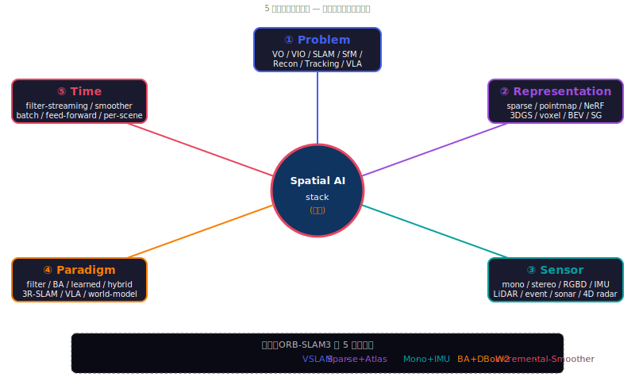
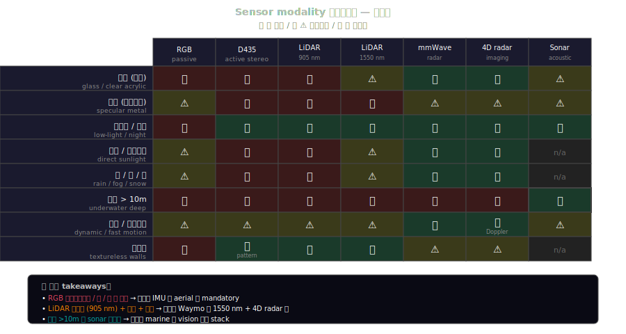
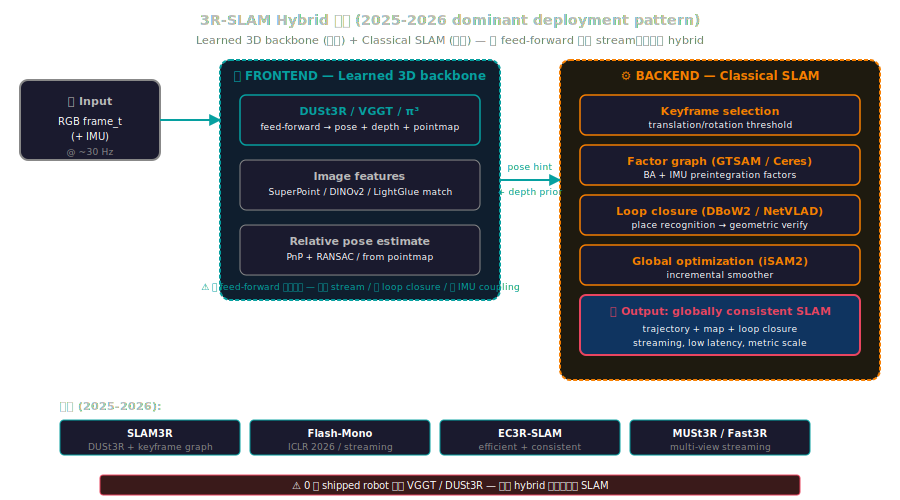
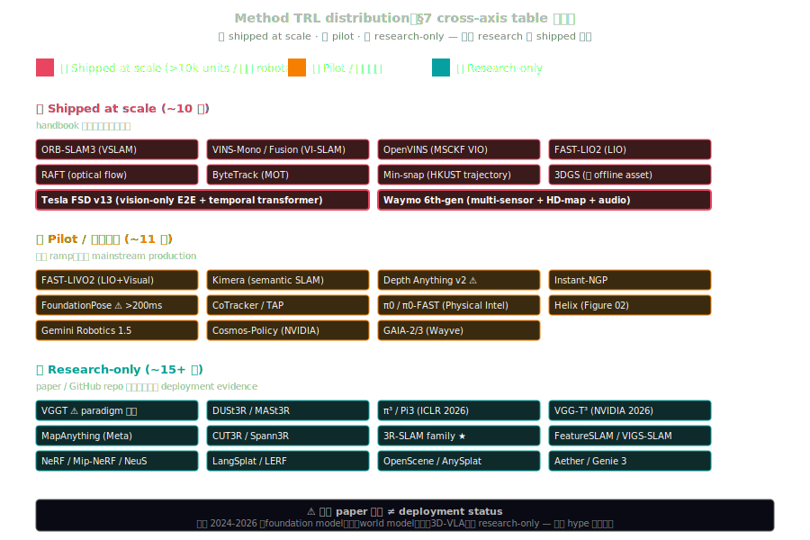
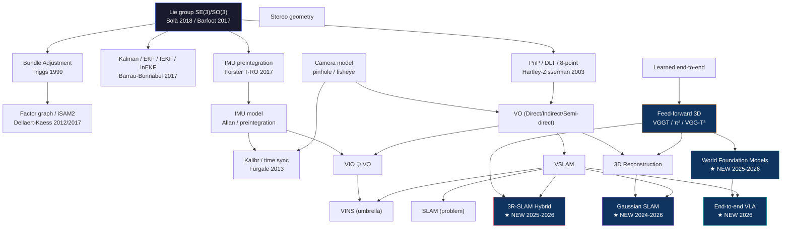
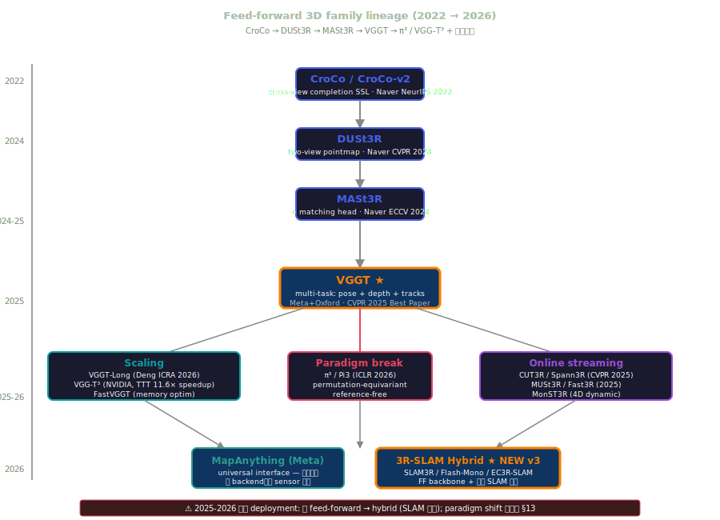

# Ontology — Spatial AI 領域學術 taxonomy (v3 · web-searched, 8-expert reviewed)

> **本文是 Spatial AI 領域的「概念骨架」** — 不是手冊章節指南（→ [`functional_map.md`](./functional_map.md)）；不是論文目錄（→ 各 zone overview）；不是失敗圖鑑（→ [`cross_zone_failure_atlas.md`](./cross_zone_failure_atlas.md)）。
>
> **本文回答**：這個領域的概念是怎麼被分類的？它們之間什麼關係？什麼是子集 / 什麼是並列 / 什麼是同義 / 什麼是 2026 還在爭論的？
>
> **v3 (2026-05-24)**: v2 經 4 個 web-searched expert agent 再審（Academic surveys / Production reality / Adversarial counter-evidence / 2026 frontier sweep）。v2 共識：5 軸框架對，但 (a) 跟 2026 academic survey consensus 比，少 pointmap / hash-grid / spatio-temporal SLAM / foundation-model representation 4 個 entry; (b) production reality 與我們列的 research-tier 方法不對等 — 0 個 shipped robot 用 VGGT/DUSt3R/CUT3R，3DGS 只作 offline asset 用; (c) 我們漏整類 **3R-SLAM Hybrid family** (SLAM3R / Flash-Mono / EC3R-SLAM / MUSt3R / Fast3R) 與 **World Foundation Models** (Cosmos-Predict-2/Reason-2/Policy / Genie 3 / GAIA-3 / Aether); (d) 我們對 VGGT 過度樂觀（Wu et al. 2025 peer-reviewed 直接反駁 paradigm shift；attention collapse rank-1 已被 arXiv 2512.21691 證實）。
>
> **v3 主要改動**：
> 1. §1.5 加 5-axis 對立分類學 disclaimer（Cadena 4-axis / Chen 3-axis / NAP transduction-principle 都存在）
> 2. §2 加 Spatio-temporal SLAM (Khronos RSS 2024) 為 peer；加 End-to-end VLA Policy
> 3. §3 加 pointmap / hash-grid / HD-map / audio / tokenized-scene 為獨立 representation
> 4. §4 加 imaging radar (4D) / audio perception / V2X
> 5. §5 加 **3R-SLAM Hybrid** + **World-Model-as-Policy** + Flow matching + 3D-aware VLA 4 個 paradigm
> 6. §6 加 Temporal transformer rolling buffer (FSD v13)
> 7. §7 cross-axis 加 11 新方法（π³, DA3, MoGe-2, VGG-T³, AnySplat, FeatureSLAM, Aether, Cosmos-Policy, π0, TAPNext, FAST-LIVO2），改 VGGT 加 caveat
> 8. §9.5 modern foundation 加 14 entry，tag 5 stale (DreamFusion / PoseDiffusion / MegaPose 等)
> 9. §11 canonical refs 加 13 篇 2025-2026 papers + surveys
> 10. §13 (new) **Open controversies + UNVERIFIED claims** — VGGT paradigm 爭議 / 3DGS-vs-NeRF 反光例外 / 「world model」定義之爭 / TRL deployment status

---

## 60 秒總綱

Spatial AI 不是一個方法，是 **5 個正交軸的張量積**：



當你看到一個方法名（ORB-SLAM3 / VGGT / FoundationPose / 3DGS），它在這 5 個軸上**都有一個座標**。學會用座標讀法，每篇 paper 都自如分類。

**領域權威 surveys**（依時間排序）：
- Cadena et al. (2016). "Past, Present, Future of SLAM: Towards the Robust-Perception Age." IEEE T-RO — 仍是 SLAM taxonomy 標桿，**無 2024-2026 正式繼任者**
- Tosi et al. (2024). "How NeRFs and 3D Gaussian Splatting are Reshaping SLAM" — arXiv 2402.13255
- Zhang et al. (2025). "Review of Feed-forward 3D Reconstruction: From DUSt3R to VGGT" — arXiv 2507.08448
- Chen et al. (2025). "A Comprehensive Survey on World Models for Embodied AI" — arXiv 2510.16732
- Xie et al. (2024). "Neural Fields in Robotics: A Survey" — arXiv 2410.20220
- Mokssit et al. (2024). "Deep Learning Techniques for Visual SLAM: A Survey" — arXiv 2308.14039

---

## §1 · 5 個分類軸

| 軸 | 問什麼 | 取值範例 |
|---|---|---|
| **Problem** | 你想算出什麼？ | pose / map / depth / object 6D / scene graph / VLA action |
| **Representation** | 結果用什麼數據結構存？ | sparse / pointmap / NeRF / 3DGS / voxel / BEV / scene graph / HD-map |
| **Sensor** | 從什麼物理訊號來？ | mono / stereo / RGBD / IMU / LiDAR / event / sonar / GNSS / 4D radar / audio |
| **Paradigm** | 用什麼計算範式？ | geometric / filter / optimization / learned / hybrid / generative / **3R-SLAM hybrid** / **world-model-as-policy** |
| **Time** | 線上還是離線？增量還是 batch？ | filter-streaming / fixed-lag smoother / incremental smoother / feed-forward / per-scene / **temporal-transformer-rolling-buffer** |

5 個軸是**正交**的（沒有一個包含另一個），所以同一個方法可以在每個軸上單獨指認。

### §1.5 · 5 軸選擇是 opinionated — 對立分類學存在

**5 軸不是學界 canonical**。其他正式 taxonomy：

| 替代 taxonomy | 軸數 | 出處 | 何時用 |
|---|---|---|---|
| **Cadena et al. 2016** | 4 | front-end / back-end / loop closure / map representation | 純 SLAM systems 視角 |
| **Chen et al. 2025 World Models** | 3 | functionality × temporal × spatial representation | 純 world model 視角 |
| **NAP National Academies** | 2 | transduction principle (mech/thermal/elec/magn/radiant/chem) × self-generating/modulating | 純 sensor physics 視角 |
| **Liu et al. 2024 Embodied AI** | 4 | perception / interaction / agent / sim-to-real | embodied AI 視角 |
| **Tosi et al. 2024** | 4-5 | sensor / representation / geometric encoding / tracking / problem variant | NeRF/3DGS SLAM 視角 |

**我們選 5 軸的理由**：(a) Time 軸獨立是 2024 後 feed-forward 範式必需的 (Zhang 2025 §3 確認); (b) Paradigm 跟 Representation 分開可避免 NeRF / 3DGS 都被叫「neural」混淆 (Xie 2024 同此); (c) 跨 embodiment / 跨年代讀法穩定。**但這是 opinionated，不是 canonical** — 詳見 §13 controversies。

---

## §2 · Problem 軸

**SLAM 一詞同時指問題與方法類**：本文用 SLAM 指**問題**（joint estimation of state + map + global consistency），VSLAM / LIO-SLAM 指**方法**（具體解法）。

```
spatial AI problems
├── Localization (我在哪 — 不包含 mapping)
│   ├── VO    (Visual Odometry) — 連續 image → 相對 pose；無 global map、無 loop closure
│   │   │      drift 線性累積（per-frame error ~0.5-2%）
│   │   ├── Direct VO        — photometric error (DSO / LSD-SLAM, Engel 2018/2014)
│   │   ├── Indirect VO      — reprojection error of keypoints (ORB-SLAM / VINS)
│   │   └── Semi-direct VO   — SVO (Forster ICRA 2014)
│   ├── VIO   (Visual-Inertial Odometry) — VO ⊊ VIO：在 VO 之上加 IMU 因子；scale + roll/pitch 由 IMU 鎖死
│   ├── LIO   (LiDAR-Inertial Odometry) — LiDAR 替代相機；FAST-LIO2 / LIO-SAM
│   ├── LIVO  (LiDAR-Inertial-Visual Odometry) — FAST-LIVO2 (Zheng 2024, ESIKF) 三模 tight-coupling
│   ├── Relocalization — 給定 map，重新定位（典型 pipeline: place recognition → geometric verification → PnP+RANSAC）
│   └── Place recognition — image-level similarity，**reloc pipeline 的第一階段**，不是 reloc 的「弱版本」
│       └── DBoW2 / DBoW3 (Gálvez-López & Tardós 2012) / NetVLAD (Arandjelović 2016) / HF-Net / HLOC (Sarlin 2019/2020)
│
├── Mapping (世界長怎樣)
│   ├── 三個正交內部軸：density (sparse↔dense) / content (geometric↔semantic) / structure (metric↔topological)
│   ├── 三軸正交 → 「sparse semantic topological map」是合法組合
│   ├── Sparse map — 3D landmarks (keypoints + descriptors)
│   ├── Dense map — voxel / mesh / TSDF / occupancy
│   ├── Semantic map — 任何 density + per-element class label
│   ├── HD-map / vector map — 道路 lane + sign + topology，AD 主流（Waymo / Apollo / Mobileye REM）
│   └── Topological map — graph (節點=地點，邊=可達)
│
├── SLAM (= Localization + Mapping + Global consistency 同時)
│   ├── Visual SLAM (VSLAM) — camera 主，可加 IMU
│   │   ├── VINS = Visual-Inertial Navigation System — **umbrella term**，涵蓋 VIO + VI-SLAM
│   │   │       VINS-Mono / VINS-Fusion 內含 loop closure → 屬於 VI-SLAM
│   │   ├── ORB-SLAM3 — visual + visual-inertial + multi-map (Atlas)
│   │   └── DSO / LSD-SLAM — direct VO（嚴格說 DSO 無 loop closure，不是完整 SLAM）
│   ├── LIO-SLAM — LIO-SAM / FAST-LIO2 / R3LIVE
│   ├── Gaussian SLAM (3DGS 作 live map) — FeatureSLAM, VIGS-SLAM, RMGS-SLAM, FGS-SLAM, SplaTAM, MonoGS (2024-2026 興起)
│   ├── **3R-SLAM Hybrid (NEW v3 — 2025-2026 主導 pattern)** — feed-forward 3D backbone + 傳統 SLAM keyframe + loop closure
│   │   └── SLAM3R / Flash-Mono (ICLR 2026) / EC3R-SLAM / MUSt3R (arXiv 2503.01661) / Fast3R / Stereo4D / LoRA3D
│   ├── **Spatio-temporal Metric-Semantic SLAM (NEW v3)** — Khronos (Schmid RSS 2024 Outstanding Systems Paper)
│   │       4D / 動態 / 語義 在同一 stack
│   ├── Multi-session SLAM — 多次跑同地，map 接力
│   └── Multi-agent SLAM — 多機共享 map（→ SG-Reg / Hydra-Multi / Compact Multi-Agent GS-SLAM）
│
├── Initialization (是 VIO / SLAM 內部一個 subfield)
│   ├── Static init — IMU 不動，從重力反推 roll/pitch + accel bias
│   ├── Dynamic / motion-based init — visual SfM + IMU alignment (Qin & Shen 2017 VINS-Mono)
│   ├── Stereo / RGB-D bootstrap — 有 metric depth，初始化簡化
│   └── Loosely-coupled vs tightly-coupled init
│
├── Reconstruction (世界長得多漂亮 — offline / multi-view)
│   ├── SfM (Structure from Motion) — **photogrammetry 譜系（1980s+）**；offline batch；no IMU
│   ├── MVS (Multi-View Stereo) — SfM 之後的 densify 步驟
│   ├── Feed-forward 3D — one-shot 多 view → pose+depth+points（詳見 §5.2 / §9.5）
│   │   └── ⚠ **2025-2026 是 hybrid 不是替代**：純 feed-forward (DUSt3R/VGGT) 無法 stream，所有實際 deployment 走 3R-SLAM Hybrid（見 §5.4）
│   ├── Novel-view synthesis — NeRF / 3DGS 為主任務
│   └── 4D reconstruction — 加時間軸 (4DGS / D-NeRF / MonST3R / Stereo4D)
│
├── Tracking (東西去哪)
│   ├── Object 6-DoF pose tracking — 已知物體模型 (FoundationPose / MegaPose)
│   ├── Object 2D tracking — bounding box (SORT / ByteTrack)
│   ├── Pixel-level / point tracking — CoTracker / TAP / TAPNext / TAPNext++ / Track-On (long-horizon 1024 frame)
│   ├── Optical flow — RAFT (Teed & Deng ECCV 2020)
│   └── Visual tracking (classical) — KCF / CSRT, no learning
│
├── Spatial reasoning (這場景什麼意思)
│   ├── VLM 空間 QA — 「杯子在桌子左邊嗎」(3DSRBench / BLINK)
│   ├── Scene graph reasoning — 物體 + 空間關係
│   ├── Affordance — 「這物體可以怎麼操作」
│   └── Open-vocabulary 3D — LangSplat / OpenScene
│
├── Pose estimation (孤立任務 / 不需序列)
│   ├── Camera pose (PnP / DLT) — 給 2D-3D 對應算 6-DoF
│   ├── Human pose — body / hand / face landmarks
│   └── Object pose — instance / category-level / unseen
│
└── Action interface (→ VLA / Policy)
    ├── 3D feature cloud → policy
    ├── Goal/waypoint → planner
    ├── Affordance → grasp planner
    └── **End-to-end VLA (NEW v3)** — vision + language → action 整合一個 net；2026 主流
        └── π0 / π0-FAST (Physical Intelligence), Helix (Figure), Gemini Robotics 1.5, 3D-VLA, OG-VLA, Cosmos-Policy (NVIDIA), RDT-1B (THU-ML)
```

**子集關係 (corrected)**：

| 關係 | 說明 |
|---|---|
| VO ⊊ VIO | VIO 嚴格擴展 VO 的 state，加入 IMU 因子 |
| VSLAM = SLAM ∩ {camera as primary sensor} | 不是 ⊂，是「camera-主導 SLAM 方法的子類」 |
| VINS = {VIO} ∪ {VI-SLAM} | umbrella term，不是公式 |
| SfM ≠ offline VSLAM | 不同學術譜系（photogrammetry 1980s+ vs robotics 1990s+） |
| Place recognition ⊂ reloc 的第一階段 | 不是 reloc 的「弱版本」 |
| **3R-SLAM Hybrid ≠ Feed-forward** | learned 3D backbone（DUSt3R/VGGT） + 傳統 SLAM keyframe/loop closure；2025-2026 新類 |
| VGGT 同時佔 Reconstruction + Localization + Tracking | 多任務 synergy（Wang et al. CVPR 2025 best paper），但 ⚠ 見 §13 paradigm shift 爭議 |

---

## §3 · Representation 軸

**警告：這軸最容易混淆**。原因：實際上有 **7 個正交內部子軸**。

### §3.1 · 7 個正交子軸

| 子軸 | Pole A | Pole B |
|---|---|---|
| **Density** | sparse (landmarks) | dense (voxel / radiance field) |
| **Storage** | explicit (data stored) | implicit (function evaluated) |
| **Geometry type** | surface (2-manifold in R³) | volume (3D scalar/vector field) |
| **Sampling** | discrete | continuous |
| **Topology** | regular grid | irregular set (point cloud / mesh / graph) |
| **Time** | static | dynamic |
| **Content** | geometric only | semantic (含 feature / label) |

### §3.2 · 主要表徵的 7-軸座標

| 表徵 | Density | Storage | Geometry | Sampling | Topology | Time | Content |
|---|:---:|:---:|:---:|:---:|:---:|:---:|:---:|
| **Sparse landmarks** | sparse | explicit | implicit surface | discrete | irregular | static | geom |
| **Point cloud** | varies | explicit | surface/points | discrete | irregular | static | either |
| **Mesh** | varies | explicit | **surface (2-mfld)** | discrete | irregular | static | geom |
| **Voxel grid (general)** | dense | explicit | volume | discrete | regular | static | either |
| **TSDF (Curless-Levoy 1996)** | dense | explicit | volume (surface at d=0) | discrete | regular | static | geom |
| **Occupancy grid** | dense | explicit | volume (surface at p=0.5) | discrete | regular | static | geom/sem |
| **NeRF (Mildenhall 2020)** | dense | implicit | volume (radiance + density) | continuous | (MLP) | static | radiance |
| **3DGS (Kerbl 2023)** | dense | explicit | volume (radiance + density) | continuous (alpha-blend) | irregular Gaussians | static | radiance |
| **NeuS / VolSDF (NeurIPS 2021)** | dense | implicit | **surface (zero-level-set)** | continuous | (MLP) | static | geom |
| **Plenoxels (Yu 2022)** | dense | explicit | volume | continuous | sparse voxel + SH | static | radiance |
| **Hash grid (Instant-NGP)** | dense | **explicit** + tiny MLP | volume | continuous | multi-res hash | static | radiance |
| **Tri-plane / K-Planes / HexPlane (NEW v3)** | dense | explicit (factored) | volume | continuous | 3-6 2D planes | static/4D | radiance |
| **Pointmap (NEW v3, DUSt3R/VGGT)** | dense | explicit | 3D points per pixel | discrete | regular (image grid) | static | geom |
| **BEV map** | dense | explicit | volume → 2D projection | discrete | regular 2D grid | varies | either |
| **HD-map / vector map (NEW v3)** | sparse | explicit | semantic graph (lane + sign + topology) | discrete | graph | static | semantic + geo-ref |
| **Scene graph** | sparse | explicit | abstract | discrete | graph | static | semantic |
| **Feature cloud (OpenScene)** | sparse | explicit | (points + feat vectors) | discrete | irregular | static | semantic |
| **Feature field (LERF / LangSplat)** | dense | implicit (or 3DGS-explicit) | volume of features | continuous | (function) | static | semantic |
| **Tokenized scene (NEW v3 — foundation model latent)** | dense | implicit (transformer state) | volume | discrete tokens | regular (token grid) | static/4D | learned |
| **Depth map** | dense | explicit | 2.5D image-space | discrete | regular 2D | varies | geom |
| **Audio spatial map (NEW v3)** | sparse | explicit | 3D source position + signature | discrete | irregular events | dynamic | semantic |

### §3.3 · Voxel ≠ TSDF ≠ Occupancy ≠ Density — 都是「voxel grid」但存不同 scalar field

| 變體 | 每 voxel 存 | Surface 隱含於 | 用途 | 代表 |
|---|---|---|---|---|
| **Occupancy** | p ∈ [0,1] (or log-odds ℓ ∈ R) | p = 0.5 | planning / collision | Octomap / Tesla Occupancy Net v3 |
| **TSDF** | (d, w) — signed distance + weight | d = 0 | high-quality mesh extract | KinectFusion / Voxblox |
| **Density** | σ ∈ R₊ | (sample-based render) | volume rendering | Plenoxels / Instant-NGP |
| **SH radiance** | SH coefficients per voxel | (render) | view-dependent color | Plenoxels |

### §3.4 · BEV ≠ Occupancy Network — 不同維度

| 表徵 | 維度 | 經典 |
|---|---|---|
| **LSS (Lift-Splat-Shoot)** | (x, y) → C-channel | Philion ECCV 2020 |
| **BEVFormer** | (x, y) → C-channel via attention | Li ECCV 2022 |
| **BEVFusion** | LSS + LiDAR voxel fused at BEV stage | Liu ICRA 2023 |
| **Occupancy Network (Tesla v3 / OccFormer ICCV 2023)** | **(x, y, z) → class** — true 3D, not BEV | Tesla AI Day 2022 / Zhang ICCV 2023 |
| **4D Occupancy / FSF-Net (NEW v3)** | (x, y, z, t) + scene flow | FSF-Net arXiv 2409.15841 |

### §3.5 · 5 種 Scene Graph

| Scene Graph 變體 | 是什麼 | 代表 |
|---|---|---|
| **3D Scene Graph (Armeni 2019 ICCV)** | hierarchical (building→room→object)，offline | Armeni et al. |
| **Image SGG** | 2D, `<subj, rel, obj>` predicates，**not 3D** | Xu CVPR 2017 等 |
| **ConceptGraphs (Gu ICRA 2024)** | open-vocab，LLM-grounded，online RGB-D | Gu et al. |
| **SG-Reg / Hydra-Multi** | scene graph **registration** 跨 agent / session | Liu T-RO 2025 / MIT SPARK |
| **OVIR-3D / OpenScene** | open-vocab 3D segmentation (voxel/point)，常被誤認為 scene graph 但**沒有顯式 edge** | Peng CVPR 2023 等 |

### §3.6 · Feature cloud vs Feature field — 重要 distinction

| | Feature cloud | Feature field |
|---|---|---|
| **是什麼** | explicit 點集，每點帶 CLIP/DINO feature | 一個函數 f: R³ → R^F |
| **儲存** | 離散有限 | 連續無限解析度 |
| **代表** | OpenScene / ConceptFusion | LERF / LangSplat / DFF / F3RM |
| **類比** | point cloud vs NeRF（但用在 semantic 軸） | 同 |

### §3.7 · Depth maps：2.5D, 不算 3D

Depth / disparity / surface-normal / optical flow 都是 **image-space** 表徵：pixel-aligned，缺背面，single-view。它們是 spatial AI pipeline 的**輸出**或**中間結果**，不是世界表徵。要升 3D 需要 unprojection + fusion。

### §3.8 · Pointmap (NEW v3) — DUSt3R/VGGT primitive

**Pointmap ≠ depth map ≠ sparse landmarks**：
- 每像素一個 3D point in shared coordinate frame (cross-view consistent)
- 直接 multi-view 一致（不需 unprojection）
- 是 DUSt3R / MASt3R / VGGT / VGG-T³ / Pi3 系列的**輸出表徵**
- 學界共識：應作獨立 representation primitive（Zhang 2025 §3）

---

## §4 · Sensor 軸

**Sensor 是物理層**：跟 problem 軸獨立。但**每個 sensor 還有子型**，子型差異常常決定能不能用。

### §4.1 · Modality 樹

```
Sensor modality
├── Optical (光)
│   ├── Passive
│   │   ├── Monocular RGB
│   │   │   ├── Shutter: Global (Sony IMX296 / Basler ace) vs Rolling (IMX477)
│   │   │   │           ※ >30°/s yaw + rolling → VIO 直接不可用
│   │   │   ├── Sensor: Mono (2× SNR, no demosaic) vs Bayer (color)
│   │   │   └── Wavelength: Visible (400-700 nm) / NIR (700-1000) / SWIR (1000-2500) / LWIR (8-14 μm) / MWIR (3-5)
│   │   ├── Stereo (passive baseline)
│   │   ├── Multi-camera array (Insta360 / GoPro 多視角)
│   │   └── Polarization camera
│   ├── Active
│   │   ├── Structured light (Kinect v1, 已 EOL)
│   │   ├── Active stereo (D435/D455/D456) — passive stereo + 隨機 IR pattern aug ※ **不是 structured light**
│   │   ├── ToF
│   │   │   ├── Single-point ToF (TF-Mini / VL53L1X) — drone altitude
│   │   │   ├── Indirect ToF iTOF (Kinect v2 / Azure Kinect / L515 已 EOL)
│   │   │   └── Direct ToF dToF / SPAD (iPhone Pro / Velabit)
│   │   └── Active NIR projection (850 nm 主動投影紋理)
│   └── Specialty
│       ├── Event camera / DVS (Prophesee EVK4 / DAVIS346) — 像素級異步亮度變化
│       ├── Thermal IR (FLIR Boson / Lepton, 8-14 μm LWIR)
│       └── Hyperspectral
│
├── Inertial (慣性)
│   └── IMU = 3-axis accel + 3-axis gyro (+ mag = MARG)
│       ├── Consumer MEMS — BMI270 / ICM-42688 / MPU-9250 — BI ~10°/hr — $1-10
│       ├── Industrial MEMS — ADIS16470/16505 / VN-100 — BI ~1°/hr — $1-3k
│       ├── Tactical — Honeywell HG4930 / KVH 1750 — BI ~0.1°/hr — $3-30k
│       └── Navigation / FOG / RLG — Honeywell HG9900 — BI &lt;0.01°/hr — $30k+
│
├── Range / depth (距離直接)
│   ├── LiDAR
│   │   ├── Mechanical spinning (Velodyne VLP-16/HDL-32, Ouster OS1) — 360° FOV
│   │   ├── Solid-state MEMS / OPA (Hesai AT128, Innoviz One)
│   │   ├── Flash (Continental HFL110)
│   │   ├── FMCW coherent (Aeva Aeries II / SiLC)
│   │   └── 波長：905 nm Si APD vs 1550 nm InGaAs
│   ├── ToF (single-point / scanning, 見 Optical Active)
│   ├── Ultrasonic — cm 級，cheap
│   ├── mmWave radar — TI AWR / Continental ARS (77/79 GHz)
│   ├── **Imaging radar / 4D radar (NEW v3)** — Waymo 6th-gen / Mobileye / Pony.ai 全用
│   │       4D = range + bearing + elevation + Doppler；2026 AD 已產品化
│   └── FMCW radar (24/60/77 GHz)
│
├── Acoustic (聲學)
│   ├── Microphone array (beamforming)
│   ├── **Audio perception (NEW v3)** — Waymo EARs 偵測 siren；Tesla FSD v13 緊急車輛偵測
│   ├── Multibeam sonar (marine 主圖)
│   ├── Side-scan sonar (海底紋理)
│   └── DVL (Doppler Velocity Log, marine 對地速度) — Teledyne $30k+
│
├── RF / EM (電磁)
│   ├── GNSS — sub-types:
│   │   ├── SPP — 5-10 m
│   │   ├── SBAS — 1-3 m (廣域差分)
│   │   ├── DGPS — sub-m
│   │   ├── RTK fix — cm
│   │   ├── RTK float — dm
│   │   └── PPP / PPP-RTK — 10 cm，30 min 收斂
│   ├── UWB — sub-types:
│   │   ├── ToF / DS-TWR (Ubisense / Decawave DW1000)
│   │   ├── TDoA (Pozyx)
│   │   └── AoA / phase-based (DW3000 / Apple U1/U2)
│   ├── WiFi-RTT (FTM-2nd gen)
│   ├── Bluetooth AoA
│   ├── **V2X / C-V2X (NEW v3)** — vehicle-to-everything；中國 robotaxi 已用，US Section 5G
│   └── Magnetometer (地磁場 yaw 校正)
│
└── Contact / proprioceptive (接觸 / 本體)
    ├── Joint encoder
    │   ├── Incremental optical / Absolute magnetic (AS5048) / SSI/BiSS / Resolver
    ├── Force-torque sensor (wrist 6-DoF: ATI Mini40 / Robotiq FT300) — $5-10k
    ├── Tactile array
    │   ├── Vision-based (DIGIT $1.5k / GelSight / TacTip)
    │   ├── Capacitive (含 touchless proximity — Figure 02 採用)
    │   └── Piezoresistive (BioTac / ReSkin)
    ├── Skin pressure / load cell (humanoid foot)
    ├── Current sensing (cobot 碰撞偵測)
    └── Pressure altimeter (depth gauge marine / barometer drone)
```

### §4.2 · 跨 modality 的高層分類

| 軸 | Pole A | Pole B | 解釋 |
|---|---|---|---|
| **Active vs Passive** | Passive (mono / stereo / RGB / event) | Active (LiDAR / radar / sonar / structured light / ToF) — 發信號再接收 |
| **Coherent vs Incoherent** | Incoherent (ToF / 一般 LiDAR) | Coherent (FMCW radar / FMCW LiDAR) — encode per-pixel velocity ※ 這條軸 narrow，僅雷射/雷達適用 |
| **Direct vs Indirect range** | Direct (LiDAR ToF / radar) | Indirect (stereo triangulation / SfM) |
| **Range-bearing vs Bearing-only** | Range-bearing (LiDAR + landmark) | Bearing-only (mono camera) — Thrun *Probabilistic Robotics* ch. 6 classification |

### §4.3 · Modality 失敗交叉表（誰怕誰）




| 環境/物體 | RGB | Active stereo (D435) | LiDAR (905 nm) | LiDAR (1550 nm) | mmWave radar | Imaging radar (4D) | Sonar |
|---|:---:|:---:|:---:|:---:|:---:|:---:|:---:|
| **透明 (玻璃)** | ❌ | ❌ | ❌ | ⚠️ | ✅ | ✅ | ⚠️ |
| **鏡面 (拋光金屬)** | ⚠️ | ❌ | ❌ | ❌ | ⚠️ | ⚠️ | ⚠️ |
| **金屬一般** | ✅ | ✅ | ✅ | ✅ | ⚠️ | ✅ | ✅ |
| **暗環境** | ❌ | ✅（active）| ✅ | ✅ | ✅ | ✅ | ✅ |
| **強光 / 陽光直射** | ⚠️ | ❌（IR 干擾）| ❌（905 nm 怕陽光）| ⚠️ | ✅ | ✅ | n/a |
| **雨 / 霧** | ⚠️ | ❌ | ❌（Mie scatter）| ⚠️ | ✅ | ✅ | n/a |
| **水下 &gt;10m** | ❌ | ❌ | ❌ | ❌ | ❌ | ❌ | ✅ |
| **動態 / 高速** | ⚠️（RS 偽影）| ⚠️ | ⚠️ | ⚠️ | ✅ | ✅ Doppler | ⚠️ |
| **稀紋理** | ❌ | ✅（pattern aug）| ✅ | ✅ | ⚠️ | ⚠️ | n/a |

→ 詳見 [`foundations/sensor-physics/sensor_selection_decision_matrix.md`](../foundations/sensor-physics/sensor_selection_decision_matrix.md)（23 sensor × 14 維 SWaP-C 對比 + 6 use case 決策樹）。

---

## §5 · Paradigm 軸

```
┌──────────────────────────────────────────────────────────┐
│  Geometric / classical (基於幾何 + 標定 + 優化)            │
│  ├── Filter-based (EKF / IEKF / InEKF / MSCKF / ROVIO)   │
│  ├── Optimization-based (BA / Factor graph / iSAM2 /     │
│  │       solvers: Ceres / g2o / GTSAM)                   │
│  ├── Closed-form (PnP / DLT / 8-point / ICP)             │
│  ├── Outlier rejection (RANSAC / MAGSAC++)               │
│  └── Robust kernels (Huber / Cauchy / DCS / SC)          │
│                                                            │
│  Learned / data-driven (詳見 §5.2 三層)                    │
│                                                            │
│  Hybrid (學習 + 幾何混合 — 詳見 §5.4)                       │
│  ├── Learned front-end + classical back-end              │
│  ├── Differentiable rendering (NeRF / 3DGS)              │
│  ├── Differentiable simulation (MuJoCo MJX / NVIDIA Warp)│
│  └── **3R-SLAM Hybrid (NEW v3, dominant 2025-2026)**     │
│                                                            │
│  Generative (詳見 §5.3)                                    │
│  ├── Image-to-3D / Video-to-3D                            │
│  ├── Diffusion-as-geometry / pose prior                   │
│  └── **Video World Models / World-Model-as-Policy (NEW v3)** │
│                                                            │
│  **VLA / End-to-end policy (NEW v3 — 2026 主流)**         │
│  ├── π0 / π0-FAST (flow matching)                         │
│  ├── Helix (Figure)                                       │
│  ├── Gemini Robotics 1.5                                  │
│  ├── 3D-VLA / OG-VLA / 3DS-VLA (3D-aware)                │
│  └── Cosmos-Policy (world-model-post-trained)            │
└──────────────────────────────────────────────────────────┘
```

### §5.1 · Theoretical / numerical concepts (canonical)

| 概念 | 用處 | Canonical ref |
|---|---|---|
| **Right perturbation Jacobian** | manifold optimization on SE(3) | Solà et al. 2018 |
| **First-Estimates Jacobian (FEJ)** | EKF-SLAM observability inconsistency 解法 | Huang & Mourikis 2010 |
| **Schur complement** | BA 邊化 landmark 得 reduced camera system | Triggs et al. 1999 BA synthesis |
| **Marginalization prior** | sliding-window 保留舊變量信息 | Sibley 2010 / OKVIS (Leutenegger IJRR 2015) |
| **Information / square-root form** | covariance form 數值不穩定的替代 | iSAM (Kaess) / Barfoot 2017 |
| **Observability (VIO 4 unobservable directions)** | 為什麼 VIO 永遠 drift in xyz + yaw | Hesch-Huang-Roumeliotis series |
| **Robust kernel switchable constraints** | 自動 outlier rejection in optimization | Sünderhauf & Protzel 2012 |

### §5.2 · Learned geometry foundations — 3 層分層

```
Learned geometry foundations
├── Monocular geometry foundation (單 image 輸入，無 pose 輸出)
│   ├── Relative depth: Depth Anything v1/v2 (Yang 2024, ByteDance)，MiDaS (Ranftl 2020 ancestor)
│   ├── Metric depth: Metric3D v2 (Hu 2024 ICCV/TPAMI)，ZoeDepth，UniDepth
│   ├── Point map (affine-invariant): MoGe (Wang ICCV 2025 Microsoft) → **MoGe-2 (2025 metric upgrade)** ★ NEW v3
│   ├── Multi-view + metric in one: **Depth Anything 3 (DA3 / DA3Metric-Large, ICLR 2026)** ★ NEW v3
│   ├── Multi-task depth+normal: Marigold (Ke CVPR 2024 oral, ETH)，GeoWizard，Lotus，GenPercept
│   └── Stereo foundation: FoundationStereo (Wen NVIDIA CVPR 2025)
│
├── Multi-view feed-forward 3D (多 view 輸入，pose + dense geometry 同時輸出)
│   ├── 兩 view: DUSt3R (Wang CVPR 2024, Naver)，MASt3R (Leroy ECCV 2024)
│   ├── 多 view batch: VGGT (Wang CVPR 2025 best paper)，MapAnything (Meta)，MV-DUSt3R+ (Tang CVPR 2025)
│   ├── **Permutation-equivariant: π³ / Pi3 (Yu ICLR 2026)** ★ NEW v3 — reference-free, scale-invariant
│   ├── **Linear-scaling: VGG-T³ (NVIDIA DVL Feb 2026)** ★ NEW v3 — KV-distillation MLP, 11.6× speedup
│   ├── **Kilometer-scale: VGGT-Long (Deng ICRA 2026)** ★ NEW v3 — chunked + loop closure
│   ├── Online streaming: CUT3R (Wang CVPR 2025, Meta+UCB)，Spann3R (Wang 3DV 2025)
│   ├── **VGGT 自帶 streaming (causal attention + KV cache) ★ NEW v3.1**: StreamVGGT (ICLR 2026, arXiv 2507.11539)，INCVGGT (ICLR 2026)
│   │       — LLM 式 autoregressive；O(N) per frame；distilled from bidirectional VGGT；仍 un-metric 仍 ≥ 50 ms/frame
│   ├── SfM-replacement frontend: MASt3R-SfM (Duisterhof 2024)，ACE-Zero
│   └── Dynamic / 4D: MonST3R (Zhang 2024)，Stereo4D
│
│   譜系: CroCo (Weinzaepfel NeurIPS 2022) → DUSt3R → MASt3R → VGGT → π³ / VGG-T³
│         ★ NEW v3: MapAnything 作為「universal interface」吸收上述為 backend
│         ⚠ 但 2025-2026 實際 deployment 不直接用，走 3R-SLAM Hybrid（見 §5.4）
│
├── Object / pose foundation
│   ├── Object 6-DoF: FoundationPose (Wen NVIDIA CVPR 2024)，MegaPose (CoRL 2022 — 已退役，被 FoundationPose 取代)
│   └── Camera pose via diffusion (★ 2026 已被 VGGT/π³ 吸收): PoseDiffusion (Wang ICCV 2023)，RayDiffusion (Zhang ICLR 2024) [HISTORICAL]
│
└── Generalizable radiance / surface
    ├── Generalizable NeRF: PixelNeRF (Yu CVPR 2021)，MVSNeRF，IBRNet
    ├── Generalizable GS: pixelSplat (Charatan CVPR 2024)，MVSplat (Chen ECCV 2024)
    └── **Pose-free feed-forward 3DGS: AnySplat (arXiv 2505.23716)** ★ NEW v3 — pose-aware quality 無需 pose
```

**「Foundation model」嚴格定義**：(a) 訓練在 web-scale 或多 dataset corpus；(b) 在未見 domain zero-shot 可用無需 finetune；(c) 多任務 heads。**Depth Anything 完全符合；FoundationStereo borderline；per-scene NeRF 不符合**。

### §5.3 · Generative 3D / world models

```
Generative 3D / world models
├── Image-to-3D (single image → mesh / splats)
│   ├── NVS-via-diffusion: Zero123 / Zero123++ / Stable Zero123 / Wonder3D / SyncDreamer / CAT3D
│   ├── Native 3D gen: SAM 3D Objects (Meta Nov 2025)，Trellis，Pi3-Gen
│   └── SDS / VSD [HISTORICAL 2022-2023]: DreamFusion (Poole ICLR 2023)，ProlificDreamer
│       — 已被 video-diffusion world models + feed-forward 3DGS 取代
│
├── Diffusion-as-geometry prior
│   ├── Depth: Marigold / GeoWizard / Lotus / GenPercept (SD finetune)
│   └── Normal: 同上
│
├── World Foundation Models (NEW v3 — 2026 最大資金/注意力磁鐵)
│   ├── **NVIDIA Cosmos family (GTC 2026)** ★
│   │   ├── Cosmos-Predict-2 (2B/14B) — video foundation model
│   │   ├── Cosmos-Reason-2 (7B reasoning VLM)
│   │   ├── Cosmos-Transfer-2.5
│   │   └── **Cosmos-Policy** — post-trained 為 robot policy，LIBERO/RoboCasa SOTA
│   ├── **Google DeepMind Genie 3** (Aug 2025) ★ — 11B autoregressive，720p @ 24fps real-time navigable，多分鐘 consistency
│   ├── **Wayve GAIA-3** (2026) ★ — extends GAIA-2 從 generation 到 closed-loop **evaluation** of driving policies
│   ├── **Aether (OpenRobotLab / InternRobotics, ICCV 2025 Outstanding Paper)** ★ — 4D reconstruction + action-conditioned video prediction + goal-conditioned planning 統一一個 net
│   ├── Sora (OpenAI 2024) — video, implicit 3D（爭議：是否真 3D-aware）
│   └── World Labs (Fei-Fei Li, 2025-2026), AMI Labs (LeCun), Verses — 同時宣稱 "world model" 但定義各不同 → 見 §13
│
└── Diffusion-as-pose [HISTORICAL]: PoseDiffusion / RayDiffusion — 已被 VGGT 系列 pointmap transformer 吸收
```

### §5.4 · 3R-SLAM Hybrid family (NEW v3 — 2025-2026 dominant pattern)

**核心洞察**：純 feed-forward 3D（DUSt3R/VGGT）**無法**做 online streaming SLAM（latency 太高 / 無法 incremental update / 無 IMU coupling）。**所有實際 deployment 走 hybrid**：learned 3D backbone（為前端）+ 傳統 SLAM keyframe + loop closure（為後端 + global consistency）。




| 方法 | Year | 設計 |
|---|---|---|
| **SLAM3R** | 2025 | DUSt3R-backbone 提 pair-wise pointmap + traditional keyframe graph |
| **Flash-Mono** | ICLR 2026 | feed-forward backbone + streaming + low-latency pose |
| **EC3R-SLAM** | 2025 | efficient & consistent monocular dense SLAM with feed-forward 3D recon |
| **MUSt3R** | arXiv 2503.01661 | multi-view streaming（DUSt3R 的 streaming-temporal 變體）|
| **CUT3R** | CVPR 2025 | continuous persistent state — bridges feed-forward + incremental |
| **Spann3R** | 3DV 2025 | spatial memory online VGGT-style |
| **Fast3R** | 2025 | 多 view fast reconstruction |
| **Stereo4D** | 2025 | dynamic 4D feed-forward + traditional matching |
| **LoRA3D** | 2025 | LoRA finetuning + 3R backbone |

**Key insight (Flash-Mono review)**: feed-forward 「offline requirement of processing all frames at once makes them fundamentally incompatible with the streaming input and low-latency pose estimation required by SLAM」 — 所以**所有 production candidate 都走 hybrid**，不是純 feed-forward。

### §5.5 · Visual-Inertial Gaussian SLAM (NEW v3)

3DGS 不再只是 NVS 工具 — 2025-2026 興起 3DGS 作 live SLAM map：

| 方法 | Year | Design |
|---|---|---|
| **SplaTAM** | 2024 | 首篇 3DGS as live map for tracking |
| **MonoGS** | 2024 | mono-only Gaussian SLAM |
| **FeatureSLAM** | arXiv 2601.05738 (2026) | feature + 3DGS map |
| **VIGS-SLAM** | arXiv 2512.02293 | visual-inertial GS SLAM |
| **RMGS-SLAM** | arXiv 2604.12942 (2026) | robust mapping GS-SLAM |
| **FGS-SLAM** | 2026 | fast GS SLAM |
| **Compact Multi-Agent GS-SLAM** | arXiv 2604.00804 | 85-95% bandwidth reduction multi-agent |

### §5.6 · End-to-end VLA / World-Model-as-Policy (NEW v3)

```
VLA / Policy paradigm
├── Flow-matching VLA (2024-2026 新範式，1-step flow ≈ 16-step diffusion)
│   ├── π0 / π0-FAST (Physical Intelligence, open-source) — flow matching, 7 platforms / 68 tasks
│   ├── π0.5 — open-world generalization
│   └── FlowPolicy (AAAI 2025 Oral) — consistency flow matching 3D policy
├── Diffusion VLA
│   ├── RDT-1B (THU-ML) — bimanual diffusion transformer
│   └── Diffusion Policy (2023)
├── Tier-2 (Figure Helix style — slow VLM brain + fast motor cortex)
│   └── Helix (Figure 02) — 200 Hz motor + 7-9 Hz scene
├── 3D-aware VLA (3D channels into VLM)
│   ├── 3D-VLA (arXiv 2403.09631) — generative world model
│   ├── OG-VLA (arXiv 2506.01196)
│   └── 3DS-VLA
├── Agentic VLA
│   └── Gemini Robotics 1.5 (DeepMind Sep 2025) — Gemini 2.0 + explicit reasoning trace + agentic loop
└── World-Model-as-Policy (NEW)
    ├── Cosmos-Policy (NVIDIA) — Cosmos-Predict-2 post-trained
    └── Aether (OpenRobotLab) — geometry-aware world model 同時做 policy
```

CVPR 2026 已開 [3D-LLM/VLA workshop](https://3d-llm-vla.github.io/) — 信號：consolidation 中。

---

## §6 · Time 軸 — 修正版

**重要**：filter-based / fixed-lag smoother / incremental smoother **是三個不同 paradigm**。

| 模式 | State 維度 | 後端 | 代表 |
|---|---|---|---|
| **Filter-based streaming** | 固定 | EKF / MSCKF / InEKF / IEKF | OpenVINS / ROVIO / FAST-LIO2 |
| **Fixed-lag smoother (marginalization)** | 固定 window | 優化 + marginalize prior | VINS-Mono / VINS-Fusion / OKVIS |
| **Incremental smoother** | 持續增長 | iSAM2 / Bayes tree | ORB-SLAM3 / Kimera / LIO-SAM |
| **Offline batch** | 全部一次 | full BA | COLMAP / OpenMVG / SfM 經典 |
| **Feed-forward one-shot** | n/a | learned forward pass | VGGT / DUSt3R / MoGE / π³ / VGG-T³ |
| **Online feed-forward (streaming)** | 內部 state，無 optim | learned RNN-like / streaming | CUT3R / Spann3R / MUSt3R |
| **Per-scene optimization** | per-scene weights | GD on rendering loss | NeRF / 3DGS / LERF |
| **Temporal transformer rolling buffer (NEW v3)** | 固定 window of N frames | attention over rolling video | **Tesla FSD v13 (10s recursive buffer + LLM-class arch)** |

---

## §7 · 跨軸座標表 — 代表方法在 5 軸上的座標

**TRL inline note**：⭐ = shipped at scale / 🚀 = pilot / 🔬 = research-only




| 方法 | Problem | Representation | Sensor | Paradigm | Time | TRL |
|---|---|---|---|---|---|---|
| **ORB-SLAM3** | VSLAM + Reloc + MultiSession (Atlas) | Sparse landmarks + Keyframe graph + Atlas | Mono / Stereo / RGB-D + IMU optional | Geometric-Indirect + BA + DBoW2 | Incremental-Smoother | ⭐ |
| **VINS-Mono / VINS-Fusion** | VI-SLAM (含 loop closure) + GPS fusion | Sparse + IMU bias + Marginalization prior | Mono + IMU + GNSS optional | Geometric-FactorGraph + Ceres | Fixed-lag Smoother | ⭐ |
| **OpenVINS** | VIO | Sparse + 21-state aug | Mono / Stereo + IMU | MSCKF (filter) | Filter-Streaming | ⭐ |
| **FAST-LIO2 (Xu T-RO 2022)** | LIO | iKD-Tree map | LiDAR + IMU | Tightly-coupled IEKF | Filter-Streaming | ⭐ |
| **FAST-LIVO2 (Zheng 2024) ★ NEW v3** | LIO + Visual | Sparse + photometric | LiDAR + IMU + RGB | ESIKF tightly-coupled | Filter-Streaming | 🚀 |
| **Kimera (Rosinol MIT)** | VI-SLAM + 3D mesh + scene graph | landmarks + mesh + Hydra graph | stereo + IMU | factor graph + GTSAM | Incremental-Smoother | 🚀 |
| **DSO (Engel 2018)** | Direct VO | Sparse photometric points | Mono | Direct (photometric) | Fixed-lag Smoother | 🔬 |
| **DROID-SLAM** | VO / VSLAM | Dense flow + pose graph | Mono + IMU optional | Hybrid-LearnedFE + Diff-BA | Online (GPU 需) | 🔬 |
| **VGGT** ⚠ paradigm shift 爭議見 §13 | Feed-forward 3D | Dense pointmap + depth + pose + tracks | Multi-view RGB | Learned-EndToEnd | Feed-forward one-shot | 🔬 |
| **π³ / Pi3 (Yu ICLR 2026) ★ NEW v3** | Feed-forward 3D | Dense pointmap (reference-free) | Multi-view RGB | Learned + Permutation-equivariant | Feed-forward batch | 🔬 |
| **VGG-T³ (NVIDIA Feb 2026) ★ NEW v3** | Feed-forward 3D at scale | Dense pointmap | Multi-view RGB | Learned + TTT/KV-distillation → linear scaling | Feed-forward batch (linear) | 🔬 |
| **DUSt3R / MASt3R** | Two-view → 3D + matching | Dense pointmap (up-to-scale) | 2 RGB images | Learned end-to-end | Feed-forward | 🔬 |
| **MapAnything (Meta) ★ NEW v3** | FF3D universal interface | Pointmap + DepthMap + Pose | Multi-view RGB (any setup) | Learned-MultiTask (吸收 VGGT/DUSt3R 為 backend) | Feed-forward | 🔬 |
| **CUT3R / Spann3R** | Online feed-forward 3D | Persistent state + pointmap | RGB stream | Learned RNN-style | Online feed-forward | 🔬 |
| **StreamVGGT (ICLR 2026) ★ NEW v3.1** | Online streaming feed-forward 3D | Dense pointmap + KV cache memory | Mono RGB video | Learned + temporal causal attention + KV cache (LLM-style) + distill from bidirectional VGGT | Online feed-forward streaming | 🔬 |
| **INCVGGT (ICLR 2026) ★ NEW v3.1** | Incremental feed-forward 3D | Same family as StreamVGGT | Mono RGB | Learned incremental | Online feed-forward streaming | 🔬 |
| **SLAM3R / Flash-Mono / EC3R-SLAM ★ NEW v3** | **3R-SLAM Hybrid** | Dense + keyframe graph | Mono (+ IMU) | Hybrid: learned 3D + classical SLAM | Online incremental | 🔬 |
| **FeatureSLAM / VIGS-SLAM ★ NEW v3** | Dense Gaussian SLAM | 3D Gaussians (live map) | RGB(-D) + IMU | Hybrid: tracking + GS map | Online | 🔬 |
| **Depth Anything v2** ⚠ relative only, brittle on reflective | Relative depth | DepthMap | Single RGB | Learned-Foundation | Feed-forward | 🚀 |
| **Depth Anything 3 (DA3 ICLR 2026) ★ NEW v3** | Multi-view depth + ray + metric | DepthMap (metric variant) | Single → multi-view RGB | Learned-Foundation (DINOv2 backbone) | Feed-forward | 🔬 |
| **MoGE → MoGe-2 ★ NEW v3** | Affine-invariant → **metric** point map | Pointmap | Single RGB | Learned-Foundation | Feed-forward | 🔬 |
| **Marigold** | Depth via diffusion | DepthMap | Single RGB | Diffusion + iterative | Feed-forward (many steps) | 🔬 |
| **NeRF / Mip-NeRF 360** | Novel-view synthesis | Implicit MLP radiance | RGB + poses | Hybrid-DiffRender | Per-scene optim | 🔬 |
| **3DGS / Mip-Splatting** ⚠ 反光例外見 §13 | NVS / Reconstruction | N×Gaussian primitives | RGB + poses | Hybrid-DiffRender | Per-scene optim | ⭐ (作 offline asset) |
| **AnySplat (arXiv 2505.23716) ★ NEW v3** | Feed-forward 3DGS pose-free | 3D Gaussians | Multi-view RGB (no pose) | Feed-forward | One-shot | 🔬 |
| **Instant-NGP** | NV + reconstruction | Hash grid + tiny MLP | RGB + poses | Hybrid | Per-scene (秒級) | 🚀 |
| **NeuS / VolSDF** | Surface reconstruction | Implicit SDF | RGB + poses | Hybrid-DiffRender | Per-scene | 🔬 |
| **LangSplat / LERF** | Open-vocab 3D | 3DGS / NeRF + CLIP feature | RGB + CLIP teacher | Hybrid + Distillation | Per-scene | 🔬 |
| **OpenScene** | Open-vocab 3D segmentation | Voxel + CLIP feature | RGBD + CLIP | Zero-shot CLIP fusion | Streaming / Batch | 🔬 |
| **FoundationPose** ⚠ 需 first-frame mask, &gt;200ms | 6-DoF object pose | Mesh template + RGBD | RGBD + Object mesh | Learned + DiffRender refine | Online | 🚀 |
| **PoseDiffusion / RayDiffusion [HISTORICAL]** | Camera pose | pose distribution via diffusion | sparse RGB | Generative (diffusion) | Feed-forward | 🔬 已被 VGGT 吸收 |
| **RAFT** | Optical flow | dense 2D flow | 2 RGB frames | Learned iterative | Feed-forward | ⭐ |
| **CoTracker / TAP** | Point tracking | per-point trajectory | video | Learned transformer | Online | 🚀 |
| **TAPNext / TAPNext++ ★ NEW v3** | Long-horizon point tracking (1024 frame) | Point trajectories | Mono video | Next-token transformer (sequence parallelism) | Online streaming | 🔬 |
| **ByteTrack** | Multi-object 2D tracking | bbox + ID | detection input | Data assoc + Kalman | Streaming online | ⭐ |
| **EKF (from scratch)** | VIO baseline | 15-state vector + cov | IMU + camera | Filter (EKF) | Streaming | 🔬 (教學) |
| **Min-snap (Mellinger ICRA 2011)** | Trajectory generation | Polynomial + waypoints | (no sensor) | Optimization (QP) | Offline | ⭐ |
| **π0 / π0-FAST (Physical Intelligence) ★ NEW v3** | VLA (manipulation policy) | Action chunks | RGB + language | Flow matching VLA | Online policy | 🚀 |
| **Gemini Robotics 1.5 ★ NEW v3** | Agentic VLA | Action + reasoning trace | RGB + language | VLM + agentic loop | Online policy | 🚀 |
| **Helix (Figure 02) ★ NEW v3** | Tier-2 VLA | Action chunks | 6 RGB + IMU | Slow VLM (7-9 Hz) + fast motor (200 Hz) | Online policy | 🚀 |
| **Aether (ICCV 2025 Outstanding) ★ NEW v3** | World model + 4D recon + policy | 4D + video + action | Multi-view RGB | Generative + geometry-aware | Online rollout | 🔬 |
| **Cosmos-Policy (NVIDIA GTC 2026) ★ NEW v3** | VLA via post-trained world model | Video latent + action | RGB | Diffusion world-model post-trained | Online policy | 🚀 |
| **Genie 3 (DeepMind Aug 2025) ★ NEW v3** | Interactive world model | Latent video tokens | Action input | Autoregressive 11B transformer | Real-time 24 fps | 🔬 |
| **GAIA-2 / GAIA-3 (Wayve 2026) ★ NEW v3** | Closed-loop driving evaluation | Multi-view video latent | RGB | Diffusion world model | Offline eval / online sim | 🚀 |
| **Tesla FSD v13 ★ NEW v3** | End-to-end driving | Occupancy v3 + 10s recursive temporal buffer | 8 cameras | E2E neural network + temporal transformer | **Temporal transformer rolling buffer** | ⭐ |
| **Waymo 6th-gen Driver ★ NEW v3** | AD perception + planning | BEV + HD map + occupancy | 13 cam + 4 LiDAR + 6 imaging radar + EARs audio | Hybrid neural + classical + HD-map | Streaming + recursive | ⭐ |

---

## §7b · 跨 embodiment matrix — 同問題 ≠ 同 stack

| Problem | Drone (sub-250g) | Drone (1-5kg) | Manipulator | AGV (warehouse) | AD car | Humanoid | AUV |
|---|---|---|---|---|---|---|---|
| **Localization** | Mono+IMU VIO + PMW3901 | Stereo+IMU+RTK | Wrist-cam + forward kinematics | 2D LiDAR + AMCL | RTK + HD-map + visual + 4D radar | Head stereo + foot pressure + IMU | DVL + USBL/LBL acoustic |
| **Obstacle range** | Single-point ToF | Stereo + mmWave | Active stereo (D435) | 2D LiDAR | 3D LiDAR + 4D radar + audio | Stereo + waist-cam | Forward-look sonar |
| **Heading** | Mag (ESC 干擾大) | Mag + RTK dual-antenna | Encoder | Wheel odom + IMU | Dual-antenna RTK + tactical IMU | IMU + visual | FOG / tactical IMU |
| **Altitude / depth** | Baro + ultrasonic | Baro + LiDAR | n/a | n/a | n/a | n/a | Pressure |
| **Metric scale (no fallback)** | IMU mandatory | IMU + RTK | encoder (mech) | LiDAR | LiDAR + RTK | encoder + IMU + foot contact | DVL |

→ 詳見 [`crossing/sensor-stack-matrix/sensor_budget_matrix_v1.md`](../crossing/sensor-stack-matrix/sensor_budget_matrix_v1.md)、[`foundations/sensor-physics/sensor_selection_decision_matrix.md`](../foundations/sensor-physics/sensor_selection_decision_matrix.md)。

---

## §8 · 概念依賴圖



### §8.1 · NeRF family — see v2（unchanged）

### §8.2 · 3DGS family — see v2（unchanged，新加 AnySplat 為 generalizable）

### §8.3 · Surface methods — see v2（unchanged）

### §8.4 · Feed-forward 3D family (★ NEW v3 — replacing per-scene as research frontier)



```
CroCo (Weinzaepfel NeurIPS 2022) — cross-view completion SSL
    ↓
DUSt3R (Wang CVPR 2024, Naver) — two-view pointmap
    ↓
MASt3R (Leroy ECCV 2024) — + matching head
    ↓
├── MASt3R-SfM (Duisterhof 2024) — SfM frontend
├── MV-DUSt3R+ (Tang CVPR 2025) — multi-view
├── CUT3R / Spann3R (CVPR 2025 / 3DV 2025) — online streaming
├── MUSt3R (2025) — streaming-temporal
├── VGGT (Wang CVPR 2025) — multi-task pose+depth+tracks
│   ↓
│   ├── VGGT-Long (Deng ICRA 2026) — kilometer-scale + loop closure
│   ├── FastVGGT (arXiv 2509.02560) — memory optim
│   ├── VGG-T³ (NVIDIA Feb 2026) — TTT/KV-distillation → linear scaling
│   ├── **StreamVGGT (ICLR 2026) ★ v3.1** — causal attention + KV cache → O(N) per-frame streaming
│   └── **INCVGGT (ICLR 2026) ★ v3.1** — parallel incremental line
├── π³ / Pi3 (Yu ICLR 2026) — permutation-equivariant, reference-free
├── MapAnything (Meta) — universal interface
└── Aether (OpenRobotLab ICCV 2025) — geometry-aware unified world modeling
```

### §8.5 · 3R-SLAM Hybrid lineage (★ NEW v3 — dominant deployment pattern)

```
DUSt3R/VGGT/π³ (feed-forward 3D backbone)
              +
keyframe selection + factor graph + loop closure (classical SLAM back-end)
              ↓
├── SLAM3R                   — DUSt3R + keyframe graph
├── Flash-Mono (ICLR 2026)   — feed-forward + streaming + low latency
├── EC3R-SLAM                — efficient + consistent monocular dense
├── MUSt3R                   — multi-view streaming
├── Fast3R                   — fast multi-view
├── LoRA3D                   — LoRA finetuning + 3R backbone
└── CUT3R / Spann3R          — bridges feed-forward + incremental

⚠ Flash-Mono review: feed-forward 「fundamentally incompatible with the streaming
   input and low-latency pose estimation required by SLAM」 → 所有 production
   candidate 都走 hybrid，不是純 feed-forward。
```

---

## §9 · Glossary（180+ terms）

> 一行定義 + handbook 何處深拆 + canonical citation。

### §9.1 · Math / Geometry / Optimization

(unchanged from v2 — see prior version for full list of ~30 entries)

### §9.2 · Sensor physics

(unchanged from v2 — see prior version)

### §9.3 · SLAM / Estimation

(unchanged from v2 — see prior version)

### §9.4 · 3D Representation

(unchanged from v2 — see prior version, plus new entries in §3.2 / §3.8)

### §9.5 · Modern foundation (2023-2026) — v3 updated

**Active foundation models / methods**

| Term | 一句話 | Canonical ref · 深拆 |
|---|---|---|
| **CroCo / CroCo-v2** | Naver SSL pretraining — DUSt3R 的祖先 | Weinzaepfel NeurIPS 2022 / ICCV 2023 |
| **DUSt3R** | two-view pointmap (up-to-scale) | Wang CVPR 2024 (Naver) |
| **MASt3R** | DUSt3R + matching head | Leroy ECCV 2024 |
| **MASt3R-SfM** | MASt3R 替 COLMAP frontend | Duisterhof 2024 |
| **VGGT** | feed-forward 多 view → pose + depth + tracks（CVPR 2025 best paper）⚠ paradigm shift 爭議 § 13 | Wang CVPR 2025 · [`vggt_cvpr2025_dissection.md`](../foundations/feed-forward-3d/vggt_cvpr2025_dissection.md) |
| **VGGT-Long ★ NEW v3** | chunked + loop closure for km-scale | Deng ICRA 2026 (arXiv 2507.16443) |
| **StreamVGGT ★ NEW v3.1** | VGGT 自帶 streaming：causal attention + KV cache (LLM-style) → O(N) per frame；distilled from bidirectional VGGT；典型 sub-second per scene | Wang et al. ICLR 2026 (arXiv 2507.11539) · [GitHub 913★](https://github.com/wzzheng/StreamVGGT) · [`streamvggt_dissection.md`](../foundations/feed-forward-3d/streamvggt_dissection.md) |
| **INCVGGT ★ NEW v3.1** | 平行另一條 incremental VGGT 路線 | ICLR 2026 [OpenReview](https://openreview.net/pdf/1995d220697c6b5a0dc0dde14751e3ee4c351422.pdf) |
| **VGG-T³ / VGG-TTT ★ NEW v3** | TTT/KV-distillation MLP → 11.6× speedup vs VGGT | NVIDIA DVL Feb 2026 (arXiv 2602.23361) |
| **FastVGGT ★ NEW v3** | memory-optim VGGT | arXiv 2509.02560 |
| **π³ / Pi3 ★ NEW v3** | permutation-equivariant feed-forward 3D (reference-free, scale-invariant) | Yu ICLR 2026 (arXiv 2507.13347) |
| **MV-DUSt3R+** | multi-view DUSt3R 擴展 | Tang CVPR 2025 |
| **CUT3R** | online streaming feed-forward 3D | Wang CVPR 2025 (Meta+UCB) |
| **Spann3R** | spatial memory for online reconstruction | Wang 3DV 2025 |
| **MUSt3R ★ NEW v3** | multi-view streaming feed-forward 3D | arXiv 2503.01661 |
| **MapAnything ★ NEW v3** | universal feed-forward metric 3D interface (吸收 VGGT/DUSt3R 為 backend) | Meta FAIR 2024-25 |
| **MonST3R** | dynamic-scene DUSt3R (feed-forward 4D) | Zhang 2024 |
| **Depth Anything v1/v2** | relative depth foundation ⚠ relative only, brittle on reflective/thin/rotated | Yang NeurIPS 2024 (ByteDance) |
| **Depth Anything 3 (DA3) ★ NEW v3** | single plain DINOv2 transformer; multi-view + depth+ray prediction; DA3Metric-Large 變體；>10% improvement vs DA2 on ETH3D | ByteDance Seed ICLR 2026 |
| **Metric3D / Metric3D-v2** | metric depth foundation | Hu ICCV 2023 / TPAMI 2024 |
| **MoGE → MoGe-2 ★ NEW v3** | **affine-invariant → metric** point map + sharp detail (data refinement) | Wang Microsoft ICCV 2025 → arXiv 2507.02546 |
| **FoundationStereo** | stereo foundation model | Wen CVPR 2025 (NVIDIA) |
| **Marigold / GeoWizard / Lotus** | diffusion-based monocular depth + normal | Ke CVPR 2024 oral (ETH) / Fu ECCV 2024 |
| **FoundationPose** | 6-DoF object pose foundation ⚠ 需 first-frame mask, &gt;200ms (not real-time) | Wen CVPR 2024 (NVIDIA) |
| **AnySplat ★ NEW v3** | pose-free feed-forward 3DGS — 匹配 pose-aware baselines | arXiv 2505.23716 |
| **3R-SLAM Hybrid family ★ NEW v3 (詳見 §5.4)** | learned 3D backbone + classical SLAM keyframe + loop closure | SLAM3R / Flash-Mono / EC3R-SLAM / Fast3R / LoRA3D 全系 |
| **FeatureSLAM / VIGS-SLAM / RMGS-SLAM / FGS-SLAM ★ NEW v3** | 3DGS as live SLAM map | 詳見 §5.5 |
| **Compact Multi-Agent GS-SLAM ★ NEW v3** | multi-agent 3DGS SLAM, 85-95% bandwidth reduction | arXiv 2604.00804 |
| **FAST-LIVO2 ★ NEW v3** | LiDAR-Inertial-Visual odometry, ESIKF tight-coupling | Zheng arXiv 2408.14035 |
| **TAPNext / TAPNext++ ★ NEW v3** | long-horizon point tracking via next-token transformer (1024 frame) | arXiv 2604.10582 |
| **Track-On ★ NEW v3** | online point tracking with memory | CVPR 2026 |
| **FlowPolicy ★ NEW v3** | consistency flow matching 3D policy | AAAI 2025 Oral |

**Generative 3D / World Foundation Models**

| Term | 一句話 | Canonical ref |
|---|---|---|
| **Zero123 / Zero123++ / Wonder3D / SyncDreamer / CAT3D** | NVS-via-diffusion from single image | various 2023-2024 |
| **SAM 3D Objects ★ (updated)** | image → 3D foundation (segment + lift one shot) | Meta FAIR Nov 2025 |
| **DreamFusion / ProlificDreamer [HISTORICAL 2022-2023]** | SDS / VSD text-to-3D — 已被 video-diffusion world models + feed-forward 3DGS 取代 | Poole ICLR 2023 |
| **Aether ★ NEW v3** | **geometric-aware unified world modeling** — 4D recon + action-cond video + planning 在一個 net | OpenRobotLab / InternRobotics ICCV 2025 Outstanding Paper (arXiv 2503.18945) |
| **NVIDIA Cosmos family ★ NEW v3 (replaces single "Cosmos")** | World foundation models for Physical AI | NVIDIA GTC 2026 (arXiv 2511.00062) |
| ⤷ Cosmos-Predict-2 | video foundation model (2B/14B) | GTC 2026 |
| ⤷ Cosmos-Reason-2 | reasoning VLM (7B) | GTC 2026 |
| ⤷ Cosmos-Transfer-2.5 | transfer learning | GTC 2026 |
| ⤷ Cosmos-Policy | post-trained robot policy, LIBERO/RoboCasa SOTA | GTC 2026 |
| **Genie 2/3 ★ updated** | autoregressive 11B world model, **Genie 3: 720p @ 24fps real-time, multi-minute consistency** | DeepMind Aug 2025 / Jan 2026 |
| **GAIA-2 / GAIA-3 ★ NEW v3** | Wayve driving world models; GAIA-3 = closed-loop **evaluation** | Wayve 2026 |
| **PoseDiffusion / RayDiffusion [HISTORICAL]** | camera pose via diffusion — 已被 VGGT/π³ 吸收 | Wang ICCV 2023 / Zhang ICLR 2024 |
| **LangSplat** | 3DGS + CLIP feature distillation | Qin CVPR 2024 |
| **OpenScene** | voxel + CLIP zero-shot | Peng CVPR 2023 |

**End-to-end VLA / Policy ★ ALL NEW v3**

| Term | 一句話 | Canonical ref |
|---|---|---|
| **π0 / π0-FAST (Physical Intelligence)** | open-source flow-matching VLA, 7 platforms / 68 tasks; π0.5 = open-world generalization | Black et al. 2024-2026 |
| **Helix (Figure)** | Tier-2 VLA on Figure 02: 200 Hz motor + 7-9 Hz scene VLM | Figure AI 2025 |
| **Gemini Robotics 1.5** | agentic VLA on Gemini 2.0 + explicit reasoning trace | DeepMind Sep 2025 |
| **RDT-1B (THU-ML)** | bimanual diffusion transformer | THU-ML 2024 |
| **3D-VLA (arXiv 2403.09631)** | 3D-aware VLA generative world model | 2024 |
| **OG-VLA (arXiv 2506.01196)** | open-graph VLA | 2025 |
| **3DS-VLA** | 3D-shaped VLA | 2025 |
| **Cosmos-Policy (NVIDIA GTC 2026)** | world-model-as-policy post-training | NVIDIA 2026 |

### §9.6 · Tracking (unchanged + TAPNext / Track-On already in §9.5)

### §9.7 · Embodiment / Deployment (unchanged from v2)

### §9.8 · Deployment glossary (unchanged from v2)

### §9.9 · NEW v3 — Production-only entries

| Term | 一句話 | Canonical |
|---|---|---|
| **HD-map / vector map / Roadbook (Mobileye REM)** | semantic road graph，AD 主流 | Mobileye REM / HERE / TomTom |
| **Fleet learning / shadow mode / neural recall** | 群眾 data engine — Tesla / Mobileye / Wayve | Tesla AI Day 2021+ |
| **Sim-to-real transfer** | training in sim → deploying real (RoboSplat, π0 fine-tune, Swift) | UZH RPG Swift Science Robotics 2022 |
| **Imaging radar / 4D radar** | range + bearing + elevation + Doppler in one sensor | Waymo 6th-gen / Aptiv / Continental |
| **Audio perception (EARs)** | siren / 緊急車輛偵測 | Waymo / Tesla FSD v13 |
| **V2X / C-V2X** | vehicle-to-everything RF side-channel | 3GPP Release 16+ |
| **Tier-2 architecture (slow VLM brain + fast motor cortex)** | Figure Helix pattern | Figure AI |
| **Temporal transformer rolling buffer** | 10s 滾動 video buffer + attention（Tesla FSD v13）| Tesla 2026 |

---

## §10 · 邊界 — 什麼不在 spatial AI 範圍 + 關鍵術語定義

### §10.1 · 不算 spatial AI

| 不算 spatial AI | 為什麼 | 去哪找 |
|---|---|---|
| 2D 物體檢測 (Faster R-CNN 等) | 沒 3D 輸出 | classical CV |
| 純語言 reasoning (LLM) | 沒空間理解 | LLM 文獻 |
| Image classification | 沒幾何 | classical DL |
| Speech / NLP | 不同 modality | 各自領域 |
| Pure RL policy 無 spatial state | 沒 spatial | RL 文獻 |
| **VLA action policy** [⚠ NOTE 2026]: VLA**現在已是 spatial AI 的核心 paradigm**（見 §5.6），不再純屬下游。**spatial AI vs VLA 邊界正在模糊** | π0 / Helix / Cosmos-Policy 兼具兩端 | [VLA-Handbook](https://github.com/sou350121/VLA-Handbook) |
| Video world model 中無 explicit 3D 輸出 (Sora) | implicit 3D / debatable | implicit 3D / world model |

### §10.2 · 關鍵術語精確定義（NEW v3 — 解 §13 controversies）

| 術語 | 我們的精確定義 | 為何 |
|---|---|---|
| **Feed-forward** | test-time **不做 per-scene gradient descent / optimization**；single forward pass through learned net | 區分純 GD-free（VGGT/π³）vs 帶 iterative refinement（Marigold 多步） |
| **Foundation model** | (a) trained on web-scale or multi-dataset corpus; (b) zero-shot on unseen domain no finetune; (c) ideally multi-task heads | Stanford CRFM canon |
| **SLAM** | 必含 **loop closure + global consistency**（per Cadena 2016：「if we sacrifice loop closure, SLAM reduces to odometry」）→ 純 VIO 嚴格不是 SLAM | Cadena 2016 IEEE T-RO |
| **Real-time** | ≥ 30 FPS at sensor rate **including tracking + mapping**（不只 tracking）| 區分 iMAP/NICE-SLAM 等 tracking-only "real-time" 宣稱 |
| **World model** | 此詞被 2026 多家公司同名異義（Cosmos / Genie / GAIA / AMI / World Labs / Verses 都不同定義）→ 本文**指 generative video + action-conditioned + sometimes 3D-aware** | Humanoids Daily 2026 |
| **VLA (Vision-Language-Action)** | 端到端 net 從 (vision + language) → (action)；2024 後成主流 robot policy paradigm | π0 paper |

---

## §11 · Canonical references — 領域權威列表

### SLAM / Estimation theory
1. **Cadena et al. (2016)** "Past, Present, and Future of SLAM" — IEEE T-RO — 仍 canonical（無 2024-2026 正式繼任）
2. **Triggs et al. (1999)** "Bundle Adjustment — A Modern Synthesis" — BA 聖經
3. **Hartley & Zisserman (2003)** *Multiple View Geometry in Computer Vision*, 2nd ed.
4. **Thrun, Burgard, Fox (2005)** *Probabilistic Robotics*
5. **Barfoot (2017)** *State Estimation for Robotics*
6. **Strasdat (2012)** PhD thesis; "Why Filter?" (2010/2012 IJRR)
7. **Sünderhauf & Protzel (2012)** switchable constraints
8. **Cyrill Stachniss SLAM course (Uni Bonn)** — 教學標準

### Visual / Visual-Inertial
9. **Scaramuzza & Fraundorfer (2011, 2012)** VO tutorial — IEEE RAM
10. **Forster et al. (2017)** "On-Manifold Preintegration" — T-RO
11. **Solà, Deray, Atchuthan (2018)** "A micro Lie theory" — arXiv 1812.01537
12. **Leutenegger et al. (2015)** OKVIS — IJRR
13. **Mourikis & Roumeliotis (2007)** MSCKF — ICRA
14. **Mur-Artal & Tardós (2017)** ORB-SLAM2 — T-RO
15. **Campos et al. (2021)** ORB-SLAM3 — T-RO
16. **Qin, Li, Shen (2018)** VINS-Mono — T-RO
17. **Engel, Koltun, Cremers (2018)** DSO — T-PAMI
18. **Forster, Pizzoli, Scaramuzza (2014)** SVO — ICRA
19. **Bloesch et al. (2015)** ROVIO — IROS
20. **Barrau & Bonnabel (2017)** InEKF — IEEE TAC
21. **Huang & Mourikis (2010)** FEJ — IJRR
22. **Kaess et al. (2012)** iSAM2 — IJRR
23. **Dellaert & Kaess (2017)** Factor Graphs — FnT Robotics

### Calibration / Sensors
24. **Furgale, Rehder, Siegwart (2013)** Kalibr — IROS
25. **Li & Mourikis (2014)** temporal calibration — IJRR
26. **El-Sheimy, Hou, Niu (2008)** Allan variance — IEEE T-IM
27. **Gallego et al. (2022)** event camera survey — TPAMI
28. **Siegwart, Nourbakhsh, Scaramuzza (2011)** *Autonomous Mobile Robots* 2nd ed.

### Modern 3D / Foundation (2020-2026)
29. **Mildenhall et al. (2020)** NeRF — ECCV
30. **Müller et al. (2022)** Instant-NGP — SIGGRAPH
31. **Yu et al. (2022)** Plenoxels — CVPR
32. **Barron et al. (2022)** Mip-NeRF 360 — CVPR
33. **Kerbl et al. (2023)** 3DGS — SIGGRAPH
34. **Wang et al. (2021)** NeuS — NeurIPS
35. **Yariv et al. (2021)** VolSDF — NeurIPS
36. **Curless & Levoy (1996)** TSDF — SIGGRAPH
37. **Newcombe et al. (2011)** KinectFusion — ISMAR
38. **Wang et al. (2024)** DUSt3R — CVPR
39. **Leroy et al. (2024)** MASt3R — ECCV
40. **Wang et al. (2025)** VGGT — CVPR (Best Paper)
41. **Yang et al. (2024)** Depth Anything V2 — NeurIPS
42. **Ke et al. (2024)** Marigold — CVPR (Oral)
43. **Peng et al. (2023)** OpenScene — CVPR
44. **Kerr et al. (2023)** LERF — ICCV

### NEW v3 — 2025-2026 frontier
45. **Tosi et al. (2024)** "How NeRFs and 3DGS are Reshaping SLAM" — arXiv 2402.13255 (survey)
46. **Zhang et al. (2025)** "Review of Feed-forward 3D Reconstruction: DUSt3R to VGGT" — arXiv 2507.08448 (survey)
47. **Chen et al. (2025)** "World Models for Embodied AI: A Comprehensive Survey" — arXiv 2510.16732
48. **Xie et al. (2024)** "Neural Fields in Robotics: A Survey" — arXiv 2410.20220
49. **Mokssit et al. (2024)** "Deep Learning Techniques for Visual SLAM" — arXiv 2308.14039
50. **Schmid et al. (2024)** Khronos: Spatio-Temporal Metric-Semantic SLAM — RSS 2024 Outstanding Systems Paper (arXiv 2402.13817)
51. **Yu et al. (2026)** π³ Permutation-Equivariant Visual Geometry — ICLR (arXiv 2507.13347)
52. **ByteDance Seed (2026)** Depth Anything 3 — ICLR
53. **Wang et al. (2025)** MoGe-2 — arXiv 2507.02546
54. **NVIDIA DVL (2026)** VGG-T³ — arXiv 2602.23361
55. **Deng et al. (2026)** VGGT-Long — ICRA (arXiv 2507.16443)
56. **AnySplat (2025)** — arXiv 2505.23716
57. **OpenRobotLab (2025)** Aether — ICCV Outstanding (arXiv 2503.18945)
58. **NVIDIA (2026)** Cosmos World Models — arXiv 2511.00062 (GTC 2026)
59. **DeepMind (2025-2026)** Genie 3 — blog post
60. **Wayve (2026)** GAIA-3 — press release
61. **Physical Intelligence (2024-2026)** π0 family — HF blog / open-source
62. **Wu et al. (2025)** Photogrammetric Aerial Evaluation of DUSt3R/MASt3R/VGGT — *Geo-Spatial Information Science* / Taylor & Francis (arXiv 2507.14798) — **critical of VGGT paradigm shift claim**
63. **arXiv 2512.21691 (2026)** "Analyzing the Mechanism of Attention Collapse in VGGT" — **VGGT failure mode**

### Embodiment-specific
64. **Mellinger & Kumar (2011)** Min-snap — ICRA
65. **Foehn, Romero, Scaramuzza (2022)** Time-Optimal Quadrotor — Science Robotics
66. **Rosinol et al. (2020)** Kimera — ICRA
67. **Shan et al. (2020)** LIO-SAM — IROS
68. **Xu et al. (2022)** FAST-LIO2 — T-RO
69. **Zheng et al. (2024)** FAST-LIVO2 — arXiv 2408.14035

---

## §12 · 跨參考

| Want | 去 |
|---|---|
| 看每個 zone 寫什麼 | [`functional_map.md`](./functional_map.md) |
| 看 42 個工具的生死 | [`cross_zone_failure_atlas.md`](./cross_zone_failure_atlas.md) |
| 看 NeRF / 3DGS / SfM / VGGT 範式轉變時間線 | [`timeline.md`](./timeline.md) |
| 看不同 representation 對比 | [`representation_comparison.md`](./representation_comparison.md) |
| 看每個 zone 入口 | [`foundations/overview.md`](../foundations/overview.md) |
| 從場景找入口 | [`../ONBOARDING.md`](../ONBOARDING.md) |
| Sensor 選型 23×14 決策矩陣 | [`sensor_selection_decision_matrix.md`](../foundations/sensor-physics/sensor_selection_decision_matrix.md) |
| 跨 embodiment sensor budget | [`sensor_budget_matrix_v1.md`](../crossing/sensor-stack-matrix/sensor_budget_matrix_v1.md) |

---

## §13 · Open controversies + UNVERIFIED claims (NEW v3)

> 本節**明確列出**我們知道有爭議的 claim。讀者必看 — 不要把 ontology 當定論。

### §13.1 · 「VGGT 是 paradigm shift」— **CONTESTED**

| 支持 | 反對 |
|---|---|
| Wang et al. (2025) CVPR Best Paper title | **Wu et al. (2025) Geo-Spatial Information Science (peer-reviewed)**: "transformer-based methods cannot fully replace traditional SfM and MVS, but offer promise as complementary approaches" |
| 多任務 synergy 確實顯示 | **arXiv 2512.21691**: VGGT global self-attention **literally collapses to rank-1** as input length grows — 新失敗模式 |
| Naver / Meta / NVIDIA 大規模採用 | **FastVGGT (arXiv 2509.02560)**: quadratic memory blows up beyond a few hundred frames |
| | **VGGT capped at 518 px input**, holes around buildings, fails top-down on tall structures (Wu 2025) |

**本 ontology 立場**：VGGT 是**重要的範式信號**但不是 "shift"。實際 deployment 走 3R-SLAM Hybrid（§5.4），不是純 VGGT。

### §13.2 · 「3DGS 取代 NeRF」— **CONTESTED on specular/reflective**

3DGS 主流場景超過 NeRF (Mip-Splatting 證實)，**但反光/specular/sparse-view 仍 NeRF 強**：
- Medium "NeRF vs 3DGS: Why 3DGS Isn't Better at Everything" (Mar 2026)
- arXiv 2507.23374 "NeRF Is a Valuable Assistant for 3D Gaussian Splatting" — 反向引入 NeRF
- ref-NeRF / NeRF-Casting 在反射場景仍 demonstrably 優於 3DGS
- 多篇 2026 paper（PolarGuide-GSDR, MSGS, TraceFlow）存在**因為** 3DGS 反射失敗

**本 ontology 立場**：3DGS 接管多數 NVS / SLAM use cases，**反光場景例外**。

### §13.3 · 「Feed-forward 3D 取代 per-scene optimization」— **PARTIAL**

- **取代了**：offline SfM / MVS / few-view reconstruction
- **沒取代**：real-time SLAM with IMU + loop closure（仍 VIO/VINS 主場）
- 2025-2026 真相是 **3R-SLAM Hybrid**：feed-forward backbone + 傳統 SLAM 後端

### §13.4 · 「Depth Anything democratizes depth」— **with caveats**

Depth Anything v2 documented failures:
- Hallucinated depth at edges
- Misinterprets reflections/paintings as geometry
- Fails on thin structures, brittle on rotated images
- **No metric scale** without Metric3D-v2 → claim should be "relative depth only"
- DA3 (ICLR 2026) 解決多 view + metric，但 v3 mature production 還待證實

### §13.5 · 「FoundationPose 是 foundation model」— **disputed**

- Requires manually annotated **first-frame mask**
- **>200ms inference** (unusable for real-time manipulation loop)
- Depends on external 2D detector (single point of failure)
- Single-task (only 6-DoF pose) — borderline foundation
- **Production status**: 🚀 pilot only, not shipped

### §13.6 · 「World Model」定義之爭

Humanoids Daily 2026: "the industry is grappling with a term that means everything and nothing." 同詞被以下實體用 with incompatible definitions：

- **NVIDIA Cosmos**: generative video + action conditioned + post-train as policy
- **DeepMind Genie 3**: interactive autoregressive video at real-time
- **Wayve GAIA-3**: closed-loop driving evaluation
- **Fei-Fei Li World Labs**: 3D-grounded representation
- **LeCun AMI Labs**: 預測下一狀態的 representation learning
- **Verses**: active inference framework
- **Runway / Iconic**: video generation tools

→ 本 ontology §5.3 用 "World Foundation Models" 統稱**但明示定義不一**。

### §13.7 · 「5 軸是 canonical」— **UNVERIFIED**

替代分類學存在（Cadena 4-axis / Chen 3-axis / NAP transduction-principle / Liu 4-axis embodied）。**5 軸是 opinionated choice** — 詳見 §1.5。

### §13.8 · "Coherent vs Incoherent" 軸 — **scope dispute**

是 narrow radar/optics 概念，不適合作 general sensor taxonomy primitive。**標記 [SPECIALIZED]**，主用 active/passive 為高層分類。

### §13.9 · 「Direct vs Indirect VO」— **被 hybrid 模糊**

2024 後 D2VO 等深度學習 hybrids 模糊此分類 — 仍有用但需註明 "classical era distinction"。

### §13.10 · "Real-time" 定義模糊

ICRA/RSS papers 使用 ≥10 FPS / ≥30 FPS / ≥sensor rate 不一致。iMAP / NICE-SLAM "real-time" 宣稱被質疑（tracking-only timing）。本 ontology 採 §10.2 定義：≥30 FPS at sensor rate including tracking + mapping。

---

## §14 · Historical / superseded methods (NEW v3)

| 方法 | Status | 原因 |
|---|---|---|
| **MegaPose (CoRL 2022)** | HISTORICAL | FoundationPose 取代 |
| **MoGE** | SUPERSEDED | **MoGe-2 (2025) metric upgrade** |
| **PoseDiffusion / RayDiffusion** | INTEGRATED | 被 VGGT/π³ 統一吸收 |
| **DreamFusion / ProlificDreamer (SDS/VSD)** | HISTORICAL | video-diffusion world models + feed-forward 3DGS 取代 |
| **MASt3R-SfM** | TRANSITION ERA | VGGT/π³ 後重要性下降 |
| **Two-view-only DUSt3R as usage pattern** | OBSOLETE | multi-view extensions are default |
| **NICE-SLAM era pure neural SLAM** | SUPERSEDED | 3DGS-as-SLAM-map family / 3R-SLAM Hybrid |

---

*Last updated: 2026-05-24 (v3 · 4 web-searched agent reviewed)*
*5 axes + 7 representation sub-axes · 180+ glossary terms · 69 canonical references · 10 controversies explicitly listed · 7 historical methods tagged*
*v2 → v3 主要新增：3R-SLAM Hybrid family / World Foundation Models / End-to-end VLA paradigm / TRL inline / §13 controversies / §10.2 strict definitions*
*配合 functional_map / cross_zone_failure_atlas 讀；本文回答「概念怎麼分」+「2026 還在爭論什麼」，那兩本回答「哪裡寫了 / 哪個能用」。*
