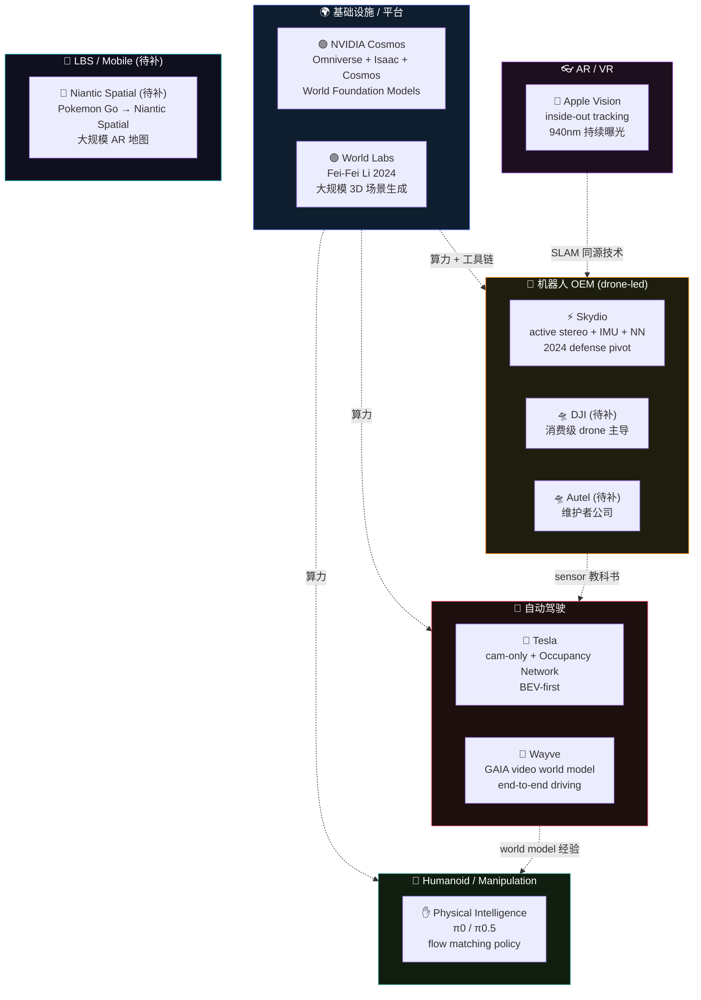

# 🏢 Companies — 产业地图 (Industry Atlas)

> **谁在押什么 spatial intelligence 路线 — 从博客 / 论文 / GTC talks 反推的产业 stack 解析。**
>
> 目前收录 **7 家公司** + 待补 3 家。
>
> Pulsar pipeline 每周从一手来源拉新 — 见每篇文末 `## 🤖 Moltbot Updates` 段。
>
> 不知道从哪开始？先选你的角色 ↓

&nbsp;

## 🎭 你是谁？

| | 角色 | 你想看什么 | 👉 推荐起点 |
|:---:|------|---------|-----------|
| 💼 | **战略 / 投资人** | "谁押对了路线？" | → [NVIDIA Cosmos](nvidia_cosmos.md) — GPU 商业模型驱动 spatial 整盘策略 |
| 🤖 | **机器人公司架构师** | "我该 copy 谁的 stack？" | → [Skydio](skydio.md) — aerial autonomy 最被抄的模板 |
| 🚗 | **AD 工程师** | "Tesla 还是 Waymo school？" | → [Tesla Occupancy](tesla_occupancy.md) + [Wayve](wayve_world_model.md) — 两条道路的认识论分歧 |
| 🦾 | **manipulation 团队** | "π0 / π0.5 怎么工作？" | → [Physical Intelligence](physical_intelligence.md) — VLA 与 spatial 的交集落地 |
| 👓 | **AR/VR 开发者** | "Apple 怎么做 SLAM？" | → [Apple Vision](apple_vision.md) — inside-out tracking 的产业级实现 |
| 🌐 | **3D foundation 研究** | "World Labs 在做什么？" | → [World Labs](world_labs.md) — Fei-Fei Li 的 3D 数据 + 研究双押注 |

&nbsp;

---

&nbsp;

## 🗺️ 产业地图



> **读图方式**：每个 cluster 代表一种"打 spatial intelligence 的方法"。NVIDIA / World Labs 卖工具，OEM 卖产品，AD 卖驾驶，Humanoid 卖动作，AR 卖体验，LBS 卖地图 — 同样的 3DGS / VGGT / depth foundation 在不同商业模式下走样很多。

&nbsp;

---

&nbsp;

## 🏛️ 五大公司分类

&nbsp;

<details open>
<summary><h3>🌍 1. 基础设施 / 平台 &nbsp;<code>2 家</code></h3></summary>

**一句话**：卖工具不卖产品 — 占据 spatial AI 产业的"卖铲子"位。

| 公司 | 一句话定位 | 关键押注 |
|---|---|---|
| [NVIDIA Cosmos](nvidia_cosmos.md) | World Foundation Models 三件套 (Predict / Transfer / Reason) | Cosmos 是 sim2real 数据工厂，不是直接给机器人用 — 押 GPU TAM 扩张 |
| [World Labs](world_labs.md) | Fei-Fei Li 创办 2024，3D 场景生成 + 研究双线 | 押注 "3D 数据"成为下一个 ImageNet 级公共资产 |

</details>

&nbsp;

<details>
<summary><h3>🚁 2. 机器人 OEM (drone-led) &nbsp;<code>1 家 · 待补 2 家</code></h3></summary>

**一句话**：把 spatial AI 装进真实机器人产品 — drone 是这一类最成熟的市场。

| 公司 | 一句话定位 | 关键押注 |
|---|---|---|
| [Skydio](skydio.md) | active stereo + IMU + 学习感知 = aerial autonomy 模板 | 2024 国防 pivot — 商用 drone 模板被工业 / 国防双线套用 |
| 🛸 **DJI** (待补) | 消费级 drone 全球主导 | 待写 — 闭源 stack，主要从专利 / 拆解反推 |
| 🛸 **Autel** (待补) | EVO 系列消费 drone — 维护者公司 | 待写 — 维护者一手内部知识 |

</details>

&nbsp;

<details>
<summary><h3>🚗 3. 自动驾驶 &nbsp;<code>2 家</code></h3></summary>

**一句话**：spatial AI 资源密度最高的一翼 — 也是 cam-only vs LiDAR doctrinal split 最分裂的战场。

| 公司 | 一句话定位 | 关键押注 |
|---|---|---|
| [Tesla Occupancy](tesla_occupancy.md) | cam-only + Occupancy Network + 数据规模 | 押 "data scale 真值" 替代 sensor physics 真值 |
| [Wayve](wayve_world_model.md) | GAIA video world model + end-to-end | 押 "world model 通用驾驶能力" 超越 modular AD 栈 |

> 没收 Waymo 单独成文 — Waymo 的核心是 LiDAR + HD map，公开技术细节较少。其策略在 `embodiments/driving/waymo_vs_tesla_doctrinal_split.md` 里有对比性分析。

</details>

&nbsp;

<details>
<summary><h3>🦾 4. Humanoid / Manipulation &nbsp;<code>1 家</code></h3></summary>

**一句话**：把 spatial 算出来的 3D 接到 VLA 动作头 — 这是 VLA-Handbook 和本仓的交集。

| 公司 | 一句话定位 | 关键押注 |
|---|---|---|
| [Physical Intelligence](physical_intelligence.md) | π0 / π0.5 — VLM + flow matching action head | 押 "implicit 3D from VLM" 击败 explicit-3D-VLA |

> Unitree / Figure / 1X 三家 humanoid 公司在 `embodiments/humanoid-legged/unitree_h1_vs_figure_vs_1x.md` 有对比 — 那是产品视角；这里 PI 是单独的 spatial-policy 接口视角。

</details>

&nbsp;

<details>
<summary><h3>👓 5. AR/VR &nbsp;<code>1 家</code></h3></summary>

**一句话**：用户是人不是机器人，但 SLAM / hand tracking / spatial anchor 技术同源 — 作为 cross-reference case 收录。

| 公司 | 一句话定位 | 关键押注 |
|---|---|---|
| [Apple Vision](apple_vision.md) | Vision Pro inside-out tracking + 940nm 持续曝光 | 押 "spatial computing" 成为 iPhone 下一代品类 |

> Meta Quest / Pico 不单独成文 — 与 Apple 相比技术差异不大；维护者深度有限。

</details>

&nbsp;

<details>
<summary><h3>🧭 6. LBS / Mobile (待补) &nbsp;<code>0 家 · 待补 1 家</code></h3></summary>

**一句话**：大规模 AR 地图 — 用户手机为 sensor 节点，crowdsource spatial 数据。

| 公司 | 一句话定位 | 关键押注 |
|---|---|---|
| 🧭 **Niantic Spatial** (待补) | Pokemon Go 转型，大规模 AR 地图 | 待写 — Visual Positioning System (VPS) 反推 |

</details>

&nbsp;

---

&nbsp;

## ⚡ Speed Runs

> *没时间读 7 篇？选一条最短路线。*

&nbsp;

### 🏃 "我要做 drone 产品" (3 家)
```
Skydio → DJI (待补) → Autel (待补)
```
[开始 →](skydio.md) — 先看模板，再看消费级巨头，再看维护者内部经验。

&nbsp;

### 🎓 "我做 AD 选路线" (2 家 + crossing)
```
Tesla Occupancy → Wayve → crossing/representation-migration/3dgs_as_simulator_comparison.md
```
[开始 →](tesla_occupancy.md) — cam-only 路线先吃透，再看 world model school。

&nbsp;

### 🤖 "我做 humanoid / manipulation" (1 家 + 多 cross-ref)
```
Physical Intelligence → bridge-to-vla/feature-cloud-to-action.md → embodiments/humanoid-legged/
```
[开始 →](physical_intelligence.md) — π0/π0.5 是接口范式。

&nbsp;

### 🌍 "我看 spatial 工具链产业" (2 家)
```
NVIDIA Cosmos → World Labs
```
[开始 →](nvidia_cosmos.md) — GPU + 生态打法 vs 研究 + 数据打法的对照。

&nbsp;

### 👓 "我看 AR/VR" (1 家 + crossing)
```
Apple Vision → foundations/sensor-physics/active_nir_850nm_for_embodied_ai.md
```
[开始 →](apple_vision.md) — 为什么 Apple 选 940nm 不是 850nm，根本物理。

&nbsp;

---

&nbsp;

## 🏆 Achievements

读完一篇就算解锁。看看你能拿几个？

| | 成就 | 解锁条件 |
|:---:|------|---------|
| 🥉 | **First Recon** | 读完任意 1 篇 company |
| 🎓 | **Industry Map** | 读完 5 大分类各 1 篇 |
| 🐉 | **Boss Hunter** | 读完 3 篇 "最难"文章（见下表） |
| 💼 | **Strategist** | 读完 NVIDIA + Tesla + Wayve（3 家最大押注的对比） |
| 🤖 | **Maker** | 读完 Skydio + Physical Intelligence + Apple Vision（3 个最接近 maker stack 的实操参考） |
| 👑 | **Full Atlas** | 读完所有 7 篇 + 3 待补完工后补读 |

<details>
<summary>🐉 Boss Monsters（每类最硬的一篇）</summary>

| Category | Boss | Why It's Hard |
|---|---|---|
| 🌍 Platform | [NVIDIA Cosmos](nvidia_cosmos.md) | 三件套架构 + GPU 商业模型反推 + 2027 可证伪预测 |
| 🚁 Drone OEM | [Skydio](skydio.md) | active stereo + 学习感知 + 国防 pivot 的多线叙事 |
| 🚗 AD | [Tesla Occupancy](tesla_occupancy.md) | AI Day 反推 + cam-only 哲学的认识论辩护 |
| 🦾 Humanoid | [Physical Intelligence](physical_intelligence.md) | implicit 3D 押注的可证伪 vs explicit 路线 |
| 👓 AR/VR | [Apple Vision](apple_vision.md) | 940nm 选择背后的眼睛安全 dose budget 数学 |

</details>

&nbsp;

---

&nbsp;

## 🔄 与其他目录的边界

| 这里写什么 | 别在这里 |
|---|---|
| **公司层面**的战略 / 押注 / 产品线 / 工具链 | 单论文 dissection 去 `foundations/` |
| 闭源 stack 的逆向工程（博客 / 专利 / 演讲） | 通用方法学去 `foundations/` |
| 产品对比角度的 humanoid / drone 厂商对比 | 但 product-level 对比已在 `embodiments/<x>/<vendor_comparison>.md` 中，本目录是**公司战略**视角 |
| Pulsar pipeline 每周追加新动态（per file 的 `## 🤖 Moltbot Updates` 段） | 不在 `companies/README.md` 这里聚合更新 — 每篇自己的文档管自己 |

&nbsp;

---

&nbsp;

<details>
<summary>📊 Stats</summary>

&nbsp;

**7 家公司已收录** · **3 家待补** (DJI, Autel, Niantic Spatial)

- 部分自动追加：每篇文末有 `## 🤖 Moltbot Updates` 段供 Pulsar pipeline 追加发布动态 — 见 [`AGENTS.md`](../AGENTS.md) §2 写入权限矩阵。
- 维护节奏：major company stack 更新由人工触发（如 NVIDIA GTC / Apple WWDC / Tesla AI Day），minor 产品 / SKU 由自动 pipeline 增量。
- 闭源 stack 反推规则：必须有一手 URL（blog / talk / patent / 论文），UNVERIFIED 严格标。

</details>

&nbsp;

---

[← Back to Handbook root](../README.md) · [→ foundations](../foundations/README.md) · [→ embodiments](../embodiments/README.md) · [→ crossing (USP)](../crossing/README.md)
