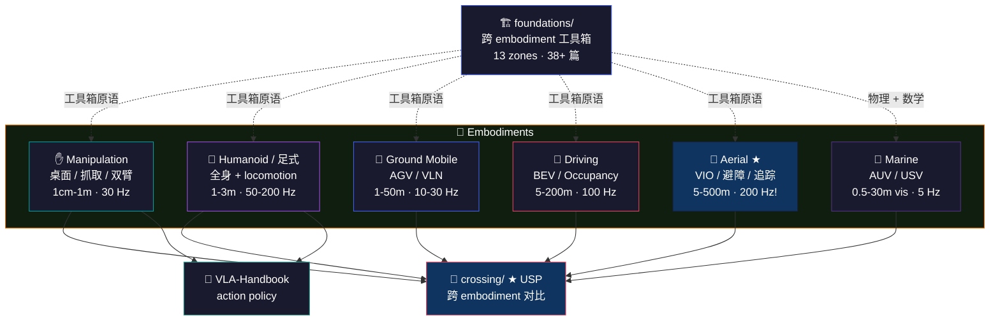

# 🤖 Embodiments — Explorer's Map

> **Spatial intelligence 在不同 embodiment 上长得截然不同 — 尺度 1cm vs 1km、控制频率 5 Hz vs 200 Hz、米制可选 vs 必需。**
>
> 同一类问题（perceive → represent → reason → act），在 6 个 embodiment 上有 6 种解法。本目录写每个 embodiment 的 SOTA stack + 它独有的 spatial 问题。
>
> Drone 是维护者锚定方向（深度 1.5–2× 其他）；marine 故意写得轻，作为 contrasting case stress-test 视觉-only spatial AI 的上限。
>
> 不知道从哪开始？先选你的角色 ↓

## 🎭 你是谁？

| | 角色 | 你的应用 | 👉 推荐起点 |
|:---:|------|---------|-----------|
| ✋ | **manipulation / 机械臂工程师** | 桌面 / 抓取 / 装配 / 双臂 / dexterous hand | → [manipulation/](manipulation/) — 注意 spatial 这边只写 representation 侧，policy 在 [VLA-Handbook](https://github.com/sou350121/VLA-Handbook) |
| 🦿 | **humanoid / 足式机器人** | Unitree / Figure / 1X / Boston Dynamics | → [humanoid-legged/](humanoid-legged/) — 全身 spatial 推理（gaze 远 + 落脚近）|
| 🛒 | **AGV / 室内导航** | 仓储 / 餐饮 / 家庭 / VLN | → [ground-mobile/](ground-mobile/) — 2D LiDAR + AMCL 主导，神经 SLAM 是过度工程 |
| 🚗 | **自动驾驶 (AD)** | 量产 / robotaxi | → [driving/](driving/) — 注意：不是 AD 综述，只写 spatial primitive |
| 🚁 | **无人机 / 空中机器人** ★ | UZH RPG / Skydio / DJI / Autel | → [aerial/](aerial/) — **维护者锚定方向**，8 个子目录最深 |
| 🌊 | **水下机器人 / 海洋** | AUV / USV / 声呐 stack | → [marine/](marine/) — 极端 stress test，sonar-primary，视觉是辅助 |

---

## 🔍 一眼看清 6 大 embodiment 特性

> *分 4 张窄表 — GitHub 渲染友好。看物理约束、上下游、sensor stack、决策。*

### 表 1 · 物理约束（尺度 / 频率 / latency / Metric）

| Embodiment | **尺度** | **控制频率** | **延迟预算** | **Metric 需求** |
|---|:---:|:---:|:---:|:---:|
| ✋ [Manipulation](manipulation/) | 1cm–1m workspace | 30 Hz OK | 100 ms | ✅ 必需 |
| 🦿 [Humanoid](humanoid-legged/) | 1–3m 全身 | 50–200 Hz | 5–50 ms | ✅ |
| 🛒 [Ground Mobile](ground-mobile/) | 1–50m 室内 | 10–30 Hz | 50–100 ms | ✅ |
| 🚗 [Driving](driving/) | 5–200m | 100 Hz | 10 ms | ✅ |
| 🚁 [Aerial](aerial/) ★ | 5–500m 户外 | **200 Hz** ‼️ | **5 ms** ‼️ | ✅（无 fallback）|
| 🌊 [Marine](marine/) | 0.5–30m visibility | 5 Hz | 200 ms | ✅（DVL 给）|

### 表 2 · 上游 → 主要任务 → 下游消费

| Embodiment | **🔼 上游 (input sensor)** | **🎯 主要 spatial 任务** | **🔽 下游 (consumer)** |
|---|---|---|---|
| ✋ Manipulation | wrist RGBD (D435) + arm encoders + IMU 可选 | object 6D pose / grasp planning / contact-rich | VLA policy（policy 在 [VLA-Handbook](https://github.com/sou350121/VLA-Handbook)）|
| 🦿 Humanoid | head stereo + foot contact + multi-IMU 网 | 全身姿态 + locomotion + head gaze 双目标 | whole-body controller + reaching policy |
| 🛒 Ground Mobile | 2D LiDAR + wheel odom + IMU + cam | 室内 SLAM + obstacle avoid + VLN | path planner + navigation policy |
| 🚗 Driving | 多目 RGB + radar + (LiDAR 视厂家) + IMU + GNSS | BEV / 占用网络 / lane / 物体检测 | downstream perception → planner → controller |
| 🚁 Aerial ★ | mono cam + IMU + (stereo if >800g) + 可选 GNSS | VIO + 避障 + active tracking + on-board mapping | 200 Hz autopilot 内控环 |
| 🌊 Marine | DVL + multibeam sonar + FOG IMU + (cam < 5m visibility) | sonar-primary SLAM + DVL 死推 + 视觉辅助 | mission planner + 水下导航 |

### 表 3 · SWaP-C 绑定（什么是 BoM 杀手）

| Embodiment | **SWaP-C 主导约束** | **典型 BoM 占比** |
|---|---|---|
| ✋ Manipulation | cost-per-cell | ~5% of $25-50k 臂 |
| 🦿 Humanoid | head weight + thermal | 3–8% of 全机 |
| 🛒 Ground Mobile | cost + 认证 | 10–20% of $5–30k AGV |
| 🚗 Driving | range + 集成 miles | $50k+ on $80k 车（LiDAR 一项占一半）|
| 🚁 Aerial ★ | **weight + power** | **20–40% by weight**（最严苛）|
| 🌊 Marine | pressure + acoustic | 30–50% of $50k–1M AUV |

### 表 4 · 决定性因素（关键限制 / 何时选）

| Embodiment | ⚠️ **关键限制（接受才能用）** | ✅ **何时选（决定性场景）** |
|---|---|---|
| ✋ Manipulation | 透明 / 镜面 / 动态物体 / 杂乱场景 | 工厂 / 实验室 / 桌面任务 |
| 🦿 Humanoid | 全身 IMU 漂移 / 动态平衡 / 跌倒 / 软组织撞击 | Unitree H1 / Figure 02 / 1X 风格 |
| 🛒 Ground Mobile | 仓库人多 / 玻璃门 / 不平地面 / GPS 不可用 | 仓储 / 室内服务 / 餐饮 / VLN |
| 🚗 Driving | 极端天气 / reflective road / 远距离 / 法规 / miles | 量产 AD / robotaxi / ADAS |
| 🚁 Aerial ★ | **桨叶振动** / 风 / 电池 / sub-10 ms 强约束 | UZH 赛车 / Skydio 巡检 / DJI / Autel |
| 🌊 Marine | **视觉退化** / GPS 不可用 / 压力 / 声学多径 | 水下勘探 / 管线巡检 / contrasting case |

### 🎯 5 秒选 embodiment

```
你的机器人物理形态？
│
├─ 不动 (固定基座) + 一只手
│   └─ ✋ Manipulation
│       (cost-per-cell 主导；要米制；透明物体是 #1 失败)
│
├─ 两腿 / 多腿 (全身可动)
│   └─ 🦿 Humanoid / Legged
│       (head + foot 双视点；全身 IMU 网；落脚 ≠ gaze 目标)
│
├─ 轮子 (室内为主)
│   └─ 🛒 Ground Mobile (AGV)
│       (2D LiDAR + AMCL 至今未被取代；BoM 锁死)
│
├─ 车 (公路 / 高速)
│   └─ 🚗 Driving
│       (200m 远距离 ≠ manipulation；Tesla vs Waymo 路线分歧)
│
├─ 飞 (空中)
│   └─ 🚁 Aerial ★
│       (200 Hz / 5 ms 强约束；weight+power binding；★ 维护者深度)
│
└─ 水下
    └─ 🌊 Marine
        (DVL 是真主角；视觉 95% 时间是装饰)
```

### 🚦 2D 定位：尺度 × 控制频率

```
   控制频率 (Hz)
       │
   200 ┤                                                   🚁 Aerial ★
       │                                                  (5 ms latency)
       │
       │
   100 ┤                              🦿 Humanoid       🚗 Driving
       │                              (whole-body)      (10 ms latency)
       │
    50 ┤
       │
       │
    30 ┤    ✋ Manipulation           🛒 Ground Mobile
       │    (100 ms OK)               (50-100 ms)
       │
    10 ┤
       │
       │
     5 ┤                                                            🌊 Marine
       │                                                            (200 ms OK)
       │
       └──────────┬──────────┬──────────┬──────────┬──────────┬──────────► 尺度 (m, log scale)
                 0.1m       1m         10m        100m       1km
                 ↑          ↑           ↑          ↑          ↑
              manipulation humanoid  ground mobile  driving   aerial
              (workspace) (full body) (indoor)    (highway)  (outdoor)

   读图秘诀:
   • 右上 (大 + 快) = aerial — 最严苛 operational envelope
   • 左下 (小 + 慢) = manipulation — sensor / compute 都有余量
   • 中间 = humanoid / AGV / driving — 各自的 SWaP-C trade
   • 离群 marine — 频率慢，靠 sonar 而非视觉
```

> **读图秘诀**：你的机器人物理形态决定 (尺度, 频率) 坐标 → 决定 sensor 选型 + spatial 模型选型。**aerial 是最难的角落**，所以这个 handbook 在 aerial 上写得深 1.5–2×。

---

## 🌍 世界地图



> **读图方式**：每个 embodiment 都从 `foundations/` 拉工具，到 `crossing/` 做对比；manipulation + humanoid 还会拉到 [`VLA-Handbook`](https://github.com/sou350121/VLA-Handbook) 接 policy。aerial / marine 是 sensor-physics 锚定（drone weight+power、marine acoustic）。

---

## 🏛️ 六大 embodiment 深读

### ✋ 1. `manipulation/` — 桌面 / 抓取 / 双臂 / 灵巧手  `2 篇`

**一句话**：spatial 这边只写 representation 侧（3D feature cloud, affordance, SAM 3D）；policy 在 [VLA-Handbook](https://github.com/sou350121/VLA-Handbook)。

**关键限制**：透明 / 镜面物体（D435 active stereo 失效）、动态环境、杂乱场景物体重叠。**米制必需** —— 抓不到 vs 抓得到只差 5 mm。

| 推荐入口 | 说明 |
|---------|------|
| [manipulation/](manipulation/) | 子区导读 |
| [3d_feature_cloud_representations.md](manipulation/3d_feature_cloud_representations.md) | PointNet++ / SAM-3D / DINOv2 lifted 三谱系 |
| [bimanual_and_dexterous_hand.md](manipulation/bimanual_and_dexterous_hand.md) | 双臂 task-space frame 解耦 + dexterous hand 触觉融合 |

### 🦿 2. `humanoid-legged/` — 全身 + 行走 + 平衡  `2 篇`

**一句话**：humanoid 与 manipulation 的最大区别是**身体本身在 scene 里移动** — gaze 远 + 落脚近 是 spatial 推理的根本两难。

**关键限制**：全身 IMU 累计漂移、动态平衡（站不稳）、跌倒后软组织碰撞、多 IMU 同步。

| 推荐入口 | 说明 |
|---------|------|
| [humanoid-legged/](humanoid-legged/) | 子区导读 |
| [whole_body_spatial_perception.md](humanoid-legged/whole_body_spatial_perception.md) | 全身 spatial 感知（head + foot 双视点）|
| [unitree_h1_vs_figure_vs_1x.md](humanoid-legged/unitree_h1_vs_figure_vs_1x.md) | 三家 humanoid 公司的 spatial stack 对比 |

### 🛒 3. `ground-mobile/` — AGV / 室内 / VLN  `2 篇`

**一句话**：mass-market AGV 锁死在 2D LiDAR + AMCL 是 BOM 决定的工程现实；3D / 神经 SLAM 在仓储是过度工程。

**关键限制**：仓库人多 / 玻璃门 / 不平地面 / GPS 不可用。**米制必需**但 GNSS fallback 通常可得（开放门外）。

| 推荐入口 | 说明 |
|---------|------|
| [ground-mobile/](ground-mobile/) | 子区导读 |
| [agv_indoor_localization_stack.md](ground-mobile/agv_indoor_localization_stack.md) | 室内 AGV 全 stack 拆解 |
| [vln_and_object_nav.md](ground-mobile/vln_and_object_nav.md) | VLN + ObjectNav 三种范式（modular vs end-to-end vs language-conditioned）|

### 🚗 4. `driving/` — BEV / 占用网络 / Waymo vs Tesla  `2 篇`

**一句话**：**严格不写 AD 综述** — 只写 spatial primitive。BEV / occupancy / world model 是这边的 3 个 axis。

**关键限制**：远距离（200m 设计目标）、极端天气、reflective road、HD map 是否必需的路线之争。

| 推荐入口 | 说明 |
|---------|------|
| [driving/](driving/) | 子区导读 + AD 综述边界声明 |
| [bev_and_occupancy.md](driving/bev_and_occupancy.md) | BEVFormer / Tesla Occupancy Network 完整拆解 |
| [waymo_vs_tesla_doctrinal_split.md](driving/waymo_vs_tesla_doctrinal_split.md) | 两条道路的认识论之争（sensor physics 真值 vs data-scale 真值）|

### 🚁 5. `aerial/` ★ — Drone 维护者锚定  `9 篇 · 1.5-2× 深度`

**一句话**：aerial 是 spatial intelligence 最严苛的角落 — 200 Hz / 5 ms / 米制 / 抗振动同时要满足 — 任何不满足都不能上控制环。

**关键限制**：桨叶振动激发 IMU（100-400 Hz）/ 风 / 电池续航 / weight+power binding（20-40% by weight）/ sub-10 ms 强约束。

| 推荐入口 | 说明 |
|---------|------|
| [aerial/](aerial/) | 子区导读（8 个 axes）|
| [aerial/vio/](aerial/vio/) | VINS-Mono / OpenVINS / DROID-SLAM 三大 VIO stack |
| [aerial/event-camera/](aerial/event-camera/) | UZH RPG champion-level racing + event camera 物理 |
| [aerial/obstacle-avoidance/README.md](aerial/obstacle-avoidance/overview.md) | 两条 school（RL reactive vs classical planning）|
| [aerial/active-tracking/README.md](aerial/active-tracking/overview.md) | Skydio ActiveTrack + DJI ActiveTrack 反推 |
| [aerial/on-board-mapping/README.md](aerial/on-board-mapping/overview.md) | 3DGS on Jetson Orin + GNSS-denied long-range |
| [aerial/sensor-stack/README.md](aerial/sensor-stack/overview.md) | 250g / 800g / 1.5kg+ 三档 payload 的 sensor 选型 |

### 🌊 6. `marine/` — AUV / USV / 声呐 stack  `2 篇 · contrasting case`

**一句话**：marine 是 spatial intelligence 的**真正 stress test** — 视觉退化、GPS 不可用、声学主导 — 任何在水下能 work 的方法都是真鲁棒。

**关键限制**：视觉吸收 + 散射（<5m visibility）、GPS 不可用、声学多径、压力下 sensor 受限、单 mission $50k-1M 部署成本。

| 推荐入口 | 说明 |
|---------|------|
| [marine/](marine/) | 子区导读 |
| [sensor_stack_underwater.md](marine/sensor_stack_underwater.md) | DVL 是 marine "GNSS"，multibeam / side-scan 声呐 stack |
| [underwater_slam_dvl_sonar.md](marine/underwater_slam_dvl_sonar.md) | 水下 SLAM 完整拆解（视觉辅助 < 5m，sonar 主导）|

---

## ⚡ Speed Runs

> *没时间读所有 embodiment？选最相关的 1-2 个深读，其他靠 crossing/ 对比补全。*

### 🏃 "我做 drone 产品" (Aerial focus)
```
aerial/sensor-stack → aerial/vio/openvins → aerial/on-board-mapping
+ crossing/slam-vio-migration/vggt_vs_drone_vio (跨 embodiment 对比)
```

### 🎓 "我做 manipulation policy"
```
manipulation/3d_feature_cloud_representations
+ bridge-to-vla/feature-cloud-to-action
+ VLA-Handbook (cross-link to sister handbook)
```

### 🚗 "我做 AD"
```
driving/bev_and_occupancy → driving/waymo_vs_tesla_doctrinal_split
+ companies/nvidia_cosmos + companies/tesla_occupancy + companies/wayve_world_model
```

### 🤖 "我做 humanoid"
```
humanoid-legged/whole_body_spatial_perception
+ unitree_h1_vs_figure_vs_1x
+ aerial/vio/openvins (humanoid 也用 MSCKF / IMU)
```

### 🛒 "我做 AGV / VLN"
```
ground-mobile/agv_indoor_localization_stack → vln_and_object_nav
+ foundations/classical-slam/orb_slam3 (室内 SLAM 仍主导)
```

### 🌊 "我做水下 / marine"
```
marine/sensor_stack_underwater → underwater_slam_dvl_sonar
+ foundations/sensor-physics/ (声学 / DVL 物理)
```

---

## 🏆 Achievements

| | 成就 | 解锁条件 |
|:---:|------|---------|
| 🥉 | **First Embodiment** | 读完任意 1 个 embodiment 的 README |
| 🎓 | **Cross-Embodiment Initiated** | 读完 ≥3 个 embodiment + 1 篇 `crossing/` |
| 🚁 | **Aerial Specialist** | 读完 aerial/ 全部 9 篇 |
| 🌊 | **Marine Realist** | 读完 marine/ 全部 + 理解为什么视觉-only 在水下输 |
| 👑 | **Full Atlas** | 6 个 embodiment 都读完 + 5 个 crossing wedge 都读完 |

---

### 📊 Stats

**6 个 embodiment**·**19 篇 dissection**·aerial 9 篇（维护者锚定）

**与其他目录的关系**：
- 上游工具来自 `foundations/`（13 zones）
- 跨 embodiment 对比走 `crossing/`（5 wedges, USP）
- manipulation / humanoid 的 policy 在姊妹仓 [VLA-Handbook](https://github.com/sou350121/VLA-Handbook)
- BoM / 标定 / 失败模式 in `deployment/`

---

[← Back to Handbook root](../README.md) · [→ foundations](../foundations/overview.md) · [→ crossing (USP)](../crossing/overview.md) · [→ bridge to VLA-Handbook](../bridge-to-vla/overview.md)
