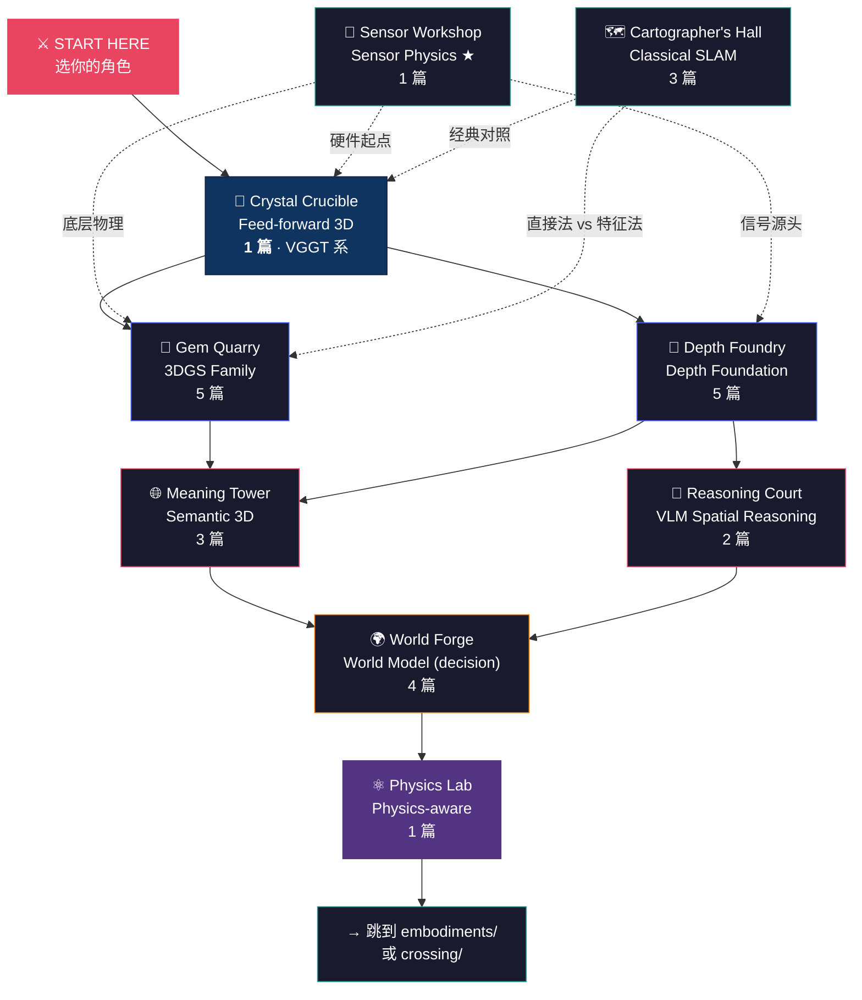

# 🏗️ Foundations — Explorer's Map

> **Foundations** 是跨 embodiment 共享的底层 — 3DGS / VGGT / Depth Foundation / 经典 SLAM 这些"工具箱"原语，无论你做 manipulation、aerial 还是 marine，最终都会回到这里。
>
> 目前收录 **17 篇深度解析** + **9 区导读**，是华语世界对空间智能底层最系统的拆解。
>
> 不知道从哪开始？先选你的角色 ↓

&nbsp;

## 🎭 你是谁？

| | 角色 | 你的背景 | 👉 推荐起点 |
|:---:|------|---------|-----------|
| 🧙 | **3D vision 研究者** | 熟悉 NeRF / SfM / Multi-view stereo | → [VGGT 解构](feed-forward-3d/vggt_cvpr2025_dissection.md)，2025 CVPR best paper 是范式转移信号 |
| 🤖 | **机器人感知工程师** | 调过 SLAM、做过 RGBD 处理 | → [Depth Anything v2 解构](depth-foundation/depth_anything_v2_dissection.md)，相对深度 vs 度量深度的现场 trap |
| 🎮 | **图形学 / 渲染从业者** | 熟悉光线追踪、material shading | → [3DGS 原始论文解构](3dgs-family/3dgs_original_dissection.md)，看它如何在 6 个月内 100× NeRF |
| 🛰️ | **跨 embodiment / 系统架构师** | 同时关注车 + 机器人 + AR | → [Crossing 章节旗舰](../crossing/slam-vio-migration/vggt_vs_drone_vio.md)，再回来看 foundations 当工具箱 |
| 📡 | **传感器 / 硬件团队** | 写过 driver、做过 BoM | → [850nm 主动近红外解构](sensor-physics/active_nir_850nm_for_embodied_ai.md)，学界综述写不出的 SWaP-C 工程账 |
| 🗺️ | **SLAM 工程师** | 跑过 ORB-SLAM / VINS / OpenVINS | → [ORB-SLAM3 解构](classical-slam/orb_slam3_dissection.md)，经典框架的 multi-map atlas 设计 |

&nbsp;

---

&nbsp;

## 🌍 世界地图



> **读图方式**：实线 = 建议学习顺序（从 feed-forward 3D 出发是最快理解全局的路径）。虚线 = Sensor Physics 是物理底层，遇到 "为什么 850nm？"" 为什么 RGBD 在户外失效？" 这种问题随时回来。

&nbsp;

---

&nbsp;

## 🏛️ 八大区域

&nbsp;

<details open>
<summary><h3>🔮 Crystal Crucible — Feed-forward 3D &nbsp;<code>1 篇 · ⭐ 旗舰区</code></h3></summary>

**一句话**：3D 不再是离线拟合的目标 — 而是可直接前向推理的输出。

2024 年之前，多视图 3D 重建 = COLMAP + per-scene optimization（NeRF / 3DGS 都属于这一类，需要分钟到小时级训练）。**DUSt3R / MASt3R** 把成对前向 3D 推理打通；**VGGT (CVPR 2025 best paper)** 把 N-view 收进单次 transformer pass。这是空间智能从"拟合"到"推理"的范式转移信号 — 所有 manipulation / AD 的 perception front-end 都会被改写。

| 推荐入口 | 说明 |
|---------|------|
| [VGGT (CVPR 2025) Dissection](feed-forward-3d/vggt_cvpr2025_dissection.md) | ★ 完整拆解：4-head 联合训练、训练数据配比、为什么 N-view 不只是 2-view 加强版 |

📂 **完整目录**：待补 (1 篇暂未拆出独立 README)。DUSt3R / MASt3R / π³ streaming 的独立解构是下一轮 W2 目标。

</details>

&nbsp;

<details>
<summary><h3>💎 Gem Quarry — 3DGS Family &nbsp;<code>5 篇</code></h3></summary>

**一句话**：3DGS 不是 NeRF 的加速版 — 它把"可编辑、可检视、可工程化"的 radiance field 还给了机器人圈。

为什么 2023 SIGGRAPH 这一篇能在 6 个月内取代 NeRF？关键是各向异性 gaussian splat 的可微 rasterizer — 训练 100× 快、推理实时、显式 primitive 可以直接编辑 / 调权。后续 3 条衍生线分别在动态场景 (4DGS)、SLAM 后端 (GS-SLAM)、抗锯齿 (Mip-Splatting) 上各自往前推一格。**robotics 圈关心的不是 photo-realistic 视频生成，而是这些 primitives 是 inspectable 的。**

| 推荐入口 | 说明 |
|---------|------|
| [3DGS Original Dissection](3dgs-family/3dgs_original_dissection.md) | Kerbl et al. SIGGRAPH 2023 — 100× 加速怎么来的、1-2 GB 存储是什么代价 |
| [4DGS Dynamic Scenes](3dgs-family/4dgs_dynamic_scenes.md) | 标准化集合 + 变形场 vs per-timestep gaussians 两条路 |
| [GS-SLAM](3dgs-family/gs_slam_dissection.md) | 把 3DGS 放进 SLAM 后端，loop closure 是未解问题 |
| [Mip-Splatting](3dgs-family/mip_splatting.md) | 3D 平滑 + 2D dilation 修 aliasing — 无人机和 VR 的 default |

📂 **完整目录**：[3dgs-family/README.md](./3dgs-family/README.md)

</details>

&nbsp;

<details>
<summary><h3>📏 Depth Foundry — Depth Foundation &nbsp;<code>5 篇</code></h3></summary>

**一句话**：MiDaS 之后的范式转移 — depth 是 "foundation model"，但 "相对 vs 度量" 这一步会让机器人栽跟头。

Depth Anything v2 在论文里看起来 strictly better，但只能输出 *相对* depth — 你拿去抓杯子，得到的方向对、距离错。Metric3D 用 canonical camera transformation 把度量这一项找回来。MoGe 走 affine-invariant 多任务路线（点 + 深度 + 法线）。FoundationStereo 用"synthetic + foundation backbone"配方把 stereo matching 也接进 foundation 时代。**为机器人选 depth model 的第一题永远是：你需要米，还是只需要相对顺序？**

| 推荐入口 | 说明 |
|---------|------|
| [Depth Anything v2](depth-foundation/depth_anything_v2_dissection.md) | 62M 无标注数据蒸馏的秘方，以及"漂亮输出 vs 度量陷阱" |
| [Metric3D](depth-foundation/metric3d_dissection.md) | Canonical camera transformation 让单目度量成为可能 |
| [MoGe](depth-foundation/moge_dissection.md) | 多 head 仿射不变几何 — VGGT 谱系的先声 |
| [FoundationStereo](depth-foundation/foundationstereo_dissection.md) | 给无人机最便宜的被动度量深度 |

📂 **完整目录**：[depth-foundation/README.md](./depth-foundation/README.md)

</details>

&nbsp;

<details>
<summary><h3>🌐 Meaning Tower — Semantic 3D &nbsp;<code>3 篇</code></h3></summary>

**一句话**：2D 语义特征（DINOv2 / SigLIP / CLIP）必须被"抬"进 3D 空间，机器人才能听懂"把红色杯子放到桌子左边"。

三条主流路线：**逐像素投影** (最简单，2D 特征 + 深度直接 backproject)；**LERF-style feature field** (NeRF/3DGS 里训一个语义 field)；**OpenScene-style 直接融合** (零样本，无需 per-scene 训练)。LERF 给了 paradigm proof，OpenScene 因为不用 per-scene 训练所以在 deployment 上跑赢 — robotics 圈引用 OpenScene 比 LERF 多。

| 推荐入口 | 说明 |
|---------|------|
| [LERF Dissection](semantic-3d/lerf_dissection.md) | 多 scale CLIP 蒸馏到 NeRF field，paradigm proof 但训得贵 |
| [OpenScene Dissection](semantic-3d/openscene_dissection.md) | 直接 CLIP/SAM → 3D voxel，零 per-scene 训练，部署赢家 |

📂 **完整目录**：[semantic-3d/README.md](./semantic-3d/README.md)

</details>

&nbsp;

<details>
<summary><h3>🧠 Reasoning Court — VLM Spatial Reasoning &nbsp;<code>2 篇</code></h3></summary>

**一句话**：VLM 默认是"扁平的" — 它没有 3D 概念，除非你刻意训练它。

GPT-4V 知道"杯子在桌上"，但不知道"杯子在你右手 12 cm 处"。三种修法：**implicit pretraining** (SpatialVLM 用 2B 合成 QA pair 训出"空间感")、**explicit caption tokens** (SpatialBot 把深度直接接进 prompt)、**3D-aware benchmark training** (用 3DSRBench 这种 benchmark 强迫学习)。SpatialVLM 是 data paper 不是 model paper — 它告诉你 *合成数据 pipeline* 才是 lever。

| 推荐入口 | 说明 |
|---------|------|
| [SpatialVLM Dissection](vlm-spatial-reasoning/spatialvlm_dissection.md) | 2B 合成 QA pair pipeline，Google DeepMind CVPR 2024 |

📂 **完整目录**：[vlm-spatial-reasoning/README.md](./vlm-spatial-reasoning/README.md)

</details>

&nbsp;

<details>
<summary><h3>🌍 World Forge — World Model (decision-useful only) &nbsp;<code>4 篇</code></h3></summary>

**一句话**：严格 "decision-useful" 门槛 — 不收 generative 3D for users，只收对具身决策有用的世界模型。

NVIDIA Cosmos 是 sim2real *data factory* (Transfer > Predict > Reason)。Genie 是 inference-time MPC planner 而非训练数据源。Marble 大部分功能不在范围内（目标用户是人不是机器人），但 depth-from-video 这一片仍有用。**这一区 70% 的 "世界模型" hype 被打 ❌ —  PRD 明确写了这个门槛。**

| 推荐入口 | 说明 |
|---------|------|
| [NVIDIA Cosmos](world-model/nvidia_cosmos_dissection.md) | sim2real 数据工厂；预测 2027-12 真机 contact-rich 任务提升 < 15% |
| [Genie / Genie 2](world-model/genie_dissection.md) | 推理时 planner 而非训练源；latent action 接地是未解 |
| [Marble (decision view)](world-model/marble_decision_view.md) | 显式 in-scope / out-of-scope 表 — 拒绝大部分功能 |

📂 **完整目录**：[world-model/README.md](./world-model/README.md)

</details>

&nbsp;

<details>
<summary><h3>⚛️ Physics Lab — Physics-aware Rendering &nbsp;<code>1 篇</code></h3></summary>

**一句话**：PhysGaussian 是"物理感知 *渲染*"，不是"物理 grounding *策略训练*" — 别搞混。

MPM (Material Point Method) 物理 + 3DGS 渲染 = 看起来很物理，但材料参数仍要手工设置 per asset。它的真正用途是 *soft-body augmentation* 给 manipulation policy 训练 — 而不是 rigid contact dynamics 学习。Contact-rich scenarios 这条路它不能走。

| 推荐入口 | 说明 |
|---------|------|
| [PhysGaussian](physics/physgaussian_dissection.md) | MPM + 3DGS；soft-body augmentation 而非 contact dynamics |

📂 **完整目录**：待补（physics 这片暂只有 1 篇）

</details>

&nbsp;

<details>
<summary><h3>🗺️ Cartographer's Hall — Classical SLAM &nbsp;<code>3 篇</code></h3></summary>

**一句话**：feed-forward 3D 之前 (2014-2021)，视觉 SLAM 的 industry standard 由 ORB-SLAM 系 和直接法 (DSO / LSD) 定义 — 现在仍是绝大多数机器人 PoC 的起点。

跨 embodiment 通用的经典视觉 SLAM 工具箱。**ORB-SLAM3** (2021) 一锅包揽 mono / stereo / RGBD / IMU-tightly-coupled，加上 multi-map atlas 处理 long-term operation 中的重定位；**DSO / LSD-SLAM** 走直接法（pixel intensity gradient 而非 feature matching），在 gradient-rich 场景里更准但 loop closure 较弱。**Kalibr / maplab** 工具链是任何视觉惯性系统不可绕过的标定基建。

> **与 `embodiments/aerial/vio/` 的边界**：VIO 区写无人机实时性导向的 VINS-Fusion / OpenVINS / DROID-SLAM；这一区写跨 embodiment 通用、不强假设 IMU 紧耦合的经典视觉 SLAM 框架。

| 推荐入口 | 说明 |
|---------|------|
| [ORB-SLAM3 Dissection](classical-slam/orb_slam3_dissection.md) | T-RO 2021 旗舰：tracking / local mapping / atlas multi-map 三模块，ORB descriptor 为何仍是关键 |
| [Direct Methods (DSO / LSD-SLAM)](classical-slam/direct_methods_dso_lsd.md) | 直接法 vs 特征法的根本分歧，何时 DSO 准、何时输 |
| [SLAM Toolchain Ecosystem](classical-slam/slam_toolchain_ecosystem.md) | Kalibr 标定 / maplab 框架 / ROS 集成 / 部署 caveat |

📂 **完整目录**：[classical-slam/README.md](./classical-slam/README.md)

</details>

&nbsp;

<details>
<summary><h3>📡 Sensor Workshop — Sensor Physics ★ &nbsp;<code>1 篇 · 🛰️ 独家轴</code></h3></summary>

**一句话**：学界综述写不出 SWaP-C 工程账；厂商内部资料又封闭 — 这一区是本书与所有其他空间智能资源最大的差异点。

850 nm 不是任意选的 — 它在 Si CMOS QE × solar irradiance dip × IEC 60825-1 Class 1 safety budget × cost 的四元优化里是唯一的清算点。Apple Vision Pro 用 940nm 不是性能更好，是 *exposure duration* 不同。**任何空间智能 deployment 选择 active sensing 前都该看这一区。**

| 推荐入口 | 说明 |
|---------|------|
| [Active NIR 850nm for Embodied AI](sensor-physics/active_nir_850nm_for_embodied_ai.md) | ★ 独家：Si QE / solar dip / 眼睛安全的四元优化，附 ToF/structured-light/active stereo 三档对比 |

📂 **完整目录**：待补。ToF / LiDAR / event camera 物理拆解是下一轮 W2 目标。

</details>

&nbsp;

---

&nbsp;

## ⚡ Speed Runs

> *没时间读 14 篇？选一条最短路线。*

&nbsp;

### 🏃 "我就想搞清楚 2024-2026 spatial 范式怎么变了"（3 篇）

```
3DGS Original → Depth Anything v2 → VGGT
```

[开始 →](3dgs-family/3dgs_original_dissection.md)（per-scene → foundation → feed-forward N-view 三段跃迁）

&nbsp;

### 🎓 "我要为无人机选 perception stack"（4 篇）

```
Depth Anything v2 → FoundationStereo → 850nm 物理 → VGGT vs Drone VIO
```

[开始 →](depth-foundation/depth_anything_v2_dissection.md)（理解 relative-vs-metric，再决定 active vs passive）

&nbsp;

### 🤖 "我要做 manipulation 的 3D-aware policy"（3 篇）

```
VGGT → OpenScene → bridge-to-vla/feature-cloud-to-action
```

[开始 →](feed-forward-3d/vggt_cvpr2025_dissection.md)（encoder → semantic lift → policy interface 完整链）

&nbsp;

### 🧬 "我是 VLA 研究者，想跨过来看 spatial"（3 篇）

```
VGGT → SpatialVLM → bridge-to-vla/3d_aware_vla
```

[开始 →](feed-forward-3d/vggt_cvpr2025_dissection.md)（先建立 encoder 直觉，再看 3D 和 VLA 怎么接）

&nbsp;

### 🏗️ "我是 sensor hardware 团队"（2 篇 + 1 crossing）

```
850nm NIR → crossing/sensor-stack-matrix
```

[开始 →](sensor-physics/active_nir_850nm_for_embodied_ai.md)（先吃透物理，再看跨 embodiment SWaP-C 矩阵）

&nbsp;

---

&nbsp;

## 🏆 Achievements

读完一篇就算解锁。看看你能拿几个？

| | 成就 | 解锁条件 |
|:---:|------|---------|
| 🥉 | **First Blood** | 读完任意 1 篇 dissection |
| 🎓 | **Orientation** | 读完 VGGT + 3DGS Original + Depth Anything v2（三大底层） |
| 💎 | **Full Map** | 8 区各读至少 1 篇 |
| 🐉 | **Boss Hunter** | 读完 3 篇 "最难"文章（见下表） |
| ⚡ | **Speed Runner** | 完成任意一条 Speed Run |
| 🛰️ | **Cross-Embodiment** | 至少读 1 篇 foundations + 1 篇 `crossing/` + 1 篇 `embodiments/` |
| 👑 | **Foundation Master** | 8 区各读全部文章 |

<details>
<summary>🐉 Boss Monsters（每区最硬的一篇）</summary>

| Zone | Boss | Why It's Hard |
|------|------|---------------|
| 🔮 Crystal Crucible | [VGGT Dissection](feed-forward-3d/vggt_cvpr2025_dissection.md) | 4-head 联合训练数学 + 训练数据配比 + 部署内存模型 |
| 💎 Gem Quarry | [3DGS Original](3dgs-family/3dgs_original_dissection.md) | 可微 rasterizer + anisotropic gaussian 数学 |
| 📏 Depth Foundry | [Metric3D](depth-foundation/metric3d_dissection.md) | Canonical camera transformation 推导 |
| 🌐 Meaning Tower | [LERF](semantic-3d/lerf_dissection.md) | 多 scale CLIP 蒸馏 + NeRF field 联合优化 |
| 🧠 Reasoning Court | [SpatialVLM](vlm-spatial-reasoning/spatialvlm_dissection.md) | 2B 合成 QA pair 生成 pipeline |
| 🌍 World Forge | [NVIDIA Cosmos](world-model/nvidia_cosmos_dissection.md) | sim2real data factory 的可证伪预测 |
| ⚛️ Physics Lab | [PhysGaussian](physics/physgaussian_dissection.md) | MPM + 渲染联合优化的限制 |
| 🗺️ Cartographer's Hall | [ORB-SLAM3](classical-slam/orb_slam3_dissection.md) | Multi-map atlas 设计 + 三模块协同 |
| 📡 Sensor Workshop | [850nm NIR](sensor-physics/active_nir_850nm_for_embodied_ai.md) | 四元优化 + 眼睛安全工程账 |

</details>

&nbsp;

---

&nbsp;

<details>
<summary>📊 Stats</summary>

&nbsp;

**17** dissections · **9** zones · 部分由 [Pulsar](https://github.com/sou350121/Pulsar-KenVersion) 自动生成、部分人工撰写。

新文章会通过 Pulsar pipeline 自动追加，参考 [`AGENTS.md`](../AGENTS.md) 的写入权限矩阵 + 14 项质量门槛。

**与 VLA-Handbook 的关系**：VLA-Handbook 管 action policy（diffusion / flow matching / RL），Spatial-Handbook 管 world representation（3DGS / VGGT / depth foundation）；两者交集是 3D-aware VLA — 见 [`bridge-to-vla/`](../bridge-to-vla/README.md)。

</details>

&nbsp;

---

[← Back to Handbook root](../README.md) · [→ Crossing (★ USP)](../crossing/README.md) · [→ Embodiments](../embodiments/README.md) · [→ Bridge to VLA-Handbook](../bridge-to-vla/README.md)
