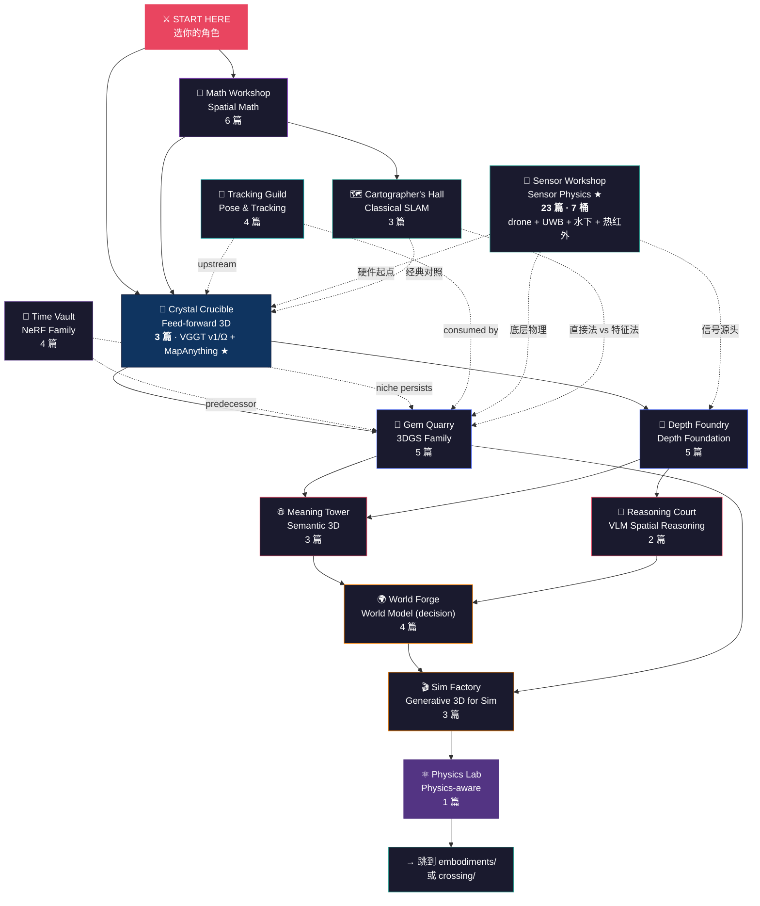

# 🏗️ Foundations — Explorer's Map

> **Foundations** 是跨 embodiment 共享的底层 — 3DGS / VGGT / Depth Foundation / 经典 SLAM 这些"工具箱"原语，无论你做 manipulation、aerial 还是 marine，最终都会回到这里。
>
> 目前收录 **83 篇深度解析** + **13 区导读**，是华语世界对空间智能底层最系统的拆解。
>
> **2026-05 重要更新（多轮叠加）**：
> - 🔮 Feed-Forward 3D：+ VGGT-Ω + **MapAnything ★ (metric solved)** + 即将 Depth Anything 3
> - 📡 Sensor Physics ★：5 → 23 篇（+ RGB / GNSS / barometer / magnetometer / opt-flow / range finder + UWB / WiFi / 水下声呐 / 热红外 / 24GHz Doppler / mic array `pending agent`）
> - 🧮 Spatial Math：+ 前置教学（rotation_intuition_primer）+ 跨领域数学灵感（cross_domain_math_inspirations）+ IMU §6 production 优化 10 项
> - 📏 Depth Foundation：4 篇 v1.2 深化 + 新 **depth_models_comparison.md** ★（4 模型横向对比）
>
> 不知道从哪开始？先选你的角色 ↓

&nbsp;

## 🎭 你是谁？

| | 角色 | 你的背景 | 👉 推荐起点 |
|:---:|------|---------|-----------|
| 🧙 | **3D vision 研究者** | 熟悉 NeRF / SfM / Multi-view stereo | → [Feed-Forward 3D 三件套对照](feed-forward-3d/overview.md)：VGGT v1 (CVPR 2025) + **MapAnything (metric ★)** + **VGGT-Ω (efficient ★)** |
| 🤖 | **机器人感知工程师** | 调过 SLAM、做过 RGBD 处理 | → [Depth Anything v2 解构](depth-foundation/depth_anything_v2_dissection.md)，相对深度 vs 度量深度的现场 trap |
| 🎮 | **图形学 / 渲染从业者** | 熟悉光线追踪、material shading | → [3DGS 原始论文解构](3dgs-family/3dgs_original_dissection.md)，看它如何在 6 个月内 100× NeRF |
| 🛰️ | **跨 embodiment / 系统架构师** | 同时关注车 + 机器人 + AR | → [Crossing 章节旗舰](../crossing/slam-vio-migration/vggt_vs_drone_vio.md)，再回来看 foundations 当工具箱 |
| 📡 | **传感器 / 硬件团队** | 写过 driver、做过 BoM | → [850nm 主动近红外解构](sensor-physics/active_nir_850nm_for_embodied_ai.md)，学界综述写不出的 SWaP-C 工程账 |
| 🗺️ | **SLAM 工程师** | 跑过 ORB-SLAM / VINS / OpenVINS | → [ORB-SLAM3 解构](classical-slam/orb_slam3_dissection.md)，经典框架的 multi-map atlas 设计 |
| 🧮 | **数学背景较弱、想补 SE(3)/BA** | 听过 quaternion 但没自信用对 | → [SE(3)/SO(3) Lie group 入门](spatial-math/se3_so3_lie_groups_primer.md)，所有 SLAM/VIO 的数学骨架 |
| 🔬 | **NeRF 老粉、想跟上 3DGS** | 训过 NeRF / Instant-NGP | → [NeRF 原始论文解构](nerf-family/nerf_original_dissection.md)，然后跳 3DGS — 范式转移看完整 |
| 🎯 | **manipulation 工程师** | 调过 grasp planner、用过 6D pose | → [FoundationPose 解构](pose-tracking/foundation_pose_dissection.md)，novel-object pose 无需 per-object 训练 |
| 🎬 | **仿真 / sim2real 团队** | 调过 Isaac Sim / Gazebo | → [Splat-Sim for Manipulation](generative-3d-sim/splat_sim_for_manipulation.md)，3DGS 当 photometric augmentation |

&nbsp;

---

&nbsp;

## 🔍 一眼看清 13 区特性

> *分 3 张窄表 — GitHub 渲染友好。先看你想要的"上游 → 输出 → 下游"链；再查特性；最后看决策。*

### 表 1 · 上游 → 输出 → 下游消费

| 区 | **🔼 上游 (input)** | **📦 输出 (output)** | **🔽 下游 (consumer)** |
|---|---|---|---|
| 🧮 [Math](spatial-math/) | （n/a — 数学 primitives） | 公式 / 算法 toolkit | 所有 SLAM / VIO / BA / 3D 系统都引用 |
| 🗺️ [Classical SLAM](classical-slam/) | 视频流 + IMU 流（在线） | **6DoF pose 轨迹 + 稀疏 map** | controller / motion planner / autonomy stack |
| 🔮 [Feed-Forward 3D](feed-forward-3d/) ★ 3 篇 | N RGB (+MapAnything 可选 K/T/D/recon) | poses + depth + pointmaps + tracks（VGGT）或 **米制 3D**（MapAnything）| 3DGS/NeRF init / SfM 替代 / **manipulation grasp（米制时）** |
| 💎 [3DGS family](3dgs-family/) | **N RGB + 相机姿态**（COLMAP / VGGT 给）| 显式 radiance field（gaussian set，可编辑）| NVS 渲染 / sim2real 数据 / 3D 可视化 |
| 🔬 [NeRF family](nerf-family/) | **N RGB + 相机姿态**（同 3DGS）| 隐式 radiance field（MLP / hash grid）| 同 3DGS，但更高质量更慢 |
| 📏 [Depth Foundation](depth-foundation/) | 单 RGB（DA v2 / Metric3D / MoGe）or stereo pair（FoundationStereo）| per-pixel depth map（**DA 相对 / Metric3D 米制**）| 点云 lift / 障碍物 / VLA 输入 |
| 🎯 [Pose & Tracking](pose-tracking/) | RGB + 已知 mesh（FoundationPose）/ 视频流（RAFT, CoTracker）| **6D 物体 pose / 像素轨迹** | manipulation grasp / 多帧融合 / motion compensation |
| 🌐 [Semantic 3D](semantic-3d/) | 3D 表示（点 / NeRF / 3DGS）+ 2D 特征（CLIP / SAM）| 语义 3D field（查询接口）| 语言-条件 manipulation / open-vocab seg / VLA prompt |
| 🧠 [VLM Spatial](vlm-spatial-reasoning/) **3 篇 ✅** | RGB + 自然语言 query | 文本答案 / bounding box | 高层 planning prompt / 自然语言 grasp |
| 🌍 [World Model](world-model/) | RGB + action sequence | predicted future video / state | sim2real 数据 / VLA 训练数据 / short-horizon planner |
| 🎬 [Generative 3D Sim](generative-3d-sim/) | 真实 scene 重建（3DGS / NeRF）or mesh | 渲染 dataset / sim2real 视觉端 | policy training（manipulation / aerial）|
| ⚛️ [Physics](physics/) | 3DGS + 刚体动力学 + 可微物理 | physics-aware 渲染 + sim 训练 + diff-physics co-design | 软体增强 + GPU sim 大批量 + 可微控制器 |
| 📡 [Sensor Physics ★](sensor-physics/) | （n/a — 硬件物理） | sensor 选型论证 / 物理硬约束 | BoM 决策 / 标定 / 失败诊断 |

&nbsp;

### 表 2 · 运行特性（4 正交轴：推理 / 训练 / 硬件 / 米制）

> *v2 重设计 — 之前 1 列混了"训练时间"和"推理时间"，现在分清。每个轴独立。*

| 区 | **🏃 推理速率** | **🎓 训练模式** | **🖥️ 最低部署硬件** | **📐 米制输出** |
|---|---|---|---|---|
| 🧮 Math | n/a（数学 toolkit） | n/a（经典）| n/a | n/a |
| 🗺️ Classical SLAM | **30 Hz** real-time | ❌ **无训练**（经典算法）| **CPU OK**（Jetson Nano 即可） | ✅ stereo/RGBD/IMU 给；**mono ❌**（scale drift） |
| 🔮 Feed-Forward 3D (v1) | ~5 Hz / latency 100-200 ms | ❌ **已训好**（用 pretrained）| Orin Nano + 3GB 内存 | ❌ **un-metric**（需要外部 anchor） |
| 🔮 Feed-Forward 3D (Ω) | ~10 Hz? `UNVERIFIED` | ❌ 已训好（**15× 数据 + 自监督**）| Orin Nano（memory 比 v1 省 30%）| ❌ un-metric |
| 🔮 **Feed-Forward 3D (MapAnything)** ★ | TBD（1B 模型推理重）| ❌ 已训好（multi-task）| RTX 4090 / A100（1B params · 4GB F32）| **✅ 米制 ★**（factored repr 含 scale factor）|
| 💎 3DGS family | **render: 60+ FPS** / 训练 5-30 min/scene | ✅ **每场景训**（per-scene fitting）| 1× consumer GPU (RTX 3090+) | ❌ 从上游 SfM 继承（COLMAP 米则米；VGGT 给则非米）|
| 🔬 NeRF family | render: 0.1-30 FPS / 训练 30 min-hr/scene | ✅ **每场景训** | 1× consumer GPU | ❌ 同上（继承上游 SfM）|
| 📏 Depth Foundation | per-frame ~50 ms | ❌ 已训好 | Orin Nano | **DA v2: ❌ 相对** / **Metric3D: ✅** / **FoundationStereo: ✅** |
| 🎯 Pose & Tracking | per-frame ~50-100 ms | ❌ 已训好 | Orin / consumer GPU | ✅（FoundationPose 直接给 6D pose） |
| 🌐 Semantic 3D | LERF: 训完 ~30 Hz / **OpenScene: 实时 lift** | **LERF: ✅ 每场景训** / **OpenScene: ❌ 不训** | LERF: 1 GPU 5 min/scene / OpenScene: edge OK | 视基底 3D 几何（米则米，相对则相对）|
| 🧠 VLM Spatial | per-query 500 ms - 数 s | ❌ 已训好 | **A100 或 cloud API**（VLM 大模型）| n/a（语言/文本输出）|
| 🌍 World Model | per-step 1-数 s | ❌ 已训好（大规模预训）| **A100+** 或 cloud | ❌ |
| 🎬 Generative 3D Sim | 视方法（per-render varies）| 视方法（Splat-Sim 用现成 3DGS / Aerial Gym 用预训） | consumer GPU | n/a（生成数据，非状态估计）|
| ⚛️ Physics (PhysGaussian) | per-scene 训 + render | ✅ 每场景训（材料参数手设） | 1× GPU | n/a |
| 📡 Sensor Physics ★ | n/a（硬件物理）| n/a | n/a | n/a |

&nbsp;

> **读表秘诀**：
> - **🏃 推理速率** = 你的应用控制环 / 任务每帧能给的预算
> - **🎓 训练模式** = 上线前是不是要训（"每场景训" = production blocker；"已训好" = 直接用）
> - **🖥️ 最低部署硬件** = 能不能跑在 Orin Nano (edge) / consumer GPU (workstation) / A100 (cloud)
> - **📐 米制输出** = 下游能不能拿到米（manipulation grasp / drone control 需要；rendering / visualization 不需要）
>
> **常见误用警告**：
> - 把 3DGS 当 "real-time 3D"（render 是实时，**训练每场景 5-30 min 不是**）
> - 把 Depth Anything v2 当 "可以拿来 grasp"（**它是相对深度，Metric3D 才给米**）
> - 把 SpatialVLM 当 "高精度 spatial"（**它给语言答案，不给度量**）
> - 把 mono Classical SLAM 当 "完整 6DoF"（**mono scale drift；需要 stereo/RGBD/IMU**）

&nbsp;

### 表 3 · 决定性因素（关键限制 / 何时选）

| 区 | ⚠️ **关键限制（接受才能用）** | ✅ **何时选（决定性场景）** |
|---|---|---|
| 🧮 Math | 不是 dissection 工具 | 想吃透 SLAM / VIO 数学 |
| 🗺️ Classical SLAM | 静态场景假设 / 白墙坍塌 / 200 Hz aerial 不够快 | 室内 manipulation / RGBD / AR 多 session |
| 🔮 Feed-Forward 3D (VGGT v1/Ω) | 200+ ms 延迟 / **un-metric** / N ≤ 30 / 边缘内存紧 | 离线 / 慢速 / 桌面环境替代 SfM |
| 🔮 Feed-Forward 3D (**MapAnything ★**) | 1B 模型推理重 / **CC-BY-NC-4.0 非商用** / 仍 batch | **需要 metric 输出的所有下游**（manipulation grasp / 慢速 drone）|
| 💎 3DGS family | 1-2 GB/场景存储 / loop closure 难 | 高保真渲染 / sim 数据 / 可检视 3D primitive |
| 🔬 NeRF family | 训练慢 / 推理慢 / 但 quality 仍领先 ~1 dB | 离线高质量 / city-scale (Block-NeRF) / surface 重建 |
| 📏 Depth Foundation | **"相对 vs 米制"陷阱** / >30m 崩 / 透明镜面失败 | 任何要 depth 的下游 (manipulation / drone) |
| 🎯 Pose & Tracking | 透明 / 镜面 / 极小物体 / OOD 物体 | manipulation grasp / 多帧追踪 |
| 🌐 Semantic 3D | LERF 每场景训 / 开集 query 有上限 | 语言-条件 grasp / 房间级查询 |
| 🧠 VLM Spatial | **精确距离差** / occlusion 失败 / 慢 | 高层 spatial 问答 / planning prompt |
| 🌍 World Model | **70% hype 被 PRD 打 ❌** / 仅 data factory 或 short-horizon | sim2real 数据 / VLA 训练 |
| 🎬 Generative 3D Sim | 接触动力学交给 Isaac / 只搞视觉 | sim2real 视觉端 augmentation |
| ⚛️ Physics | **仅 soft-body**，rigid contact 不行 | 软体仿真视觉端 |
| 📡 Sensor Physics ★ | **学界综述不写的硬约束** | 选 sensor / BoM 前必看 |

&nbsp;

### 🎯 快速决策树 (5 秒选区)

```
你的需求？
│
├─ 我要数学基础                        → 🧮 Math
│
├─ 我要 6DoF pose 估计 (实时控制)
│   ├─ 室内 + RGBD / IMU 都有          → 🗺️ Classical SLAM (ORB-SLAM3)
│   ├─ Aerial 200 Hz 控制环              → 🗺️ Classical SLAM (VINS-Fusion @ embodiments/aerial/vio/)
│   ├─ 桌面 / 慢速 / 离线 + 不需米       → 🔮 VGGT v1 / VGGT-Ω
│   └─ 桌面 / 慢速 / 离线 + 要米 ★       → 🔮 **MapAnything** (metric solved!)
│
├─ 我要 depth (per-pixel)
│   ├─ 相对深度够用 (rendering)        → 📏 Depth Foundation (Depth Anything v2)
│   ├─ 米制必需 (manipulation)         → 📏 Depth Foundation (Metric3D) 或 stereo
│   └─ 大基线 outdoor                  → 📏 FoundationStereo + RTK
│
├─ 我要场景表示 (储存 / 可视化 / 编辑)
│   ├─ 实时高保真                      → 💎 3DGS family
│   ├─ 最高质量 (离线 OK)              → 🔬 NeRF family (Mip-NeRF 360)
│   └─ City-scale                      → 🔬 Block-NeRF / Mega-NeRF
│
├─ 我要语义 (object / region / language)
│   ├─ 物体 6D pose                    → 🎯 Pose & Tracking (FoundationPose)
│   ├─ 语义 3D field                   → 🌐 Semantic 3D
│   └─ 自然语言 query                  → 🧠 VLM Spatial Reasoning (SpatialVLM)
│
├─ 我要 sim2real / 训练数据
│   ├─ 视觉 augmentation               → 🎬 Generative 3D Sim (Splat-Sim)
│   ├─ 短期未来预测                    → 🌍 World Model (Genie)
│   └─ 软体物体                        → ⚛️ Physics (PhysGaussian)
│
└─ 我要选 sensor / 做 BoM             → 📡 Sensor Physics (23 篇全集 · drone 完整 stack)
```

&nbsp;

### 🚦 实时 vs 离线 × 米制 vs 非米制 (二维定位)

```
                       米制 (Metric) ✅
                              │
                              │
   离线高质量                  │           实时米制
   (offline)                   │           (production-ready)
                              │
   • Metric3D (单帧推理)       │      • 🗺️ Classical SLAM
   • Mip-NeRF 360 surface      │        (ORB-SLAM3 + IMU/stereo)
                              │      • 🎯 FoundationPose
                              │      • 📏 stereo depth + RTK
                              │
   ────────────────────────────┼────────────────────────────────►
                              │                                  实时 (≥30 Hz) ✅
   • 🔬 NeRF / Instant-NGP     │      • 📏 Depth Anything v2
   • 💎 3DGS / 4DGS            │      • 🌐 OpenScene
   • 🔮 VGGT (large)           │      • 🎯 RAFT / CoTracker
                              │      • 🔮 VGGT-distilled (~10 Hz)
                              │
   离线非米制                   │           实时相对
   (offline, un-metric)        │           (real-time, relative)
                              │
                              │
                       非米制 / 相对 ❌
```

&nbsp;

> **读图秘诀**：你的应用控制环带宽（200 Hz aerial / 30 Hz manipulation / 几 Hz 离线）决定纵向位置；你能不能拿到 stereo / IMU / RTK 决定米制能不能给。**两轴交叉的那一象限 = 你该用的工具区。**

&nbsp;

---

&nbsp;

## 🌍 世界地图



> **读图方式**：实线 = 建议学习顺序（从 feed-forward 3D 出发是最快理解全局的路径）。虚线 = Sensor Physics 是物理底层，遇到 "为什么 850nm？"" 为什么 RGBD 在户外失效？" 这种问题随时回来。

&nbsp;

---

&nbsp;

## 🏛️ 十三大区域

&nbsp;

<details open>
<summary><h3>🧮 Math Workshop — Spatial Math &nbsp;<code>6 篇 · 工具箱第一站</code></h3></summary>

**一句话**：所有 SLAM / VIO / 3D 优化的数学骨架 — SE(3) / 四元数 / Bundle Adjustment / Bayesian filtering / IMU preintegration。

对应 VLA-Handbook `math_for_vla.md` 在那一侧的地位 — 工具箱的第一站。所有其他区都在引用这些原语：classical-slam 的 BA、aerial-VIO 的 MSCKF、VGGT bypass 的优化、feed-forward 3D 的 pose 表示。**没补这一区，所有 dissection 都缺脚手架。**

| 推荐入口 | 说明 |
|---------|------|
| [SE(3)/SO(3) Lie Group Primer](spatial-math/se3_so3_lie_groups_primer.md) | Rotation 在曲面流形上、优化在切线空间 — left/right 微扰区别是 top-3 SLAM bug |
| [Quaternions and Rotations](spatial-math/quaternions_and_rotations.md) | Hamilton vs JPL convention war — OpenVINS↔ORB-SLAM3 集成的沉默 bug |
| [Bundle Adjustment](spatial-math/bundle_adjustment.md) | Schur complement + Jacobian sparsity，所有 SLAM 的核心数学 |
| [Pose Graph Optimization](spatial-math/pose_graph_optimization.md) | BA 之后的 loop closure 数学，g2o / GTSAM 生态 |
| [Bayesian Filtering: EKF/MSCKF](spatial-math/bayesian_filtering_ekf_msckf.md) | MSCKF 用 null-space landmark marginalisation 跑赢 opt-VIO 在 sub-10ms |
| [IMU Preintegration Math](spatial-math/imu_preintegration_math.md) | Forster 2017 让 VINS-Mono / OpenVINS 跑得起来的核心 trick |

📂 **完整目录**：[spatial-math/README.md](./spatial-math/overview.md)

</details>

&nbsp;

<details>
<summary><h3>🔮 Crystal Crucible — Feed-forward 3D &nbsp;<code>3 篇 · ⭐ 旗舰区</code></h3></summary>

**一句话**：3D 不再是离线拟合的目标 — 而是可直接前向推理的输出。

2024 年之前，多视图 3D 重建 = COLMAP + per-scene optimization（NeRF / 3DGS 都属于这一类，需要分钟到小时级训练）。**DUSt3R / MASt3R** 把成对前向 3D 推理打通；**VGGT (CVPR 2025 best paper)** 把 N-view 收进单次 transformer pass。这是空间智能从"拟合"到"推理"的范式转移信号 — 所有 manipulation / AD 的 perception front-end 都会被改写。

| 推荐入口 | 说明 |
|---------|------|
| [Feed-Forward 3D 三件套对照 README](feed-forward-3d/overview.md) | ★ 时间线 + 互补对照 4 张窄表 + 选型决策树 |
| [VGGT v1 (CVPR 2025) Dissection](feed-forward-3d/vggt_cvpr2025_dissection.md) | 谱系起点：4-head N-view 范式开创，un-metric |
| [VGGT-Ω Dissection](feed-forward-3d/vggt_omega_dissection.md) | 2026-05：register attention + 30% memory + 动态场景 ★ |
| [**MapAnything Dissection** ★](feed-forward-3d/mapanything_dissection.md) | 3DV 2026：**factored repr + metric ★ + 12+ tasks unified** |

📂 **完整目录**：[feed-forward-3d/README.md](feed-forward-3d/overview.md) — 3 件套时间线 + 对照表 + 选型决策树。

</details>

&nbsp;

<details>
<summary><h3>💎 Gem Quarry — 3DGS Family &nbsp;<code>5 篇</code></h3></summary>

**一句话**：3DGS 不是 NeRF 的加速版 — 它把"可编辑、可检视、可工程化"的 radiance field 还给了机器人圈。

为什么 2023 SIGGRAPH 这一篇能在 6 个月内取代 NeRF？关键是各向异性 gaussian splat 的可微 rasterizer — 训练 100× 快、推理实时、显式 primitive 可以直接编辑 / 调权。后续 3 条衍生线分别在动态场景 (4DGS)、SLAM 后端 (GS-SLAM)、抗锯齿 (Mip-Splatting) 上各自往前推一格。**robotics 圈关心的不是 photo-realistic 视频生成，而是这些 primitives 是 inspectable 的。**

| 推荐入口 | 说明 |
|---------|------|
| [3DGS Original Dissection](3dgs-family/3dgs_original_dissection.md) | Kerbl et al. SIGGRAPH 2023 — 100× 加速怎么来的、1-2 GB 存储是什么代价 |
| [4DGS Dynamic Scenes](3dgs-family/4dgs_dynamic_scenes.md) | 标准化集合 + 变形场 vs per-timestep gaussians 两条路 |
| [GS-SLAM](3dgs-family/gs_slam_dissection.md) | 把 3DGS 放进 SLAM 后端，loop closure 是未解问题 |
| [Mip-Splatting](3dgs-family/mip_splatting.md) | 3D 平滑 + 2D dilation 修 aliasing — 无人机和 VR 的 default |

📂 **完整目录**：[3dgs-family/README.md](./3dgs-family/overview.md)

</details>

&nbsp;

<details>
<summary><h3>🔬 Time Vault — NeRF Family &nbsp;<code>4 篇 · predecessor + niche</code></h3></summary>

**一句话**：NeRF 不是死了 — 它是 3DGS 在 *quality + scale* 两条 lane 上仍未拿下的对手。

2020-2024 NeRF 系是 dominant paradigm，3DGS 出现后被 deployment 边缘化，**但仍有三个 niche 它赢**：(a) Mip-NeRF 360 在 offline 重建质量上仍领先 ~1 dB LPIPS，(b) Block-NeRF / Mega-NeRF 在 city-scale AV 仿真上 3DGS 因为存储仍打不下来（Waymo / Cosmos 生产都还在用 NeRF lineage），(c) surface reconstruction NeRF 仍胜过 3DGS 出 mesh。

| 推荐入口 | 说明 |
|---------|------|
| [NeRF Original (ECCV 2020)](nerf-family/nerf_original_dissection.md) | 体渲染 + 位置编码 + 5D 输入的组合是真贡献，不是 MLP |
| [Instant-NGP](nerf-family/instant_ngp_dissection.md) | 多分辨率 hash encoding 把 NeRF 训练从小时降到分钟 |
| [Mip-NeRF 360](nerf-family/mip_nerf_360_dissection.md) | Unbounded scene + cone-tracing anti-aliasing — 至今 offline 质量标杆 |
| [Block-NeRF (Waymo)](nerf-family/block_nerf_large_scenes.md) | 城市级场景拼接 — 3DGS 至今未在 city-scale 取代它 |

📂 **完整目录**：[nerf-family/README.md](./nerf-family/overview.md)

</details>

&nbsp;

<details>
<summary><h3>📏 Depth Foundry — Depth Foundation &nbsp;<code>5 篇</code></h3></summary>

**一句话**：MiDaS 之后的范式转移 — depth 是 "foundation model"，但 "相对 vs 度量" 这一步会让机器人栽跟头。

Depth Anything v2 在论文里看起来 strictly better，但只能输出 *相对* depth — 你拿去抓杯子，得到的方向对、距离错。Metric3D 用 canonical camera transformation 把度量这一项找回来。MoGe 走 affine-invariant 多任务路线（点 + 深度 + 法线）。FoundationStereo 用"synthetic + foundation backbone"配方把 stereo matching 也接进 foundation 时代。**为机器人选 depth model 的第一题永远是：你需要米，还是只需要相对顺序？**

| 推荐入口 | 说明 |
|---------|------|
| [Depth Anything v2](depth-foundation/depth_anything_v2_dissection.md) | 62M 无标注数据蒸馏的秘方，以及"漂亮输出 vs 度量陷阱" |
| [Metric3D](depth-foundation/metric3d_dissection.md) | Canonical camera transformation 让单目度量成为可能 |
| [MoGe](depth-foundation/moge_dissection.md) | 多 head 仿射不变几何 — VGGT 谱系的先声 |
| [FoundationStereo](depth-foundation/foundationstereo_dissection.md) | 给无人机最便宜的被动度量深度 |

📂 **完整目录**：[depth-foundation/README.md](./depth-foundation/overview.md)

</details>

&nbsp;

<details>
<summary><h3>🎯 Tracking Guild — Pose & Tracking &nbsp;<code>4 篇</code></h3></summary>

**一句话**：物体位姿 + 光流 / 点追踪 — 机器人感知 #1 上游 missing 工具箱。

两类原语：**6D 物体位姿** (FoundationPose / MegaPose) 和 **运动追踪** (RAFT 光流 / CoTracker any-point tracking)。FoundationPose 是 manipulation 的 game-changer — novel object pose 无需 per-object 训练。CoTracker / TAP 是 contact-point tracking 的上游。

> **与 `feed-forward-3d/` 的边界**：VGGT 内部用 tracking 但没单独深度拆解；这一区拆专用工具。

| 推荐入口 | 说明 |
|---------|------|
| [FoundationPose (CVPR 2024 best)](pose-tracking/foundation_pose_dissection.md) | Novel-object 6D pose — manipulation 的 game-changer |
| [MegaPose](pose-tracking/megapose_dissection.md) | Render-and-compare 的教科书入口，被 FoundationPose 取代 |
| [RAFT Optical Flow](pose-tracking/raft_optical_flow.md) | 4D correlation + GRU 迭代精修，统治 flow benchmark 5 年 |
| [CoTracker + TAP-Vid](pose-tracking/cotracker_and_tap_dissection.md) | Any-point tracking — VLA 引用率低但落地价值高 |

📂 **完整目录**：[pose-tracking/README.md](./pose-tracking/overview.md)

</details>

&nbsp;

<details>
<summary><h3>🌐 Meaning Tower — Semantic 3D &nbsp;<code>3 篇</code></h3></summary>

**一句话**：2D 语义特征（DINOv2 / SigLIP / CLIP）必须被"抬"进 3D 空间，机器人才能听懂"把红色杯子放到桌子左边"。

三条主流路线：**逐像素投影** (最简单，2D 特征 + 深度直接 backproject)；**LERF-style feature field** (NeRF/3DGS 里训一个语义 field)；**OpenScene-style 直接融合** (零样本，无需 per-scene 训练)。LERF 给了 paradigm proof，OpenScene 因为不用 per-scene 训练所以在 deployment 上跑赢 — robotics 圈引用 OpenScene 比 LERF 多。

| 推荐入口 | 说明 |
|---------|------|
| [LERF Dissection](semantic-3d/lerf_dissection.md) | 多 scale CLIP 蒸馏到 NeRF field，paradigm proof 但训得贵 |
| [OpenScene Dissection](semantic-3d/openscene_dissection.md) | 直接 CLIP/SAM → 3D voxel，零 per-scene 训练，部署赢家 |

📂 **完整目录**：[semantic-3d/README.md](./semantic-3d/overview.md)

</details>

&nbsp;

<details>
<summary><h3>🧠 Reasoning Court — VLM Spatial Reasoning &nbsp;<code>2 篇</code></h3></summary>

**一句话**：VLM 默认是"扁平的" — 它没有 3D 概念，除非你刻意训练它。

GPT-4V 知道"杯子在桌上"，但不知道"杯子在你右手 12 cm 处"。三种修法：**implicit pretraining** (SpatialVLM 用 2B 合成 QA pair 训出"空间感")、**explicit caption tokens** (SpatialBot 把深度直接接进 prompt)、**3D-aware benchmark training** (用 3DSRBench 这种 benchmark 强迫学习)。SpatialVLM 是 data paper 不是 model paper — 它告诉你 *合成数据 pipeline* 才是 lever。

| 推荐入口 | 说明 |
|---------|------|
| [SpatialVLM Dissection](vlm-spatial-reasoning/spatialvlm_dissection.md) | 2B 合成 QA pair pipeline，Google DeepMind CVPR 2024 |

📂 **完整目录**：[vlm-spatial-reasoning/README.md](./vlm-spatial-reasoning/overview.md)

</details>

&nbsp;

<details>
<summary><h3>🌍 World Forge — World Model (decision-useful only) &nbsp;<code>4 篇</code></h3></summary>

**一句话**：严格 "decision-useful" 门槛 — 不收 generative 3D for users，只收对具身决策有用的世界模型。

NVIDIA Cosmos 是 sim2real *data factory* (Transfer > Predict > Reason)。Genie 是 inference-time MPC planner 而非训练数据源。Marble 大部分功能不在范围内（目标用户是人不是机器人），但 depth-from-video 这一片仍有用。**这一区 70% 的 "世界模型" hype 被打 ❌ —  PRD 明确写了这个门槛。**

| 推荐入口 | 说明 |
|---------|------|
| [NVIDIA Cosmos](world-model/nvidia_cosmos_dissection.md) | sim2real 数据工厂；预测 2027-12 真机 contact-rich 任务提升 &lt; 15% |
| [Genie / Genie 2](world-model/genie_dissection.md) | 推理时 planner 而非训练源；latent action 接地是未解 |
| [Marble (decision view)](world-model/marble_decision_view.md) | 显式 in-scope / out-of-scope 表 — 拒绝大部分功能 |

📂 **完整目录**：[world-model/README.md](./world-model/overview.md)

</details>

&nbsp;

<details>
<summary><h3>🎬 Sim Factory — Generative 3D for Sim &nbsp;<code>3 篇 · training-time</code></h3></summary>

**一句话**：生成式 3D 当 **训练数据 / 仿真增强** — 与 `world-model/` 严格区分（那一区是 inference-time planner，这里是 training-time data factory）。

3DGS-as-simulator 的三条线：Splat-Sim 给 manipulation policy 训练（contact dynamics 仍交 Isaac）、Aerial Gym 给无人机 sim2real（3DGS 视觉 + Isaac/PhysX 动力学）、可微渲染 (Mitsuba 3 / nvdiffrast) 当所有生成式 3D 训练的 enabler。**这区严格不收消费级 3D 内容生成。**

| 推荐入口 | 说明 |
|---------|------|
| [Splat-Sim for Manipulation](generative-3d-sim/splat_sim_for_manipulation.md) | 3DGS 当 photometric augmentation，contact 仍交 Isaac |
| [Aerial Gym 3DGS Sim2Real](generative-3d-sim/aerial_gym_3dgs_sim2real.md) | 视觉 frontend + Isaac 动力学 + 外挂风场 |
| [Differentiable Rendering (Mitsuba / nvdiffrast)](generative-3d-sim/differentiable_rendering_mitsuba_nvdiffrast.md) | Physics-correct 还是 ms-throughput — 二选一 |

📂 **完整目录**：[generative-3d-sim/README.md](./generative-3d-sim/overview.md)

</details>

&nbsp;

<details>
<summary><h3>⚛️ Physics Lab — Physics-aware Rendering &nbsp;<code>1 篇</code></h3></summary>

**一句话**：PhysGaussian 是"物理感知 *渲染*"，不是"物理 grounding *策略训练*" — 别搞混。

MPM (Material Point Method) 物理 + 3DGS 渲染 = 看起来很物理，但材料参数仍要手工设置 per asset。它的真正用途是 *soft-body augmentation* 给 manipulation policy 训练 — 而不是 rigid contact dynamics 学习。Contact-rich scenarios 这条路它不能走。

| 推荐入口 | 说明 |
|---------|------|
| [Physics zone README](physics/overview.md) | 双 lane 设计 — 渲染侧（PhysGaussian）+ 动力学侧（MJX / Warp）|
| [PhysGaussian](physics/physgaussian_dissection.md) | MPM + 3DGS；soft-body augmentation 而非 contact dynamics |
| [Rigid Body Dynamics Primer](physics/rigid_body_dynamics_primer.md) | SE(3) twist/wrench + Featherstone + contact LCP/QP/CI |
| [MuJoCo MJX Dissection](physics/mujoco_mjx_dissection.md) | XLA on GPU — 1024 env humanoid 训练 worked example |
| [NVIDIA Warp Dissection](physics/nvidia_warp_dissection.md) | DSL + autodiff — 软体球落地训练 stiffness worked example |
| [Differentiable Physics Comparison](physics/differentiable_physics_comparison.md) | Brax / MJX / Warp / Genesis 5-表对比 + 决策树 |

📂 **完整目录**：6 篇（README + 1 primer + 3 dissection 含 PhysGaussian + 1 comparison）— 已脱离 seed 状态

</details>

&nbsp;

<details>
<summary><h3>🗺️ Cartographer's Hall — Classical SLAM &nbsp;<code>3 篇</code></h3></summary>

**一句话**：feed-forward 3D 之前 (2014-2021)，视觉 SLAM 的 industry standard 由 ORB-SLAM 系 和直接法 (DSO / LSD) 定义 — 现在仍是绝大多数机器人 PoC 的起点。

跨 embodiment 通用的经典视觉 SLAM 工具箱。**ORB-SLAM3** (2021) 一锅包揽 mono / stereo / RGBD / IMU-tightly-coupled，加上 multi-map atlas 处理 long-term operation 中的重定位；**DSO / LSD-SLAM** 走直接法（pixel intensity gradient 而非 feature matching），在 gradient-rich 场景里更准但 loop closure 较弱。**Kalibr / maplab** 工具链是任何视觉惯性系统不可绕过的标定基建。

> **与 `embodiments/aerial/vio/` 的边界**：VIO 区写无人机实时性导向的 VINS-Fusion / OpenVINS / DROID-SLAM；这一区写跨 embodiment 通用、不强假设 IMU 紧耦合的经典视觉 SLAM 框架。

| 推荐入口 | 说明 |
|---------|------|
| [ORB-SLAM3 Dissection](classical-slam/orb_slam3_dissection.md) | T-RO 2021 旗舰：tracking / local mapping / atlas multi-map 三模块，ORB descriptor 为何仍是关键 |
| [Direct Methods (DSO / LSD-SLAM)](classical-slam/direct_methods_dso_lsd.md) | 直接法 vs 特征法的根本分歧，何时 DSO 准、何时输 |
| [SLAM Toolchain Ecosystem](classical-slam/slam_toolchain_ecosystem.md) | Kalibr 标定 / maplab 框架 / ROS 集成 / 部署 caveat |

📂 **完整目录**：[classical-slam/README.md](./classical-slam/overview.md)

</details>

&nbsp;

<details>
<summary><h3>📡 Sensor Workshop — Sensor Physics ★ &nbsp;<code>5 篇 · 🛰️ 独家轴</code></h3></summary>

**一句话**：学界综述写不出 SWaP-C 工程账；厂商内部资料又封闭 — 这一区是本书与所有其他空间智能资源最大的差异点。

5 篇覆盖 active NIR / ToF / LiDAR / IMU / event camera 的完整物理 — 从 Si QE 与 solar irradiance dip，到 905nm vs 1550nm 的眼睛安全 1000× 套利，到 MEMS vs FOG 的 5000× 成本阶梯，到 DVS 的异步阈值。**任何空间智能 deployment 在选 sensor 之前都该来这一区。**

| 推荐入口 | 说明 |
|---------|------|
| [Active NIR 850nm](sensor-physics/active_nir_850nm_for_embodied_ai.md) | ★ Si QE / solar dip / 眼睛安全四元优化 |
| [ToF Physics](sensor-physics/tof_physics_for_embodied_ai.md) | Phase-CW vs pulsed dToF，wrap-around 限 max range，multipath |
| [LiDAR Physics (905 vs 1550nm)](sensor-physics/lidar_physics_905_vs_1550.md) | 1000× MPE 套利，机械 / 固态 / FMCW 架构 |
| [IMU Physics & Noise Model](sensor-physics/imu_physics_and_noise_model.md) | MEMS vs FOG，Allan variance，unaided mission duration 是决定变量 |
| [Event Camera DVS Physics](sensor-physics/event_camera_dvs_physics.md) | 异步阈值 + 120dB HDR + 10μs 时间分辨率，静态场景零信号 |

📂 **完整目录**：[`sensor-physics/README.md`](./sensor-physics/overview.md) — 24 篇 single-sensor dissection + 1 篇跨 sensor 决策矩阵

</details>

&nbsp;

---

&nbsp;

## ⚡ Speed Runs

> *没时间读 14 篇？选一条最短路线。*

&nbsp;

### 🏃 "我就想搞清楚 2024-2026 spatial 范式怎么变了"（3 篇）

```
3DGS Original → Depth Anything v2 → VGGT
```

[开始 →](3dgs-family/3dgs_original_dissection.md)（per-scene → foundation → feed-forward N-view 三段跃迁）

&nbsp;

### 🎓 "我要为无人机选 perception stack"（4 篇）

```
Depth Anything v2 → FoundationStereo → 850nm 物理 → VGGT vs Drone VIO
```

[开始 →](depth-foundation/depth_anything_v2_dissection.md)（理解 relative-vs-metric，再决定 active vs passive）

&nbsp;

### 🤖 "我要做 manipulation 的 3D-aware policy"（3 篇）

```
VGGT → OpenScene → bridge-to-vla/feature-cloud-to-action
```

[开始 →](feed-forward-3d/vggt_cvpr2025_dissection.md)（encoder → semantic lift → policy interface 完整链）

&nbsp;

### 🧬 "我是 VLA 研究者，想跨过来看 spatial"（3 篇）

```
VGGT → SpatialVLM → bridge-to-vla/3d_aware_vla
```

[开始 →](feed-forward-3d/vggt_cvpr2025_dissection.md)（先建立 encoder 直觉，再看 3D 和 VLA 怎么接）

&nbsp;

### 🏗️ "我是 sensor hardware 团队"（2 篇 + 1 crossing）

```
850nm NIR → crossing/sensor-stack-matrix
```

[开始 →](sensor-physics/active_nir_850nm_for_embodied_ai.md)（先吃透物理，再看跨 embodiment SWaP-C 矩阵）

&nbsp;

---

&nbsp;

## 🏆 Achievements

读完一篇就算解锁。看看你能拿几个？

| | 成就 | 解锁条件 |
|:---:|------|---------|
| 🥉 | **First Blood** | 读完任意 1 篇 dissection |
| 🎓 | **Orientation** | 读完 VGGT + 3DGS Original + Depth Anything v2（三大底层） |
| 💎 | **Full Map** | 8 区各读至少 1 篇 |
| 🐉 | **Boss Hunter** | 读完 3 篇 "最难"文章（见下表） |
| 🧮 | **Math Initiated** | 读完 SE(3) primer + Bundle Adjustment + IMU preintegration |
| ⚡ | **Speed Runner** | 完成任意一条 Speed Run |
| 🛰️ | **Cross-Embodiment** | 至少读 1 篇 foundations + 1 篇 `crossing/` + 1 篇 `embodiments/` |
| 👑 | **Foundation Master** | 8 区各读全部文章 |

<details>
<summary>🐉 Boss Monsters（每区最硬的一篇）</summary>

| Zone | Boss | Why It's Hard |
|------|------|---------------|
| 🔮 Crystal Crucible | [MapAnything](feed-forward-3d/mapanything_dissection.md) | Factored representation + metric scale 突破 + 12+ tasks unified |
| 💎 Gem Quarry | [3DGS Original](3dgs-family/3dgs_original_dissection.md) | 可微 rasterizer + anisotropic gaussian 数学 |
| 📏 Depth Foundry | [Metric3D](depth-foundation/metric3d_dissection.md) | Canonical camera transformation 推导 |
| 🌐 Meaning Tower | [LERF](semantic-3d/lerf_dissection.md) | 多 scale CLIP 蒸馏 + NeRF field 联合优化 |
| 🧠 Reasoning Court | [SpatialVLM](vlm-spatial-reasoning/spatialvlm_dissection.md) | 2B 合成 QA pair 生成 pipeline |
| 🌍 World Forge | [NVIDIA Cosmos](world-model/nvidia_cosmos_dissection.md) | sim2real data factory 的可证伪预测 |
| ⚛️ Physics Lab | [PhysGaussian](physics/physgaussian_dissection.md) | MPM + 渲染联合优化的限制 |
| 🗺️ Cartographer's Hall | [ORB-SLAM3](classical-slam/orb_slam3_dissection.md) | Multi-map atlas 设计 + 三模块协同 |
| 📡 Sensor Workshop | [LiDAR 905 vs 1550nm](sensor-physics/lidar_physics_905_vs_1550.md) | 1000× MPE 套利 + 多架构对比 |
| 🧮 Math Workshop | [Bundle Adjustment](spatial-math/bundle_adjustment.md) | Schur complement 数学完整推导 |
| 🔬 Time Vault | [Block-NeRF (Waymo)](nerf-family/block_nerf_large_scenes.md) | City-scale 拼接 + 生产 AV 仿真细节 |
| 🎯 Tracking Guild | [FoundationPose](pose-tracking/foundation_pose_dissection.md) | Mesh-free novel object + 1M 对象 scaling |
| 🎬 Sim Factory | [Differentiable Rendering](generative-3d-sim/differentiable_rendering_mitsuba_nvdiffrast.md) | Mitsuba vs nvdiffrast 完整对比 |

</details>

&nbsp;

---

&nbsp;

<details>
<summary>📊 Stats</summary>

&nbsp;

**73** dissections · **13** zones · 部分由 [Pulsar](https://github.com/sou350121/Pulsar-KenVersion) 自动生成、部分人工撰写。

**Recent additions (2026-05, multi-round)**:
- 🔮 Feed-Forward 3D: + **VGGT-Ω** + **MapAnything ★** + DA3 (any-view generalist, 2025-11)
- 📡 Sensor Physics ★: 5 → 23 篇 (RGB / GNSS / barometer / magnetometer / opt-flow / range finder)
- 🧮 Spatial Math: + 前置教学 + 跨领域灵感 + IMU §6 production 优化
- 📏 Depth Foundation: 4 篇 v1.2 + **depth_models_comparison ★** (4 模型对照)
- 详各区 README explorer-map 风格

新文章会通过 Pulsar pipeline 自动追加，参考 [`AGENTS.md`](../AGENTS.md) 的写入权限矩阵 + 14 项质量门槛。

**与 VLA-Handbook 的关系**：VLA-Handbook 管 action policy（diffusion / flow matching / RL），Spatial-Handbook 管 world representation（3DGS / VGGT / depth foundation）；两者交集是 3D-aware VLA — 见 [`bridge-to-vla/`](../bridge-to-vla/overview.md)。

</details>

&nbsp;

---

[← Back to Handbook root](../README.md) · [→ Crossing (★ USP)](../crossing/overview.md) · [→ Embodiments](../embodiments/overview.md) · [→ Bridge to VLA-Handbook](../bridge-to-vla/overview.md)
